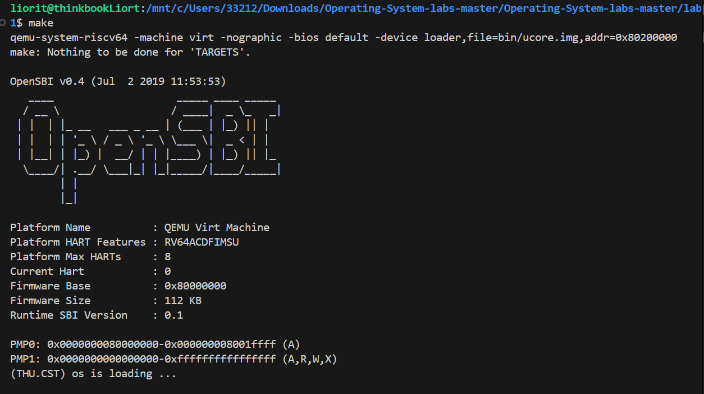

# lab1:最小可执行内核
## 实验目的
- 使用`链接脚本`描述内存布局；
- 进行`交叉编译`沈城可执行文件，进而生成内核镜像；
- 使用OpenSBI作为bootloader加载内核镜像，并使用Qemu进行模拟；
- 使用OpenSBI提供的服务，在屏幕上格式化打印字符串用于以后调试。
## 实验内容
### 练习1：理解内核启动中的程序入口操作
>阅读 kern/init/entry.S内容代码，结合操作系统内核启动流程，说明指令 la sp, bootstacktop 完成了什么操作，目的是什么？ 指令tail kern_init 完成了什么操作，目的是什么？
---


*图：OpenSBI 固件启动后加载内核镜像的过程*

上图中OpenSBI 固件启动并打印自身信息，说明固件运行环境准备好了。
而后固件把内核镜像加载并跳转到镜像的入口地址 0x80200000。因此 CPU 开始执行内核 kern_entry 的机器码。
#### 指令 la sp, bootstacktop
   在内核启动阶段，由于还没有可用的栈空间，必须先为内核设置专属的栈。la sp, bootstacktop将内核栈的顶端地址赋值给 sp，来分配好内核栈。这样，后面执行 tail kern_init 跳转到 kern_init时，已经具备了C语言运行环境，因为此时栈指针已经指向了内核的栈空间。
#### 指令 tail kern_init
   tail kern_init 指令表示无返回地跳转到 kern_init 函数入口，即不会再返回到汇编初始化代码，这样可以由 C 代码全面接管控制权，进入内核主流程。
#### 执行效果验证
kern_init 在 C 层执行，打印：cprintf("(THU.CST) os is loading ...\n")，说明内核 C 代码已被执行到。

### 练习2：使用GDB验证启动流程
>为了熟悉使用 QEMU 和 GDB 的调试方法，请使用 GDB 跟踪 QEMU 模拟的 RISC-V 从加电开始，直到执行内核第一条指令（跳转到 0x80200000）的整个过程。通过调试，请思考并回答：RISC-V 硬件加电后最初执行的几条指令位于什么地址？它们主要完成了哪些功能？请在报告中简要记录你的调试过程、观察结果和问题的答案。
---
#### 调试过程
**第一阶段：复位**
1. 首先我们进入实验代码相应的目录，打开`Ubuntu`并打开`tmux`，输入`Ctrl+B %`得到两个终端,在左侧终端运行`make debug`，在右侧终端运行`make gdb`，右侧终端会得到如下的输出：
```bash
Reading symbols from bin/kernel...                                     
The target architecture is set to "riscv:rv64".                                                      
Remote debugging using localhost:1234 
0x0000000000001000 in ?? ()                             
(gdb)
```
这说明当前CPU的当前执行地址（PC）是0x1000;
2. 为了追踪硬件加电到执行内核代码的过程，我们需要的得到内核的入口地址。我们在内核的入口函数`kern_entry`处下断点，随后执行`c`开始执行程序，内核会运行到我们设置好的断点。
```bash
(gdb) b* kern_entry
Breakpoint 1 at 0x80200000: file kern/init/entry.S, line 7.
(gdb) c
Continuing.
```
这说明我们的内核代码最终为0x80200000；
3. 接下来我们逐步跟踪硬件加电到执行内核代码的过程，首先我们在GDB中输入指令`x/10i $pc`先粗略查看硬件加电开始执行的第一条指令的地址后的十条指令，找到跳转指令和程序跳转的地址。
```bash
(gdb) x/10i $pc                                                                                                        
=> 0x1000:      auipc   t0,0x0                                                                                         
   0x1004:      addi    a2,t0,40
   0x1008:      csrr    a0,mhartid
   0x100c:      ld      a1,32(t0)                                                                                      
   0x1010:      ld      t0,24(t0)                                                                                      
   0x1014:      jr      t0                                                                                             
   0x1018:      unimp                                                                                                  
   0x101a:      .insn   2, 0x8000
   0x101c:      unimp
   0x101e:      unimp
```
可以看到在0x1014处存在`jr`跳转指令，程序跳转到地址为`t0`处；下面我们通过`si`指令逐步执行指令，并观察`t0`寄存器的值：
```bash
(gdb) si                                                                                                               
0x0000000000001004 in ?? ()                                                                                            
(gdb) si 3                                                                                                             
0x0000000000001010 in ?? ()
(gdb) i r t0
t0             0x1000   4096                                                                                           
(gdb) si                                                                                                               
0x0000000000001014 in ?? ()                                                                                            
(gdb) i r t0                                                                                                           
t0             0x80000000       2147483648
(gdb) si
0x0000000080000000 in ?? ()
```
从输出结果可以看出，t0寄存器的值为0x80000000，即程序跳转到的地址为0x80000000，OpenSBI的地址为0x80000000。当然，但从汇编指令我们也能计算出跳转地址
```asm
0x1000:	auipc	t0,0x0       # t0= pc+0x0 = 0x1000 = 4096
0x1004:	addi	a1,t0,32     # a1= t0+32 = 0x1000+32 = 0x1020
0x1008:	csrr	a0,mhartid   # a0= mhartid = 0
0x100c: ld      a1,32(t0)    # a1= [0x1000+32]
0x1010:	ld	    t0,24(t0)    # t0= [0x1000+24] = 0x80000000
0x1014:	jr	    t0           # jr   0x80000000
0x1018: unimp   
```
**0x80000000的拼接**

内存内容布局如下面表格

| 地址          | 汇编伪指令             | 实际机器码字节（小端序）                | 含义       |
| ----------- | ----------------- | --------------------------- | -------- |
| 0x1018      | `unimp`           | `00 00 00 00`               | 4 字节全 0  |
| 0x101A      | `.insn 2, 0x8000` | `00 80`                     | 插入的 2 字节 |
| 0x101C      | `unimp`           | `00 00`                     | 2 字节全 0  |
| **共计 8 字节** |                   | **00 00 00 00 00 80 00 00** |          |

由于RISC-V是小端序，所以当执行`ld t0,24(t0)`时，从0x1018开始取8个字节，所以t0=0x80000000;
>第一阶段将必要的文件载入到 Qemu 物理内存之后，Qemu CPU 的程序计数器PC会被初始化为 0x1000 ，因此 Qemu 实际执行的第一条指令位于物理地址 0x1000，接下来它将执行寥寥数条指令并跳转到物理地址 0x80000000 对应的指令处(OpenBIS)并进入第二阶段。

**第二阶段: Bootloader**

 进入到0x80000000地址后，我们可以通过`x/<format> <address>`查看OpenSBI.bin的汇编代码，通过执行这些指令，初始化处理器的运行环境。由于汇编代码过长，我们以部分代码为例进行分析：
```asm
(gdb) x/10i 0x80000000
=>  0x80000000:  add     s0, a0, zero      # s0 = a0，保存第一个参数
    0x80000004:  add     s1, a1, zero      # s1 = a1，保存第二个参数
    0x80000008:  add     s2, a2, zero      # s2 = a2，保存第三个参数
    0x8000000c:  jal     0x80000560        # 跳转并链接到 0x80000560（调用初始化函数），返回地址保存在 ra
    0x80000010:  add     a6, a0, zero      # a6 = a0，把函数返回值保存到 a6 中
    0x80000014:  add     a0, s0, zero      # a0 = s0，恢复第一个参数
    0x80000018:  add     a1, s1, zero      # a1 = s1，恢复第二个参数
    0x8000001c:  add     a2, s2, zero      # a2 = s2，恢复第三个参数
    0x80000020:  li      a7, -1            # a7 = -1，设置立即数 -1
    0x80000022:  beq     a6, a7, 0x8000002a # 如果 a6 == -1，则跳转到 0x8000002a
```
>CPU 跳转到0x80000000处继续运行。OpenSBI 运行在 RISC-V 的最高特权级（M 模式），负责初始化处理器的运行环境。完成这些初始化工作后，OpenSBI 才会准备开始加载并启动操作系统内核。OpenSBI 将编译生成的内核镜像文件加载到物理内存的0x80200000地址处。

**第三阶段：内核启动执行**

OpenSBI 完成相关工作后，跳转到0x80200000地址，开始执行kern/init/entry.S。在0x80200000这个地址上存放的是kern/init/entry.S文件编译后的机器码，因为链接脚本将entry.S中的代码段放在内核镜像的最开始位置。
1. 我们通过指令`x/5i 0x80200000`,查看内核代码起始处的汇编代码
```bash
(gdb) x/5i 0x80200000
   0x80200000 <kern_entry>:     auipc   sp,0x3                   # sp=PC+(0x3<<12)=0x80203000,初始化栈空间
   0x80200004 <kern_entry+4>:   mv      sp,sp                    # 空操作，占位用
   0x80200008 <kern_entry+8>:   j       0x8020000a <kern_init>
   0x8020000a <kern_init>:      auipc   a0,0x3
   0x8020000e <kern_init+4>:    addi    a0,a0,-2 
```
在`0x80200008`地址处，程序跳转到了`kern_init`，在该函数里完成内核的其他初始化工作。
2. 我们在`0x80200000`处设置断点，执行`c`使程序运行到断点处。
```bash
(gdb) break kern_entry
Breakpoint 1 at 0x80200000: file kern/init/entry.S, line 7.
(gdb) c
Continuing. 
```
`make debug`终端得到的输出如下：
```bash
OpenSBI v0.4 (Jul  2 2019 11:53:53)                         
   ____                    _____ ____ _____
  / __ \                  / ____|  _ \_   _|
 | |  | |_ __   ___ _ __ | (___ | |_) || |
 | |  | | '_ \ / _ \ '_ \ \___ \|  _ < | |
 | |__| | |_) |  __/ | | |____) | |_) || |_
  \____/| .__/ \___|_| |_|_____/|____/_____|
        | |
        |_|          
Platform Name          : QEMU Virt Machine                  
Platform HART Features : RV64ACDFIMSU                       
Platform Max HARTs     : 8                                 
Current Hart           : 0                                  
Firmware Base          : 0x80000000                                    
Firmware Size          : 112 KB                             
Runtime SBI Version    : 0.1                                                                    
PMP0: 0x0000000080000000-0x000000008001ffff (A)             
PMP1: 0x0000000000000000-0xffffffffffffffff (A,R,W,X)
```
说明`OpenSBI`已经启动成功。

同时在GDB窗口显示：
```bash
(gdb) c
Continuing.

Breakpoint 1, kern_entry () at kern/init/entry.S:7
7	    la sp, bootstacktop
```
`la sp, bootstacktop`将内核启动栈的顶端地址加载到栈指针寄存器 sp，为后续函数调用和中断准备好栈空间。同时我们用`x/10x $sp`查看栈初始化前的内存状态，可以看到栈中的大部分属于垃圾数据。
```bash
(gdb) x/10x $sp
0x8001bd80:  0x8001be00  0x00000000  0x8001be00  0x00000000
0x8001bd90:  0x46444341  0x55534d49  0x00000000  0x00000000
0x8001bda0:  0x00000000  0x00000000
```
3. 为了对kern_init进行分析，接着输入break kern_init设置断点,输出如下：
```bash
Breakpoint 2 at 0x8020000a: file kern/init/init.c, line 8.
```
输入`c`运行到第二个断点处，接着输入`disassemble kern_init`查看`kern_init`函数的反汇编代码：
```bash
(gdb) disassemble kern_init
Dump of assembler code for function kern_init: 
=>  0x000000008020000c <+0>:	auipc	a0,0x3
    0x0000000080200010 <+4>:	addi	a0,a0,-4 # 0x80203008
    0x0000000080200014 <+8>:	auipc	a2,0x3
    0x0000000080200018 <+12>:	addi	a2,a2,-10 # 0x80203008
    0x000000008020001c <+16>:	addi	sp,sp,-16
    0x000000008020001e <+18>:	li	a1,0
    0x0000000080200020 <+20>:	sub	a2,a2,a0
    0x0000000080200022 <+22>:	sd	ra,8(sp)
    0x0000000080200024 <+24>:	jal	0x80200490 <memset>
    0x0000000080200028 <+28>:	auipc	a1,0x0
    0x000000008020002c <+32>:	addi	a1,a1,1154 # 0x802004a8
    0x0000000080200030 <+36>:	auipc	a0,0x0
    0x0000000080200034 <+40>:	addi	a0,a0,1178 # 0x802004c8
    0x0000000080200038 <+44>:	jal	0x80200054 <cprintf>
    0x000000008020003c <+48>:	j	0x8020003a <kern_init+48>     #总是跳到自己
End of assembler dump.
```
可以看到此汇编代码与我们事先编写好的kern/init/init.c相对应。

我们输入指令`c`验证结果，`make debug`终端输出结果如下：
```bash
OpenSBI v0.4 (Jul  2 2019 11:53:53)
   ____                    _____ ____ _____
  / __ \                  / ____|  _ \_   _|
 | |  | |_ __   ___ _ __ | (___ | |_) || |
 | |  | | '_ \ / _ \ '_ \ \___ \|  _ < | |
 | |__| | |_) |  __/ | | |____) | |_) || |_
  \____/| .__/ \___|_| |_|_____/|____/_____|
        | |
        |_|

Platform Name          : QEMU Virt Machine
Platform HART Features : RV64ACDFIMSU
Platform Max HARTs     : 8
Current Hart           : 0

Firmware Base          : 0x80000000
Firmware Size          : 112 KB
Runtime SBI Version    : 0.1

PMP0: 0x0000000080000000-0x000000008001ffff (A)
PMP1: 0x0000000000000000-0xffffffffffffffff (A,R,W,X)

(THU.CST) os is loading ...
```
最后，kern_init()调用cprintf()输出一行信息，表示内核启动成功。

---
#### 练习答案
1. RISC-V 硬件加电后最初执行的几条指令位于什么地址？
- RISC-V硬件加电后最初执行的几条指令从0x1000地址开始，直到在0x1014处进行跳转结束。
- 跳转到0x80000000后，OpenSBI进行相关工作，工作完成后跳转到0X80200000执行内核代码。
2. 它们主要完成了哪些功能？

   主要通过一系列的运算，将t0寄存器的值赋成OpenSBI.bin的起始地址，并进行跳转，后续OpenSBI初始化处理器的运行环境（具体单行指令的作用见调试过程小节）。

### 知识点总结

#### 本实验中重要的知识点与 OS 原理的对应关系

本次 `lab1` 实验的核心，在于通过构建一个微型内核，来亲手实践和验证操作系统启动阶段最关键的几大原理。

首先，实验完整地复现了**操作系统的引导流程**，将理论知识具象化。我们知道，计算机加电后，CPU 并不会直接运行操作系统。本实验中，这个过程被精确地分解为三级跳：第一级，QEMU 模拟的 CPU 从固定的硬件复位地址 `0x1000` 执行一段极简的只读存储器代码，其唯一使命是进行最基础的设置并跳转到 `0x80000000`；第二级，位于 `0x80000000` 的 OpenSBI 固件接过控制权，它作为 **加载器与固件**，承担了初始化处理器运行环境、设置物理内存保护等关键任务，并最终负责将我们的内核镜像加载到内存中；第三级，OpenSBI 将控制权移交给位于 `0x80200000` 的内核入口点，至此，引导流程结束，内核开始正式运行。这个过程让我们清晰地看到，操作系统是如何在一个更底层的程序的帮助下，一步步被“唤醒”并接管计算机的。

其次，实验清晰地体现了 **RISC-V 的特权级** 概念，这直接对应了操作系统原理中的内核态与用户态。OpenSBI 运行在拥有最高硬件控制权限的机器态，而我们的操作系统内核被设计运行在权限次之的监管态。这种由硬件强制实施的权限隔离是现代操作系统安全与稳定的基石。正因为运行在监管态，我们的内核无法随心所欲地直接访问所有硬件（例如控制台输入输出），如果尝试执行特权指令，硬件会触发异常。它必须通过特定的 **`ecall` 指令**，主动陷入到机器态，请求 OpenSBI 提供服务。这深刻地揭示了**系统调用**的本质——它并非一次普通的函数调用，而是一种受硬件保护的、可控的、跨越权限边界的通信机制。`libs/sbi.c` 中的 `sbi_call` 函数，通过一段精巧的内联汇编，严格遵循了 RISC-V 标准二进制接口的调用约定：将服务编号放入 `a7` 寄存器，将参数放入 `a0` 到 `a2` 寄存器，然后执行 `ecall`，最后从 `a0` 寄存器取回返回值。

为了让内核能在目标硬件上运行，我们使用了**交叉编译**。我们在日常使用的 x86 架构计算机上，通过 `riscv64-unknown-elf-gcc` 工具链 生成了能在 RISC-V 架构上运行的代码。这突显了操作系统原理中一个重要的事实：操作系统是与硬件平台紧密相关的，它的二进制形态必须适配目标 CPU 的指令集架构。`riscv64-unknown-elf-` 这个前缀本身就蕴含了目标平台的信息：`riscv64` 指明了架构，`unknown` 表示不依赖特定厂商，`elf` 表示生成的可执行与可链接文件格式。

为了确保内核被正确加载并运行，我们必须精确地控制其**内存布局**。这正是通过**链接脚本** `tools/kernel.ld` 实现的。它首先通过 `BASE_ADDRESS = 0x80200000;` 强制规定了内核的起始加载地址，与 OpenSBI 的约定保持一致。随后，`ENTRY(kern_entry)` 指定了 `kern_entry` 作为整个程序的入口点。在 `SECTIONS` 部分，它将所有输入目标文件中的代码片段（`.text.*`）聚合到输出文件的 `.text` 段，将只读数据聚合到 `.rodata` 段，已初始化数据聚合到 `.data` 段。特别地，对于未初始化或初始化为零的全局变量，它们被放入 `.bss` 段。正如趣闻中所说，`.bss` 的设计是为了“更好地节省空间”，因为它在可执行文件中只记录长度而不占用实际空间。链接脚本还定义了 `edata` 和 `end` 等符号，分别指向 `.data` 段的结束和 `.bss` 段的结束。这使得我们的内核可以在 `kern_init` 函数中，通过 `memset(edata, 0, end - edata);` 这行代码，精确地完成对 `.bss` 段的清零，这是 C 语言运行环境得以正确建立的关键一步。

在内核的**执行环境初始化**阶段，`kern/init/entry.S` 文件扮演了至关重要的角色。C 语言的运行严重依赖于一个合法的栈空间来进行函数调用、参数传递和局部变量存储。而内核启动之初，栈指针 `sp` 寄存器的值是未定义的。因此，在跳转到任何 C 函数之前，必须先通过汇编指令 `la sp, bootstacktop` 将 `sp` 指向我们预先在 `.data` 段分配好的内核栈的顶部 (`bootstacktop`)。只有在完成了这个最基础的运行环境设置后，才能安全地通过 `tail kern_init` 跳转到 C 代码入口，避免了不可预测的崩溃。

最后，本实验最精髓的部分莫过于**从零构建标准输入输出**的过程。由于不能依赖任何外部标准库，我们从最底层的 `ecall` 调用 OpenSBI 服务开始。`libs/sbi.c` 将这次 `ecall` 封装成 C 函数 `sbi_console_putchar`，这是第一层抽象，隐藏了汇编和寄存器操作的细节。接着，`kern/driver/console.c` 中的 `cons_putc` 提供了设备无关的控制台输出接口，这是第二层抽象，未来即便底层硬件变化，上层代码也无需修改。最终，在 `libs/printfmt.c` 中，`vprintfmt` 函数实现了复杂的格式字符串解析逻辑，它以一个函数指针 `putch` 作为输出后端，而 `kern/libs/stdio.c` 中的 `cprintf` 则将 `cons_putc` 作为 `putch` 的具体实现传递给 `vprintfmt`。这个过程完美诠释了操作系统中**分层抽象**的设计思想，也揭示了应用层库函数（如 `printf`）与底层系统服务（如 `ecall`）之间层层递进的依赖关系。

#### OS 原理中很重要，但在本实验中未体现的知识点

作为一个专注于引导的最小内核，`lab1` 有意地忽略了操作系统中更为复杂的原理和功能，以便我们能集中精力理解启动过程。

最核心的缺失是**进程与线程管理**。我们的内核只有一个单一的执行流，在打印完信息后就进入了 `while(1)` 的死循环，它不具备调度多个任务的能力，也没有进程或线程的任何概念。在一个完整的操作系统中，进程管理是为了实现多任务并发执行，宏观上让多个程序看起来像同时在运行。

其次，本实验完全工作在**物理内存**之上，没有涉及**虚拟内存管理**。链接地址 `0x80200000` 就是真实的物理地址，不存在页表、地址翻译或内存隔离。虚拟内存是现代操作系统的基石，它为每个进程提供独立的地址空间，并实现内存保护，防止进程间相互干扰。

此外，内核也没有实现任何**中断与异常处理**机制。虽然 `ecall` 本身是一种同步异常，但对于外部设备产生的异步中断（如时钟中断、磁盘中断），内核没有设置中断向量表，也无法响应。中断机制是操作系统实现多任务调度和与硬件交互的基础。

最后，作为一个纯粹的内核态程序，它没有**文件系统**来管理持久化数据，也没有为用户态程序准备任何**系统调用接口**。文件系统负责数据的长期存储和组织，而系统调用接口则是内核向用户程序提供服务的“官方窗口”。这些都是一个真正的操作系统所必须具备，但在这个“麻雀骨架”阶段被刻意省略掉的核心功能，它们将在后续的实验中被逐步构建起来。
