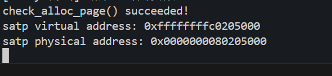

# lab2：物理内存和页表
## 练习1：理解first-fit 连续物理内存分配算法（思考题）
>first-fit 连续物理内存分配算法作为物理内存分配一个很基础的方法，需要同学们理解它的实现过程。请大家仔细阅读实验手册的教程并结合kern/mm/default_pmm.c中的相关代码，认真分析default_init，default_init_memmap，default_alloc_pages， default_free_pages等相关函数，并描述程序在进行物理内存分配的过程以及各个函数的作用。 请在实验报告中简要说明你的设计实现过程。请回答如下问题：你的first fit算法是否有进一步的改进空间？

first-fit连续物理内存分配算法：分配时从空闲块链表中找到第一个足够大的空闲块进行分配；释放时将释放的块重新加入空闲链表，并合并相邻空闲块。
### 函数实现分析
#### (1)default_init()
```c
static void
default_init(void) {
    list_init(&free_list);// 初始化双向链表
    nr_free = 0;// 空闲页计数器清零
}
```
该函数首先调用list_init函数来初始化一个空的双向链表free_list，然后定义了nr_free空闲块的个数定义为0。用于初始化存放空闲块的链表。
#### (2) default_init_memmap()
```c
static void
default_init_memmap(struct Page *base, size_t n) {
    assert(n > 0);//判定n大于0，如果为0不需要存放页面
    struct Page *p = base;
    for (; p != base + n; p ++) {
        assert(PageReserved(p));// 确保页面是保留状态
        p->flags = p->property = 0;// 初始化标志位和属性，之后页面可以被分配
        set_page_ref(p, 0);// 引用计数清零
    }
    base->property = n;// 设置第一页的块大小
    SetPageProperty(base); // 标记为有效空闲块
    nr_free += n;// 更新空闲页总数
    // 将空闲块插入链表（按地址升序）
    if (list_empty(&free_list)) {
        list_add(&free_list, &(base->page_link));
    } else {
        list_entry_t* le = &free_list;
        while ((le = list_next(le)) != &free_list) {
            struct Page* page = le2page(le, page_link);
            if (base < page) {//如果新页面起始地址小于当前遍历到的页面地址，说明找到正确插入位置
                list_add_before(le, &(base->page_link));
                break;
            } else if (list_next(le) == &free_list) {
                list_add(le, &(base->page_link));
            }
        }
    }
}
```
该函数初始化一段连续物理内存页，将其标记为空闲块并插入链表。
base是指向这段连续物理内存的起始页结构体；n需要初始化的连续物理页面的总数。首先判定n是否大于0，如果=0不需要存放页面；再遍历所有页，初始化标志位和引用计数；设置第一页的 property为块大小n，并标记为有效后按地址升序插入空闲链表。如果链表为空直接链入链表；否则遍历链表直到新页面起始地址小于当前遍历到的页面地址，说明找到正确插入位置，在该页面之前插入新的链表节点(list_add_before函数)；如果遍历完链表也没有找到这样的页面，则将新的链表节点添加到链表末尾 (list_add函数)。
```c
//libs/list.h
static inline void
list_add_before(list_entry_t *listelm, list_entry_t *elm) {
    __list_add(elm, listelm->prev, listelm);
}
static inline void
list_add(list_entry_t *listelm, list_entry_t *elm) {
    list_add_after(listelm, elm);
}
```
#### (3)default_alloc_pages()
```c
static struct Page *
default_alloc_pages(size_t n) {
    assert(n > 0);
    if (n > nr_free) {
        return NULL;// 检查是否有足够空闲页
    }
    struct Page *page = NULL;
    list_entry_t *le = &free_list;
    // 遍历链表，找到第一个大小 >=n 的块
    while ((le = list_next(le)) != &free_list) {
        struct Page *p = le2page(le, page_link);
        if (p->property >= n) {
            page = p;
            break;
        }
    }
    if (page != NULL) {//找到大小 >=n 的块
        list_entry_t* prev = list_prev(&(page->page_link));// 从链表中移除该块
        list_del(&(page->page_link));
        if (page->property > n) {
            // 分割剩余部分
            struct Page *p = page + n;
            p->property = page->property - n;
            SetPageProperty(p);
            list_add(prev, &(p->page_link));// 将剩余块重新插入链表
        }
        nr_free -= n;
        ClearPageProperty(page);// 清除分配页的有效标志
    }
    return page;
}
```
该函数用于分配n个连续的物理页。
首先检查是否有足够的空闲页（n <= nr_free）；然后遍历空闲链表，找到第一个大小 ≥ n的块；若找到的块大于需求，分割剩余部分并重新插入链表；最后更新空闲页计数，并返回分配的内存首地址。
#### (4)default_free_pages()
```c
static void
default_free_pages(struct Page *base, size_t n) {
    assert(n > 0);
    struct Page *p = base;
    for (; p != base + n; p ++) {
        assert(!PageReserved(p) && !PageProperty(p));//被释放的页不能是保留页，不能是已空闲页
        p->flags = 0;
        set_page_ref(p, 0);
    }
    base->property = n;
    SetPageProperty(base);
    nr_free += n;
    // 按地址升序插入链表
    if (list_empty(&free_list)) {
        list_add(&free_list, &(base->page_link));
    } else {
        list_entry_t* le = &free_list;
        while ((le = list_next(le)) != &free_list) {
            struct Page* page = le2page(le, page_link);
            if (base < page) {
                list_add_before(le, &(base->page_link));
                break;
            } else if (list_next(le) == &free_list) {
                list_add(le, &(base->page_link));
            }
        }
    }
    // 尝试合并低地址相邻块
    list_entry_t* le = list_prev(&(base->page_link));
    if (le != &free_list) {
        p = le2page(le, page_link);
        if (p + p->property == base) {
            p->property += base->property;
            ClearPageProperty(base);
            list_del(&(base->page_link));
            base = p;
        }
    }
    // 尝试合并高地址相邻块
    le = list_next(&(base->page_link));
    if (le != &free_list) {
        p = le2page(le, page_link);
        if (base + base->property == p) {
            base->property += p->property;
            ClearPageProperty(p);
            list_del(&(p->page_link));
        }
    }
}
```
该函数用于释放 n个连续的物理页，并尝试合并相邻空闲块。
首先初始化要释放的页并更新全局空闲页计数；再按地址升序插入空闲链表；检查前后相邻块是否连续，若连续则合并。
#### (5)其他函数
- **default_nr_free_pages()：** 返回当前系统中空闲物理页的总数，供测试函数验证内存管理的正确性。
- **basic_check()：** 基础测试函数，首先分配3个页面，验证分配成功且互不相同；临时清空空闲链表，验证此时无法分配新页面；释放之前分配的页面，验证空闲计数正确；重新分配页面，验证能获取到刚释放的页面。
- **default_check()：** 复杂测试函数，首先分配5个页面，然后释放其中3个页面，验证能否正确分配这3个页面；测试与相邻空闲块的合并功能；验证分配大块连续内存的能力；最终验证所有内存都被正确回收。
#### (6)结构体default_pmm_manager
default_pmm_manager是 First-Fit 内存管理器的接口实例，封装算法核心操作。这样内核其他模块只需调用 pmm_manager->alloc_pages()，而无需关心底层是 First-Fit 还是其他算法。
#### (7)工作流程总结（操作系统物理内存管理）
系统启动时首先通过 default_init 初始化内存管理器，通过 default_init_memmap 将可用内存加入管理；当需要内存时调用 default_alloc_pages 进行分配；当释放内存时调用 default_free_pages 回收内存并尝试合并；通过 default_check 等函数验证分配器的正确性。
### 改进空间
#### 使用更高效的数据结构
- 当前使用双向链表管理空闲块，查找时间复杂度为 O(n)。
- 可以使用平衡二叉搜索树或跳表，使查找时间复杂度降至 O(log n)。
#### 缓存最近分配的块
- 现在连续分配相似大小的块时，每次都要从头遍历链表。
- 可以记录上次分配的块地址，下次分配时优先检查其相邻空间。
#### 合并策略优化
- 现在仅在释放时合并相邻块，可能遗留小碎片。
- 可以定期全局合并，在内存碎片达到阈值时，主动扫描并合并所有空闲块。
#### 块分裂策略调整
- 当前直接按请求大小分割，可能产生无用的小块。
- 可以改为仅当剩余块大于某个阈值时才分裂，否则整块分配。
## 练习2
## 扩展练习Challenge：buddy system（伙伴系统）分配算法（需要编程）
>Buddy System算法把系统中的可用存储空间划分为存储块(Block)来进行管理, 每个存储块的大小必须是2的n次幂(Pow(2, n)), 即1, 2, 4, 8, 16, 32, 64, 128...参考伙伴分配器的一个极简实现， 在ucore中实现buddy system分配算法，要求有比较充分的测试用例说明实现的正确性，需要有设计文档。
### 伙伴系统分配算法
#### 分配内存
寻找大于等于所需大小并且最接近2的幂次的内存块。如果找到了，就分配给应用程序；如果没找到，一直对半分离出高于所需大小的空闲内存块，直到一个合适的块。
#### 释放内存
释放该内存块，并且寻找相邻的块，看其是否释放了。如果相邻块也释放了，合并这两个块，重复上述步骤直到遇上未释放的相邻块，或者达到最高上限（所有内存都释放了）。
### 设计文档
#### 1.数据结构
参考default_pmm.c定义如下结构体。
```c
typedef struct buddy_area {
    list_entry_t free_list; /* 链表头 */
    size_t nr_free;        /* 该阶数下的空闲页数 */
} buddy_area_t;

static buddy_area_t buddy_areas[MAX_ORDER];
```
其中buddy_areas数组管理不同大小的空闲块，每个元素对应一个特定阶数(2^k页)的空闲块链表；MAX_ORDER定义了支持的最大阶数。由于命令行输出的初始可用页数是31929，所以最大阶数也就14，对应块大小16384页，这里设置MAX_ORDER为15更保险。
#### 2.辅助函数
- **order_of(n)：** 计算满足2^k ≥ n的最小k值
- **page_index(p)：** 计算页面在全局pages数组中的索引
- **buddy_of(base, k)：** 查找阶数k的块的伙伴页。
```c
  static struct Page *buddy_of(struct Page *base, int k) {
    size_t idx = page_index(base);
    size_t block_size = 1UL << k; /* 页数 */
    size_t buddy_idx = idx ^ block_size;
    if (buddy_idx >= npage) return NULL;
    return &pages[buddy_idx];
}
```
伙伴是两个块大小相同（2^k页），且它们的起始地址在二进制表示中仅第 k位不同。
而x ^ (1<<k)会翻转 x的第 k位，因此采用异或定位伙伴，这样方便后续合并空闲块的操作。
#### 3.初始化函数
- **buddy_init()，buddy_init_memmap()：** 与default_pmm.c类似，首先初始化所有阶数的空闲链表和空闲页计数；初始化内存区域[base, base+n)并将内存分割为最大可能的2^k对齐块插入相应阶数的空闲链表，最后基于总页数计算实际使用的最大阶数buddy_max_order。
#### 4.分配函数
- 首先使用辅助函数order_of(n)计算最小满足阶数k
- 从阶数 k开始向上查找，直到找到第一个非空的空闲链表，即找到空闲块，因此j大于等于k；否则当所有阶数均无空闲块时返回 NULL
```c
  int j = k;
    while (j < MAX_ORDER) {
        if (!list_empty(&buddy_areas[j].free_list)) break;
        j++;
    }
    if (j >= MAX_ORDER) return NULL; /* 无可用块 */
```
- 从空闲链表 buddy_areas[j]中取出第一个块，使用le2page将链表节点转换为 struct Page指针。取出块后从链表中删除该块，然后更新空闲页计数，清除 PG_property标志即标记为已分配
```c 
list_entry_t *le = list_next(&buddy_areas[j].free_list);
    struct Page *p = le2page(le, page_link);
    list_del(&p->page_link);
    size_t block_size = 1UL << j;
    buddy_areas[j].nr_free -= block_size;
    ClearPageProperty(p);
```
- 当j大于k时，将大块分裂为两个 2^(j−1)的伙伴块。将前半部分（p）保留给当前分配请求，后半部分（half）作为空闲块插入阶数 j-1的链表
```c
  while (j > k) {
        j--;
        /* 后半部分成为阶数j的空闲块 */
        struct Page *half = p + (1UL << j);
        half->property = 1UL << j;
        SetPageProperty(half);
        list_add(&buddy_areas[j].free_list, &half->page_link);
        buddy_areas[j].nr_free += (1UL << j);
    }
```
#### 5.释放函数
- 首先规范释放大小为向上取整到2的幂的一个块
```c
 int k = order_of(n);
    size_t block_size = 1UL << k;
```
- 分段循环释放，处理非对齐的释放请求，其中cur_k是当前剩余部分的阶数估值
```c
  size_t off = 0;
    while (off < n) {
        /* 剩余大小 */
        size_t remaining = n - off;
        int cur_k = order_of(remaining);
        struct Page *cur = base + off;
        size_t gidx = page_index(cur);
   }
```
- 伙伴合并仅当伙伴块存在（buddy != NULL），伙伴块空闲（PageProperty(buddy)）和伙伴块大小匹配（buddy->property == (1 << pk)）。然后就从空闲链表移除伙伴块，选择地址较低的块作为新合并块的基址
```c
int pk = cur_k;
        while (pk + 1 < MAX_ORDER) {
            struct Page *buddy = buddy_of(blk, pk);
            if (buddy == NULL) break;
            if (!PageProperty(buddy) || buddy->property != (1UL << pk)) break;
            /* 伙伴空闲且大小相同：从空闲列表移除伙伴并合并 */
            list_del(&buddy->page_link);
            buddy_areas[pk].nr_free -= (1UL << pk);
            /* 清理旧的头部标志，确保只有合并后的新头保留PG_property */
            ClearPageProperty(buddy);
            ClearPageProperty(blk);
            /* 选择新的基址为min(blk, buddy) */
            if (buddy < blk) blk = buddy;
            pk++;
        }
```
- 插入合并后的大块
```c
  blk->property = 1UL << pk;
        SetPageProperty(blk);
        list_add(&buddy_areas[pk].free_list, &blk->page_link);
        buddy_areas[pk].nr_free += (1UL << pk);
        off += cur_size;
```
### 测试样例
#### 1.单页分配、释放测试
```c
cprintf("[Buddy 测试] 单页分配/释放测试开始\n");
    struct Page *p0 = alloc_page();
    struct Page *p1 = alloc_page();
    struct Page *p2 = alloc_page();
    assert(p0 && p1 && p2);
    assert(p0 != p1 && p0 != p2 && p1 != p2);
    cprintf("  分配到页索引: %lu, %lu, %lu\n", page_index(p0), page_index(p1), page_index(p2));
    assert(nr_free_pages() == initial_free - 3);
    free_page(p0);
    free_page(p1);
    free_page(p2);
    assert(nr_free_pages() == initial_free);
    cprintf("[Buddy 测试] 单页测试通过\n");
```
首先分配3个单页，alloc_page()分配1页物理内存，返回指向 struct Page的指针。但是实际调用的是buddy_alloc_pages(1)。伙伴算法会从阶0（1页块）的空闲链表中分配，得到的p0, p1, p2分别指向三个不同的物理页。之后使用assert检查分配是否成功和检查三个页的地址是否互不相同都通过了。最后释放完3个页后检查释放后所有空闲页数还是初始值，通过单页测试。输出如下：
```c
[Buddy 测试] 单页分配/释放测试开始
  分配到页索引: 838, 839, 840
[Buddy 测试] 单页测试通过
```
#### 2.多页分配、释放测试
```c
cprintf("[Buddy 测试] 多页分配/释放测试开始\n");
    struct Page *pa4 = alloc_pages(4);
    struct Page *pb2 = alloc_pages(2);
    assert(pa4 && pb2);
    cprintf("  分配 4 页起始页索引=%lu, 2 页起始页索引=%lu\n", page_index(pa4), page_index(pb2));
    assert(nr_free_pages() == initial_free - (4 + 2));
    free_pages(pa4, 4);
    free_pages(pb2, 2);
    assert(nr_free_pages() == initial_free);
    cprintf("[Buddy 测试] 多页测试通过\n");
```
首先分别分配了4页和2页，assert检测分配成功，并且验证成功现在的空闲页比初始少了6页，释放这些页后，空闲页数还是初始值，多页测试通过，输出如下：
```c
[Buddy 测试] 多页分配/释放测试开始
  分配 4 页起始页索引=840, 2 页起始页索引=838
[Buddy 测试] 多页测试通过
```
#### 3.分割与合并验证
```c
cprintf("[Buddy 测试] split/merge 测试开始\n");
    if (initial_free >= 8) {
        struct Page *p8 = alloc_pages(8);
        assert(p8 != NULL);
        cprintf("  分配 8 页起始页索引=%lu\n", page_index(p8));
        free_pages(p8, 8);

        struct Page *a = alloc_pages(4);
        struct Page *b = alloc_pages(4);
        assert(a && b && a != b);
        cprintf("  分配到两个 4 页块: %lu, %lu\n", page_index(a), page_index(b));
        free_pages(a, 4);
        free_pages(b, 4);
        struct Page *p8b = alloc_pages(8);
        assert(p8b != NULL);
        cprintf("  合并后再次分配 8 页起始页索引=%lu\n", page_index(p8b));
        free_pages(p8b, 8);
        assert(nr_free_pages() == initial_free);
    }
    cprintf("[Buddy 测试] split/merge 测试通过\n");
```
由于之前打印不同阶的空闲页数，阶2和阶3的输出如下：
```c
[Buddy] 阶 2 (块大小 4 页) — nr_free(页数) = 0
[Buddy] 阶 3 (块大小 8 页) — nr_free(页数) = 8
```
因此测试分配两个4页块，而阶2没有空闲块，伙伴算法会从阶3分裂一个8页块成4页块。
这是测试前的阶2、阶3：


这是分配后的阶2、阶3：


之后合并4页块，若合并成功，alloc_pages(8)应能从阶3链表中分配到一个8页块。如下输出，8页块起始页索引一样，因此合并成功。
```c
[Buddy 测试] split/merge 测试开始
  分配 8 页起始页索引=840
  分配到两个4页块: 840, 844
  合并后再次分配 8 页起始页索引=840
[Buddy 测试] split/merge 测试通过
```
最终测试全部通过。



## 扩展练习Challenge：任意大小的内存单元slub分配算法（需要编程）
>slub算法，实现两层架构的高效内存单元分配，第一层是基于页大小的内存分配，第二层是在第一层基础上实现基于任意大小的内存分配。可简化实现，能够体现其主体思想即可。
- 参考[linux的slub分配算法](linux/mm/slub.c at master · torvalds/linux)，在ucore中实现slub分配算法。要求有比较充分的测试用例说明实现的正确性，需要有设计文档。
### 设计文档
#### slub分配算法的主体思想
Buddy System以页（4KB）为单位进行内存的管理，当我们想要申请的内存比较小时，Buddy System还是会给我们提供至少4KB的内存，这样就造成了内存的浪费。为了补充和解决Buddy System的缺陷，提出了`slub`算法。

slub算法主要实现两层架构的高效内存单元分配，第一层基于页大小的内存分配，调用我们实现的`best_fit`,`defult_fit`,`buddy_system`接口即可；第二层是在第一层基础上实现基于任意大小的内存分配。

SLUB的核心思想是：将物理内存按页（page）为单位划分为多个`slab`，每个`slab`中又被切分成若干个大小相同的` object`（对象），每种大小的对象由一个独立的 `kmem_cache` 管理。
,
在SLUB中，每个slab都处于以下三种状态之一：
- FULL：slab 中的所有对象（object）都已被分配，没有空闲单元；
- Parital:slab 中部分对象被分配，部分仍空闲;
- Free: slab 中所有对象都空闲，没有任何被占用的单元。

分配内存的过程：

1. **选择`kmem_cache`**:根据要分配对象的大小，找到对应的`kmem_cache`;
2. **选择`slab`**:优先使用`partial`的slab,其次是`free`的slab,如果没有，则用`Buddy System`创建一个新的slab(一个slab的大小为4KB)；
3. **分配`object`**:从slab的freelist中取出一个空闲对象；
4. **更新`slab`**:如果slab被分配满，标记为full,否则保持partial;
5. **返回对象地址**：将对象地址返回给调用者。

内存释放的过程：

1. **找到对象所属的 slab**：通过对象地址计算出它属于哪个 slab。
2. **加入 freelist**：将对象放回 slab 的空闲链表（freelist）。
3. **更新 slab 状态**：

   * 如果 slab 之前是 full，现在有空闲对象了，状态改为 partial。
   * 如果 slab 所有对象都被释放，状态改为free，可能被回收给页分配器。
4. **更新 kmem_cache**：保持 partial slab 链表和 full/free slab 链表的正确管理。 
#### 主要的数据结构
1. **`kmem_cache`**
`kmem_cache`表示一种大小的obj的缓冲池，管理三种状态的slab,每种slab用单向链表连接。
```c
struct slab {
    unsigned int inuse;        // 已分配对象数
    unsigned int total;        // 对象总数
    void *freelist;            // 空闲对象链表头
    uint8_t *bitmap;           // 位图起始地址
    void *obj_base;            // 对象区起始地址
    struct slab *next;         // 下一个 slab
};
```
2. **`slab`**
```c
struct slab {
    unsigned int inuse;        // 已分配对象数
    unsigned int total;        // 对象总数
    void *freelist;            // 空闲对象链表头
    uint8_t *bitmap;           // 位图起始地址
    void *obj_base;            // 对象区起始地址
    struct slab *next;         // 下一个 slab
};
```
3. **全局缓存表（`kmem_cache`数组）**
```c
#define CACHE_NUM (MAX_OBJ_SHIFT - MIN_OBJ_SHIFT + 1)
static struct kmem_cache caches[CACHE_NUM];
```
#### slab页的内存布局
在真正编写slub代码时，我们会遇到为slab结构体分配内存空间的问题，开始时我们的想法是将slab结构体单独放置到一个page中，其管理的obj放到一个page中，以使一个page中存放尽可能多的obj,但这样会造成跨页访问，slab回收实现起来也比较困难；经过对现代Linux操作系统slab存储方式的调研，发现其一般将slab结构体和obj放到一页上，将所有的信息集中，便于管理，也解决了上面遇到的问题，于是我们也采取了这样的方式。为了快速判断obj和slab的状态,我们也添加了`bitmap`,用来标识obj是否被占用。

目前我们每一个slab页的结构如下所示：
```diff
+----------------------------+
| struct slab                |  ← 管理元数据（inuse, freelist, ...）
+----------------------------+
| bitmap[]                   |  ← 每个对象对应 1 bit
+----------------------------+
|  对象区(obj_base)          |
|   [Obj0][Obj1][Obj2]...    |  ← 实际分配给用户的对象
+----------------------------+
| 空余空间（对齐填充）         |
+----------------------------+
```

---

#### 主要函数设计

---

### 1. `slab_create(struct kmem_cache *cache)`

**作用**：
创建一个新的 slab，占一页内存，在页内初始化 slab 元数据、bitmap 和对象链表。

**内部逻辑**：

1. 分配一页物理内存并转换为虚拟地址，作为 slab 起始。
2. 初始化 slab 元数据：

   * `inuse = 0`，`next = NULL`
   * bitmap 紧跟在 slab 元数据后，全部清 0
   * 计算可存放对象数 `obj_num` 和 bitmap 大小：

     ```c
     int obj_num = (SLAB_PAGE_SIZE - sizeof(struct slab) - bitmap_bytes) / obj_size;
     ```
3. 对象区起始地址 `obj_base = bitmap + bitmap_bytes`，构建 freelist 链表。

---

### 2. `slub_init(void)`

**作用**：
初始化 SLUB 系统，为每个对象大小创建 kmem_cache 并初始化 slab 链表。

**内部逻辑**：

* 遍历 `caches` 数组，设置每个缓存的对象大小，并将 `slabs_free`、`slabs_partial`、`slabs_full` 链表置为空。

---

### 3. `slub_alloc(size_t size)`

**作用**：
为指定大小的对象分配内存，更新 slab 的 freelist 和 bitmap，并维护 slab 状态链表。

**内部逻辑**：

1. 获取对应 kmem_cache。
2. 从 `slabs_partial` 链表分配对象；若无可用 slab，则从 `slabs_free` 获取或新建 slab：

   ```c
   struct slab *sl = cache->slabs_partial;
   if (!sl) {
       if (!cache->slabs_free) {
           struct slab *newsl = slab_create(cache);
           newsl->next = cache->slabs_free;
           cache->slabs_free = newsl;
       }
       sl = cache->slabs_free;
       cache->slabs_free = sl->next;
       sl->next = cache->slabs_partial;
       cache->slabs_partial = sl;
   }
   ```
3. 从 slab 的 freelist 取对象，并更新 bitmap：

   ```c
   sl->freelist = *(void **)obj;
   sl->inuse++;
   sl->bitmap[idx_bit / 8] |= (1 << (idx_bit % 8));
   ```
4. slab 满时，将其从 `slabs_partial` 移到 `slabs_full` 链表。

---

### 4. `slub_free(void *objp, size_t size)`

**作用**：
回收对象，将其插入 slab freelist，清除 bitmap，并根据 slab 使用状态更新链表或释放整页内存。

**内部逻辑**：

1. 通过对象地址计算 slab 起始页：

   ```c
   struct slab *sl = (struct slab *)((uintptr_t)objp & ~(SLAB_PAGE_SIZE - 1));
   ```
2. 将对象插回 freelist，并清除 bitmap 位：

   ```c
   *(void **)objp = sl->freelist;
   sl->freelist = objp;
   sl->inuse--;
   sl->bitmap[idx_bit / 8] &= ~(1 << (idx_bit % 8));
   ```
3. slab 状态管理：

   * 若 slab 从 full 变为 partial，将其移动到 `slabs_partial` 链表
   * 若 slab 全空，将其从 `slabs_partial` 移除，并释放整页内存

---
#### 正确性测试
- 测试对象
   - 对象大小：8B ~ 2048B（2^3 ~ 2^11），对应系统 SLUB 支持的缓存大小。

   - 每种大小分配固定数量的对象，保证多页 slab 的场景。

   - 使用二维数组 objs[size_index][obj_index] 管理不同大小的对象，方便阶段性释放和复用测试。

- 测试场景

   我们模拟了6种在实际应用中的场景，对应代码中的六个阶段：

   | 阶段 | 功能       | 关键逻辑                                       |
   | -- | -------- | ------------------------------------------ |
   | 1  | 分配不同大小对象 | 为每种大小分配 TEST_OBJ_NUM / num_sizes 对象，写入特定数据 |
   | 2  | 部分释放     | 每种大小释放一半对象，检查 slab 是否从 full 变为 partial     |
   | 3  | 对象复用     | 再次分配部分对象，验证空闲 slab 是否复用                    |
   | 4  | 全部释放     | 释放所有对象，验证 slab 全空是否释放整页                    |
   | 5  | 超大对象分配   | 尝试分配超过最大对象大小，期望返回 NULL                     |
   | 6  | NULL 释放  | 调用 slub_free(NULL, size)，验证安全性             |

- 测试要点
   - 使用 cprintf 打印阶段信息，便于观察运行结果。
   - 通过 memset 写入不同的模式数据，检测对象有效性。
   - 每个阶段结束后打印阶段完成信息，方便阶段划分。
   - 二维数组管理不同大小对象，方便在阶段2和阶段4进行批量释放。
- 测试代码的运行方法

我们的测试代码为`/kern/mm/slub_test.c`文件，运行测试代码时，在`init.c`文件中导入外部函数
```c
extern void slub_test(void);
```
然后在`while(1);`前添加一行`slub_test();`,运行`make qemu`时便可看到测试函数打印出来的信息。
## 扩展练习Challenge：硬件的可用物理内存范围的获取方法（思考题）
> 如果 OS 无法提前知道当前硬件的可用物理内存范围，请问你有何办法让 OS 获取可用物理内存范围？
- **手工探测物理内存** 我们可以借鉴一下在没有SPD时，CPU探测内存条的相关信息的办法。向一块连续的区域上写入0x55，然后读取这一片区域的数据判断是否与写入的数据一致，然后再向这一片区域内写入0xAA,然后同样读取这片区域的数据判断是否和写入的一致，如果两次数据都一致，说明这块区域中的0和1是可以被程序员操纵的，大概率是一块内存。操作系统经过大范围这样的扫描，可以得到可用物理内存范围（但不一定百分百准确）。
- **DMA探测物理内存** DMA为直接内存访问。操作系统可以为`DMA`设备分配一个缓冲区（可以用OS内核本身已占用的安全页面）来传输数据。向`DMA`设备发送命令，让它读取某个物理地址范围的数据到缓冲区。如果 `DMA`访问成功并返回正确数据，则说明该物理地址存在可用内存。如果`DMA`访问失败，则说明该区域不可用。通过这种方式可以 扫描整个地址空间，得到一个大概的可用物理内存范围。

（但如果应用到实际，两种方法都存在安全风险：可能破坏原有内存数据或硬件寄存器，导致系统崩溃或设备异常。）
## 实验中重要知识点
1.> 操作系统是怎样知道当前硬件的可用内存物理范围的？

- 在RISC-V中，由**OpenSBI**来完成。OpenSBI完成对于包括物理内存在内的各外设的扫描，将扫描结果以**DTB**的格式保存在物理内存中的某个地方，随后OpenSBI会将其地址保存在`a1`寄存器中。在操作系统的内核代码中，会从`a1`寄存器中读取设备树数据的存储地址，并将设备树数据读取出来，保存到全局变量`boot_dtb`中，后续利用`dtb_init`函数来读取设备树结构中存储的相关信息。

2.>struct Page
- 实验中用struct Page的字段来管理内存状态，对应OS原理中的物理页帧抽象。但是在实验中因实现First-Fit和伙伴系统等物理内存分配算法，需要额外字段记录连续空闲块大小；而原理可能不强调连续分配，比如默认以单页为单位等。
## 实验未涉及知识点

