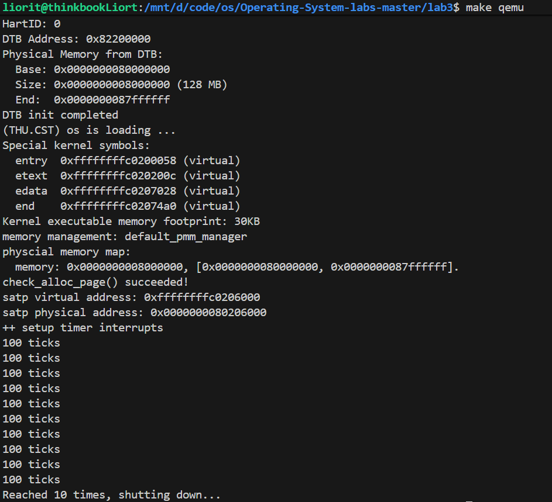
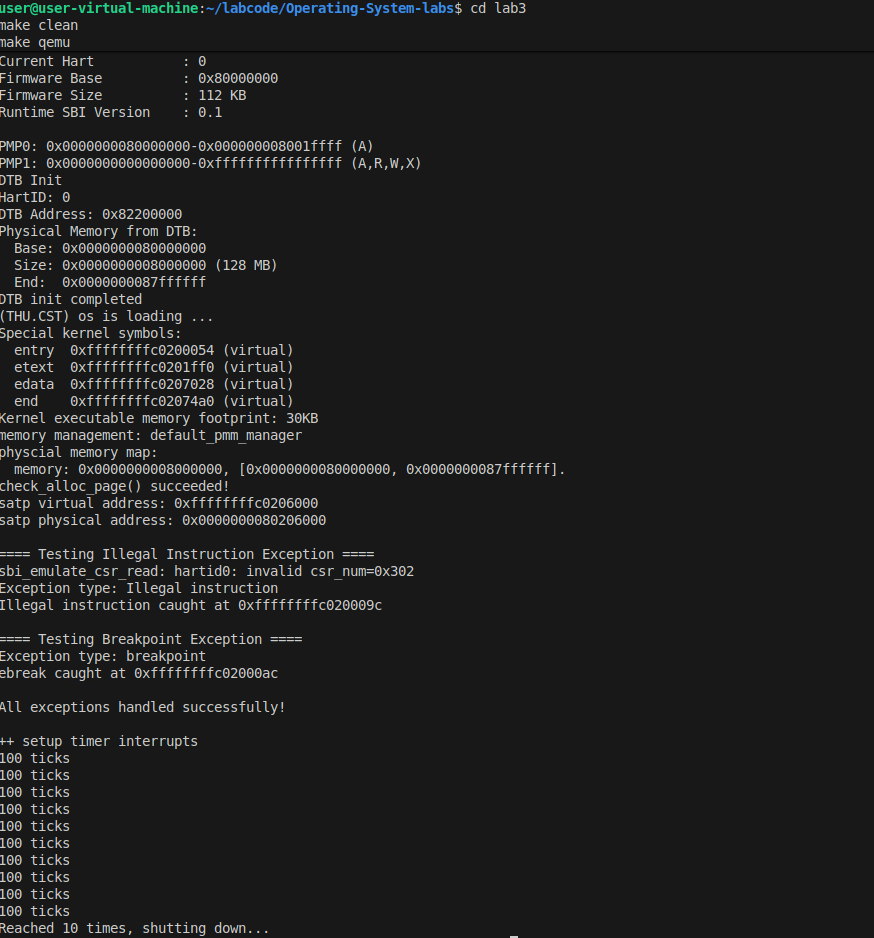

# LAB3-中断与中断处理流程
## 实验目的
- riscv 的中断相关知识
- 中断前后如何进行上下文环境的保存与恢复
- 处理最简单的断点中断和时钟中断
## 练习1:完善中断处理（需要编程）
> 请编程完善trap.c中的中断处理函数trap，在对时钟中断进行处理的部分填写kern/trap/trap.c函数中处理时钟中断的部分，使操作系统每遇到100次时钟中断后，调用print_ticks子程序，向屏幕上打印一行文字”100 ticks”，在打印完10行后调用sbi.h中的shut_down()函数关机。\
要求完成问题1提出的相关函数实现，提交改进后的源代码包（可以编译执行），并在实验报告中简要说明实现过程和定时器中断中断处理的流程。实现要求的部分代码后，运行整个系统，大约每1秒会输出一次”100 ticks”，输出10行。

- 中断处理主流程
1. 在 trapentry.S 的 __alltraps 中通过 SAVE_ALL 宏将所有寄存器保存到 trapframe
2.  调用 trap.c 中的 trap() 函数
3. trap() 调用 trap_dispatch()，根据中断类型分发给 interrupt_handler()
4. interrupt_handler() 识别出是 IRQ_S_TIMER 类型中断，执行时钟中断处理逻辑
5. 处理完毕后，通过 __trapret 恢复寄存器并返回原程序执行

- 具体实现
1. 完善处理时钟中断的部分。调用 clock_set_next_event() 设置下一次时钟中断，设置ticks 计数器自增。
2. 判断ticks是否达到100的倍数。如果是，调用 print_ticks() 打印信息，num 计数器增加，随后判断 num 是否达到10，如果是就调用 sbi_shutdown() 关机

- 运行结果

  如图，运行整个系统，大约每1秒会输出一次”100 ticks”，输出10行。

## 扩展练习 Challenge1：描述与理解中断流程
>回答：描述ucore中处理中断异常的流程（从异常的产生开始），其中mov a0，sp的目的是什么？SAVE_ALL中寄存器保存在栈中的位置是什么确定的？对于任何中断，__alltraps 中都需要保存所有寄存器吗？请说明理由。
- ucore中处理中断异常的流程：

  1. 当发生中断/异常时，首先在`init.c`中调用`idt_init()`函数，修改`sstatus`,进入S模式；跳转到中断向量表`stvec`所指向的入口`__alltraps`;
  2. 进入到`trapentry.S`的`__alltraps`汇编入口后，首先执行`SAVE_ALL`宏，首先为`trapframe`腾出内存空间，然后保存所有的通用寄存器和关键CSR，构造出`trapframe`结构，存放到栈中；最后将构造好的`trapframe`地址`sp`传给`trap()`函数；
  3. 在`trap.c`函数中，首先根据`tf->cause`的小于零的情况，判断是中断还是异常；然后根据`tf->cause`的具体值判断具体属于中断/异常的哪种情况并做相应的处理；
  4. 执行完`trap()`函数之后，返回`trapentry.S`汇编层的`__trapret`，执行`RESTORE_ALL`宏，从内核栈恢复所有寄存器，恢复`sstatus`和`sepc`;执行`sret`指令，使用`sepc`恢复原PC值，返回到原特权级，继续执行被中断的程序。
- 在RISC-V的调用约定中，`a0`是第一个函数参数寄存器，这里的
    ```asm
    move a0, sp
    jal trap
    ```
    表示当前栈指针`sp`传给`trap`函数，即`trap(sp)`，把中断/异常的上下文传递给`trap()`,从而让中断/异常处理函数能访问被保存的寄存器上下文。在这里`sp`指向的是一个`trapframe`结构体。
    ```asm
    struct trapframe {
        struct pushregs gpr;
        uintptr_t status;
        uintptr_t epc;
        uintptr_t badvaddr;
        uintptr_t cause;
    };
    ```
    通过`SAVE_ALL`函数，`sp`指向的结构体中已经保存了发生中断/异常时，所有寄存器的状态。
- 在我们目前uCore的实现中，`SAVE_ALL`中寄存器的在栈中保存的位置是在`trapentry.S`中确定的。
    ```asm
    addi sp, sp, -36 * REGBYTES
    STORE x0,  0*REGBYTES(sp)
    STORE x1,  1*REGBYTES(sp)
    ...
    STORE x31, 31*REGBYTES(sp)

    STORE s1,  32*REGBYTES(sp)
    STORE s2,  33*REGBYTES(sp)
    STORE s3,  34*REGBYTES(sp)
    STORE s4,  35*REGBYTES(sp)
    ```
    可以看到，在`SAVE_ALL`的开始，首先开辟了`36*REGBYTES`大小的内存区域用来保存36个寄存器（包括特殊寄存器）；接着寄存器按照顺序，从栈顶开始，按照地址由低到高进行保存；所以，每个寄存器的保存位置是由**保存顺序+固定偏移规则**确定的，每个寄存器占`REGBYTES`个字节。
- 严格来说，`__alltraps`不一定必须保存所有寄存器，但在当前的uCore实现中，保存所有寄存器是最安全最简单的实现方式。
    - 保存全部寄存器的优点：
       - 中断可能发生在任何时刻，无论正在执行什么指令、使用哪些寄存器，中断随时可能触发。如果只保存部分寄存器，就可能破坏被中断的程序状态。
       - 保存所有寄存器可以方便统一处理逻辑。所有陷入中断/异常/系统调用都通过同一个入口` __alltraps`。这样可以用统一的`trapframe`结构，不需要区分不同来源。
       - 当系统 panic 或打印异常时，可以完整地打印寄存器内容。方便调试和异常恢复。
    - 在进入中断/异常时，保存所有的寄存器意味着所耗费的栈帧大，内存存取的开销大，导致每次中断的延迟也比较高，所以在高性能内核或者嵌入式系统中会进行优化，只保存必要的寄存器子集。

    如果操作系统与用户程序达成协议(如ABI)，在进行中断/异常处理的时候，操作系统只可能对一部分寄存器（如 Linux RISC-V中的Caller-saved和部分CSR）进行修改，而不会对剩余寄存器进行修改，那么在进行中断/异常处理前，仅保存寄存器自己即可。

    当然，从理论上讲，不同中断所要修改的寄存器不同且提前已知，我们可以先保存少量寄存器，然后用这些少量的寄存器判断中断的类型，从而有选择性的保存更多的寄存器，但这与我们目前代码的逻辑就不太相同了，实现起来也更为复杂。如果按照当前先保存寄存器后判断中断类型的逻辑来说，任何中断都必须保存全部的寄存器，因为提前根本无法判断哪些寄存器会被修改。
## 扩展练习 Challenge2：理解上下文切换机制
>回答：在trapentry.S中汇编代码 csrw sscratch, sp；csrrw s0, sscratch, x0实现了什么操作，目的是什么？save all里面保存了stval scause这些csr，而在restore all里面却不还原它们？那这样store的意义何在呢？

### 问题分析

#### 1. `csrw sscratch, sp; csrrw s0, sscratch, x0` 的操作与目的

这两条指令实现了**sp寄存器的交换操作**:

```asm
csrw sscratch, sp      # 将当前sp保存到sscratch CSR中
csrrw s0, sscratch, x0 # 将sscratch的值读入s0,同时将x0(值为0)写入sscratch
```

**操作过程:**
1. 第一条指令将当前的栈指针sp保存到sscratch寄存器
2. 第二条指令将sscratch的值(即原来的sp)读入s0寄存器,同时清空sscratch

**目的:**
- **区分内核态和用户态**: sscratch寄存器用于保存用户态的栈指针或内核态的trapframe地址
- **快速切换栈指针**: 在陷入中断时,需要快速从用户栈切换到内核栈
- **保存上下文信息**: 将用户态的sp保存起来,以便后续恢复

在RISC-V的设计中,sscratch是专门用于在特权级切换时保存关键信息的"暂存器"。

#### 2. SAVE_ALL保存但RESTORE_ALL不还原stval/scause的原因

**为什么要保存stval和scause?**
- **stval (Supervisor Trap Value)**: 保存导致异常的地址或指令
- **scause (Supervisor Cause)**: 保存异常/中断的原因代码

这些CSR在中断处理过程中需要被读取,以判断异常类型和位置。保存它们的意义在于:

1. **传递给C语言处理函数**: trap.c中的`trap()`函数需要这些信息来判断如何处理异常
2. **保持trapframe结构完整**: trapframe结构需要记录完整的中断现场
3. **调试和日志记录**: 便于输出异常信息

**为什么不需要还原?**

关键原因是:**这些CSR是硬件自动设置的,不需要软件还原**

- 当下一次异常/中断发生时,硬件会自动更新这些CSR
- 它们是**只读(从软件角度)或硬件管理**的状态信息
- 还原它们没有意义,因为它们反映的是"当前异常"的信息,而不是需要恢复的进程状态

相比之下,通用寄存器(x0-x31)、sepc(返回地址)、sstatus(状态寄存器)等需要还原,因为它们是程序执行状态的一部分。

### 代码实现位置

相关代码在`kern/trap/trapentry.S`中:

```asm
__alltraps:
    SAVE_ALL  # 保存所有寄存器和CSR
    
    move a0, sp
    jal trap  # 调用C语言处理函数
    
__trapret:
    RESTORE_ALL  # 只还原需要还原的寄存器
    sret
```


## 扩展练习Challenge3：完善异常中断(需要编程)
>编程完善在触发一条非法指令异常 mret和，在 kern/trap/trap.c的异常处理函数中捕获，并对其进行处理，简单输出异常类型和异常指令触发地址，即“Illegal instruction caught at 0x(地址)”，“ebreak caught at 0x（地址）”与“Exception type:Illegal instruction"，“Exception type: breakpoint”。

### 实现思路

需要在`kern/trap/trap.c`中添加对非法指令异常和断点异常的处理:

1. **非法指令异常**: CAUSE_ILLEGAL_INSTRUCTION (2)
2. **断点异常**: CAUSE_BREAKPOINT (3)

### 代码实现

#### 1. 修改 trap.c 添加异常处理

在`trap_dispatch()`函数中添加异常处理分支:

```c
void trap_dispatch(struct trapframe *tf) {
    if ((intptr_t)tf->cause < 0) {
        // 中断处理
        interrupt_handler(tf);
    } else {
        // 异常处理
        exception_handler(tf);
    }
}

static void exception_handler(struct trapframe *tf) {
    switch (tf->cause) {
        case CAUSE_ILLEGAL_INSTRUCTION:
            cprintf("Exception type: Illegal instruction\n");
            cprintf("Illegal instruction caught at 0x%016llx\n", tf->epc);
            // 跳过非法指令,继续执行(epc += 4)
            tf->epc += 4;
            break;
            
        case CAUSE_BREAKPOINT:
            cprintf("Exception type: breakpoint\n");
            cprintf("ebreak caught at 0x%016llx\n", tf->epc);
            // 跳过ebreak指令
            tf->epc += 2;  // ebreak是2字节的压缩指令
            break;
            
        default:
            print_trapframe(tf);
            break;
    }
}
```

#### 2. 添加测试代码触发异常

在`kern/init/init.c`的`kern_init()`函数中添加测试:

```c
int kern_init(void) {
    extern char edata[], end[];
    memset(edata, 0, end - edata);
    
    cons_init();
    const char *message = "(THU.CST) os is loading ...\n";
    cprintf("%s\n\n", message);
    
    print_kerninfo();
    
    idt_init();
    
    // 测试非法指令异常
    cprintf("\n==== Testing Illegal Instruction ====\n");
    __asm__ __volatile__("mret");  // mret在S模式下是非法指令
    
    // 测试断点异常
    cprintf("\n==== Testing Breakpoint ====\n");
    __asm__ __volatile__("ebreak");
    
    cprintf("\nAll exceptions handled successfully!\n\n");
    
    clock_init();
    intr_enable();
    
    while (1)
        ;
}
```

### 运行结果


### 关键技术点说明

#### 1. 异常类型判断
```c
// cause的最高位表示是中断(1)还是异常(0)
if ((intptr_t)tf->cause < 0) {
    // 中断
} else {
    // 异常
}
```

#### 2. 异常码定义
根据RISC-V规范:
- `CAUSE_ILLEGAL_INSTRUCTION = 2`: 非法指令
- `CAUSE_BREAKPOINT = 3`: 断点异常

#### 3. EPC调整

**为什么需要调整EPC?**
- 异常处理完后,如果不调整epc,会重复执行导致异常的指令
- 对于非法指令,通常跳过该指令(+4字节)
- 对于ebreak,如果是调试用途可能需要停止,这里选择跳过(+2字节)

**指令长度:**
- 标准RISC-V指令: 4字节
- 压缩指令(如ebreak): 2字节

---


## 实验涉及的知识点

1. **异常与中断的基本概念**  
   异常（Exception）是 CPU 执行指令时出现的错误或特殊情况，如页错误、非法指令或系统调用，它是同步触发的事件，通常不可屏蔽。而中断（Interrupt）由外部硬件设备触发，如时钟溢出或外设完成，属于异步事件，可以通过中断使能位进行屏蔽。两者的主要区别在于触发方式和可屏蔽性：异常同步、不可屏蔽；中断异步、可屏蔽。

2. **特权级与陷入机制**  
   现代 CPU（以 RISC-V 为例）具有多级特权级：M（Machine）模式为硬件最高权限，S（Supervisor）模式为内核，U（User）模式为用户程序。中断或异常发生时，CPU 自动将当前 PC 保存到 `sepc`，将事件原因写入 `scause`，异常相关地址保存到 `stval`（如缺页地址），并切换到高特权级执行内核 trap handler。这一机制保证了用户程序被安全隔离，同时允许内核接管处理事件。

3. **内核中断处理流程**  
   当中断或异常发生时，操作系统内核会接管 CPU 执行权以响应事件。整个处理流程包括以下几个阶段：  
   - **硬件触发与上下文保存**：CPU 检测到中断或异常，自动保存关键状态信息（如程序计数器、状态寄存器等），并切换到内核特权级。  
   - **事件分发**：内核根据中断向量表，判断中断或异常类型，并将事件分发到对应的处理程序。例如，时钟中断驱动调度和时间片管理，外设中断驱动设备数据处理，系统调用触发内核服务。  
   - **中断处理与内核服务执行**：处理程序完成必要的操作，包括更新系统状态、唤醒阻塞进程、执行调度或处理设备数据等。  
   - **上下文恢复与返回用户态**：处理完成后，内核恢复被中断程序的上下文，允许 CPU 返回到原来的特权级和程序执行点，继续执行被中断的任务。  

