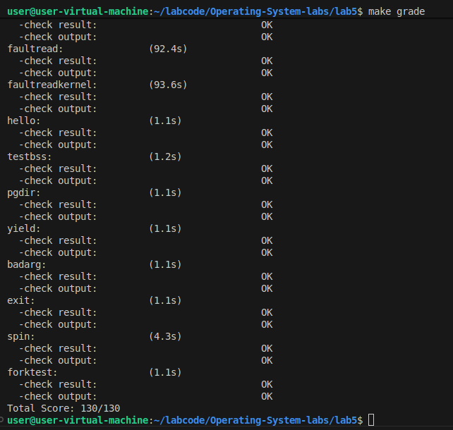
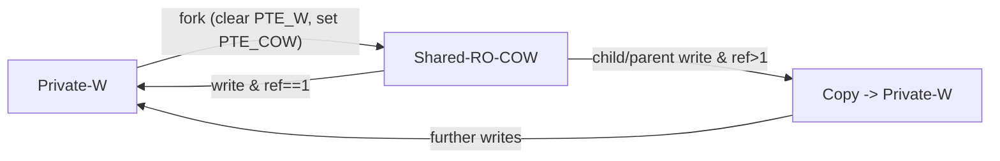
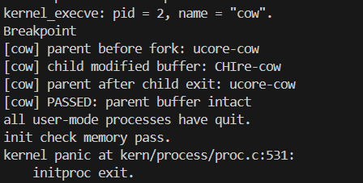
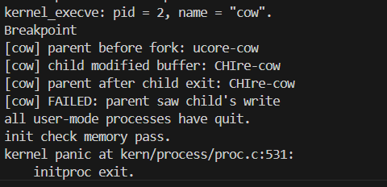
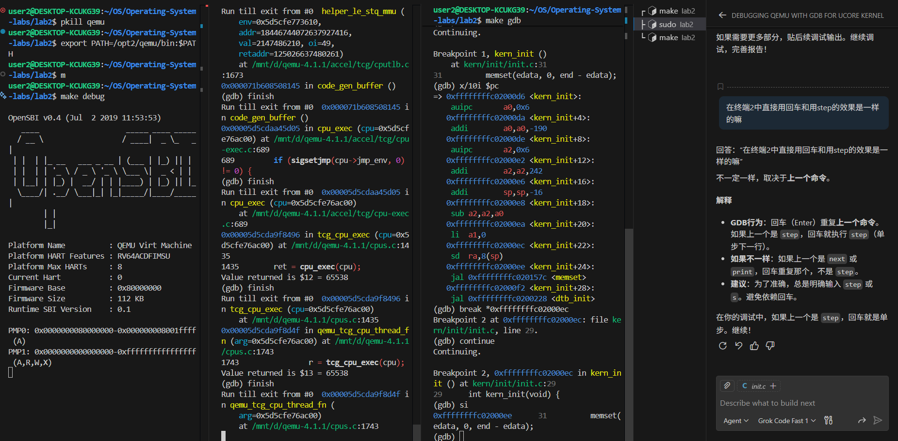
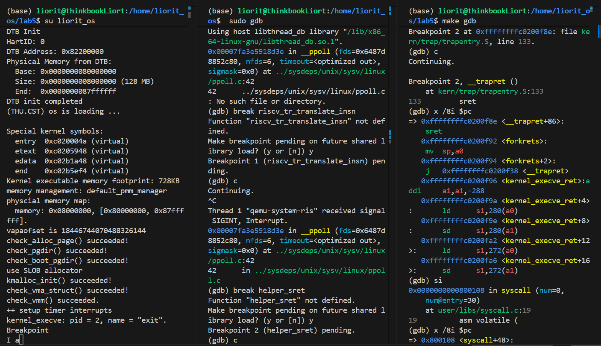

# LAB5——用户程序
## 练习0：填写已有实验
>本实验依赖实验2/3/4。请把你做的实验2/3/4的代码填入本实验中代码中有“LAB2”/“LAB3”/“LAB4”的注释相应部分。注意：为了能够正确执行lab5的测试应用程序，可能需对已完成的实验2/3/4的代码进行进一步改进。
### 更新`alloc_page()`函数
```c
static struct proc_struct *
alloc_proc(void)
{
    struct proc_struct *proc = kmalloc(sizeof(struct proc_struct));
    if (proc != NULL)
    {
        proc->state = PROC_UNINIT;          // 进程状态：未初始化
        proc->pid = -1;                      // 进程ID：未分配
        proc->runs = 0;                      // 运行次数：0
        proc->kstack = 0;                     // 内核栈地址：未分配
        proc->need_resched = 0;              // 不需要重新调度
        proc->parent = NULL;                  // 父进程指针：无
        proc->mm = NULL;                      // 内存管理结构：内核线程不需要
        memset(&(proc->context), 0, sizeof(struct context)); // 上下文清零
        proc->tf = NULL;                      // 陷阱帧指针：未设置
        proc->pgdir = boot_pgdir_pa;                  // 页目录基址：未分配//change!!!
        proc->flags = 0;                      // 进程标志：0
        memset(proc->name, 0, PROC_NAME_LEN + 1); // 进程名清零

        // LAB5 YOUR CODE : (update LAB4 steps)
        proc->wait_state = 0;  //当前进程不在任何等待状态
        proc->cptr = NULL;     //当前进程还没有子进程
        proc->optr = NULL;     //当前进程还没有更年轻的子进程
        proc->yptr = NULL;     //当前进程还没有更年长的兄弟进程
    }
    return proc;
}
```
在已有的函数上，添加`wait_state`，`*cptr`，`*yptr`，`*optr`的初始化操作，代码如上所示。
### 更新`do_fork()`函数
```c
int do_fork(uint32_t clone_flags, uintptr_t stack, struct trapframe *tf)
{
    int ret = -E_NO_FREE_PROC;
    struct proc_struct *proc;
    if (nr_process >= MAX_PROCESS)
    {
        goto fork_out;
    }
    ret = -E_NO_MEM;
    proc = alloc_proc();
    if (proc == NULL) {
        goto fork_out;
    }
    proc->parent = current;
    assert(current->wait_state==0);
    if (setup_kstack(proc) != 0) {
        goto bad_fork_cleanup_proc;
    }
    if (copy_mm(clone_flags, proc) != 0) {
        goto bad_fork_cleanup_kstack;
    }
    
    proc->pid = get_pid();
    copy_thread(proc, stack, tf);

    hash_proc(proc);
    set_links(proc);
    wakeup_proc(proc);

    ret = proc->pid;
    
    // LAB5 YOUR CODE : (update LAB4 steps)
    // TIPS: you should modify your written code in lab4(step1 and step5), not add more code.
    /* Some Functions
     *    set_links:  set the relation links of process.  ALSO SEE: remove_links:  lean the relation links of process
     *    -------------------
     *    update step 1: set child proc's parent to current process, make sure current process's wait_state is 0
     *    update step 5: insert proc_struct into hash_list && proc_list, set the relation links of process
     */

fork_out:
    return ret;

bad_fork_cleanup_kstack:
    put_kstack(proc);
bad_fork_cleanup_proc:
    kfree(proc);
    goto fork_out;
}

```
在 `do_fork` 中，更新对新创建进程 `proc` 的 **状态和父子关系信息进行初始化和关联** 的操作，主要包括：

1. **设置父进程指针**：将 `proc->parent` 指向当前进程，保证新进程知道自己的父进程是谁。
2. **检查父进程状态**：通过 `assert(current->wait_state == 0)` 确保父进程在 fork 时未处于等待状态，从而避免进程调度冲突。
3. **插入全局数据结构**：将新进程加入哈希表（用于 PID 查找）和全局进程链表（用于系统遍历所有进程）。
4. **建立父子链表关系**：调用 `set_links(proc)`，将新进程插入父进程的子进程链表，并维护兄弟进程的指针（`cptr/yptr/optr`），保证父子关系链完整。

## 练习一：加载应用程序并执行（需要编码）
>**`do_execve`**函数调用`load_icode`（位于kern/process/proc.c中）来加载并解析一个处于内存中的ELF执行文件格式的应用程序。你需要补充`load_icode`的第6步，设置好`proc_struct`结构中的成员变量`trapframe`的内容，确保在执行此进程后，能够从应用程序设定的起始执行地址开始执行。需设置正确的trapframe内容。
>
>请在实验报告中简要说明你的设计实现过程。
>
> - 请简要描述这个用户态进程被ucore选择占用CPU执行（RUNNING态）到具体执行应用程序第一条指令的整个经过。

在第6步中设置了trapframe的关键字段如下：
```c
    struct trapframe *tf = current->tf;
    memset(tf, 0, sizeof(struct trapframe));
    tf->gpr.sp = USTACKTOP;           // 用户栈指针
    tf->epc = elf->e_entry;           // 程序入口地址

    // 设置sstatus寄存器
    uintptr_t sstatus = read_csr(sstatus);
    // 清除SPP位（设置为用户态），开启中断
    sstatus &= ~SSTATUS_SPP;    // 清除SPP，表示从用户态进入
    sstatus |= SSTATUS_SPIE;   // 设置SPIE，允许中断
    sstatus &= ~SSTATUS_SIE;    // 清除SIE，在内核中禁用中断
    tf->status = sstatus;
```
首先获取当前进程的trapframe指针tf，清空trapframe。将用户栈指针设置为用户栈顶地址（USTACKTOP），并设置程序计数器（epc）为ELF文件的入口地址（elf->e_entry）。最后从CSR读取当前的sstatus寄存器值，配置处理器状态寄存器：清除SPP位（表示返回到用户态）、设置SPIE位（在用户态允许中断）、清除SIE位（当前在内核态禁用中断），确保执行sret指令后能够正确切换到用户态并开始执行应用程序。

- 用户态进程执行过程（通过exec加载新程序后的执行流程）

`load_icode()`在`do_execve()`中被调用，用于加载新程序。当进程调用exec系统调用加载新程序后，从系统调用返回用户态并执行新程序的流程如下：
1. 进程调用exec系统调用，在内核态执行`do_execve()`和`load_icode()`
2. `load_icode()`设置新的trapframe（包括`tf->epc = elf->e_entry`和`tf->gpr.sp = USTACKTOP`）
3. `sys_exec()`返回0，系统调用处理完成
4. 返回到`exception_handler()`，然后返回到`trap()`，最后返回到`__trapret`
5. `__trapret`调用`RESTORE_ALL`宏，从trapframe恢复所有寄存器（包括sstatus和sepc）
6. 执行`sret`指令：
   - CPU从sstatus恢复特权级别（用户态，因为SPP=0）
   - 从sepc恢复PC（sepc = elf->e_entry）
   - 切换到用户态
7. 程序计数器指向`elf->e_entry`指定的入口地址，应用程序的第一条指令开始执行

注意：exec后的进程不经过forkret，而是直接通过系统调用的正常返回路径（__trapret）返回到用户态。


## 练习二：父进程复制自己的内存空间给子进程（需要编码）
>创建子进程的函数`do_fork`在执行中将拷贝当前进程（即父进程）的用户内存地址空间中的合法内容到新进程中（子进程），完成内存资源的复制。具体是通过`copy_range`函数（位于kern/mm/pmm.c中）实现的，请补充`copy_range`的实现，确保能够正确执行。
>
>请在实验报告中简要说明你的设计实现过程。
>
> - 如何设计实现`Copy on Write`机制？给出概要设计，鼓励给出详细设计。
> - 
### 1\. 设计实现过程

`copy_range` 函数是进程创建（fork）过程中内存复制的核心，其主要任务是将父进程（`from`）的一段虚拟内存空间（`start` 到 `end`）复制给子进程（`to`）。为了支持写时复制（COW）和标准的内存复制，具体的代码实现逻辑如下：

**第一步：遍历并检查父进程的页表项**
代码通过一个 `do...while` 循环以 `PGSIZE`（页大小）为步长遍历指定范围的虚拟地址。

```c
do {
    // 获取父进程当前地址 start 对应的页表项 (PTE)
    pte_t *ptep = get_pte(from, start, 0), *nptep;
    if (ptep == NULL) {
        // 如果父进程该地址没有映射（PTE不存在），跳过整个页表项覆盖的范围
        start = ROUNDDOWN(start + PTSIZE, PTSIZE);
        continue;
    }
    // ...
```

这里使用 `get_pte` 检查父进程在 `start` 地址是否有有效的映射。如果没有，说明这块内存是空的，直接跳过。

**第二步：准备子进程的页表项**
如果父进程的页表项存在且有效（`PTE_V`），则需要为子进程在同样的虚拟地址获取（或分配）一个页表项。

```c
    if (*ptep & PTE_V) {
        // 为子进程获取对应地址的 PTE，如果页表不存在则创建（第三个参数为1）
        if ((nptep = get_pte(to, start, 1)) == NULL) {
            return -E_NO_MEM; // 内存不足
        }
        uint32_t perm = (*ptep & PTE_USER); // 获取用户态权限
        struct Page *page = pte2page(*ptep); // 获取父进程对应的物理页结构
        assert(page != NULL);
        // ...
```

**第三步：写时复制（COW）的分支处理（核心逻辑）**
根据 `share` 参数（由 `do_fork` 传递，fork 时通常为 1）判断是否开启共享。

```c
        // Case 1: COW 模式 (share == 1)
        if (share) {
            // 只有可写的页面才需要 COW 处理
            if (perm & PTE_W) {
                // 1. 修改子进程权限：移除写权限 (PTE_W)，添加 COW 标记 (PTE_COW)
                perm = (perm | PTE_COW) & ~PTE_W; 
                
                // 2. 修改父进程权限：移除写权限 (PTE_W)，添加 COW 标记 (PTE_COW)
                *ptep = (*ptep & ~PTE_W) | PTE_COW; 
                
                // 3. 刷新父进程的 TLB，确保硬件感知权限变化（变为只读）
                tlb_invalidate(from, start);
            }
            // 4. 建立映射：将子进程的虚拟地址映射到**同一个物理页 (page)**
            // 注意：这里没有 alloc_page，实现了内存共享
            int ret = page_insert(to, page, start, perm);
            if (ret != 0) return ret;
        }
```

**代码解析**：这是实现 COW 的关键。

  * 我们并不复制物理内存，而是直接利用 `page_insert` 把父进程的物理页映射给子进程。
  * 为了防止父子进程修改数据相互干扰，必须把双方的 `PTE_W`（写权限）都去掉，并打上 `PTE_COW`（软件定义的位），这样任何一方尝试写入都会触发 Page Fault，从而进入 COW 的缺页处理流程。

**第四步：非共享模式（深拷贝）的处理**
如果 `share` 为 0（例如 `clone` 某些特殊场景），则执行标准的深拷贝。

```c
        // Case 2: 普通复制模式 (share == 0)
        else {
            struct Page *npage = alloc_page(); // 1. 为子进程分配新的物理页
            assert(npage != NULL);
            
            void *src = page2kva(page);    // 父进程页面的内核虚拟地址
            void *dst = page2kva(npage);   // 子进程新页面的内核虚拟地址
            memcpy(dst, src, PGSIZE);      // 2. 复制物理内存内容

            // 3. 建立映射：子进程映射到自己的新物理页
            int ret = page_insert(to, npage, start, perm);
            assert(ret == 0);
        }
```
### Copy on Write (COW) 详细设计思路

#### 1\. 核心思想：推迟复制，按需分配

在标准的 `fork()` 操作中，父进程的整个用户空间内存会被“深拷贝”给子进程。如果父进程占用了大量内存，这个操作将非常耗时且浪费内存（特别是当子进程立刻调用 `exec` 替换整个内存空间时）。

COW 机制的核心策略是：**Don't copy until you have to.**

  * **Fork 时**：不复制物理内存，只复制页表项（PTE）。父子进程共享同一块物理内存，但将双方的页表权限都设为**只读（Read-Only）**。
  * **Write 时**：当任一进程尝试写入共享页时，CPU 触发缺页异常（Page Fault）。内核捕获异常后，检查发现这是一个 COW 页，此时才分配新的物理页，复制数据，并将权限恢复为**可写（Read/Write）**。

#### 2\. 关键技术细节

为了在 uCore 中实现 COW，我们需要利用 RISC-V 页表项（PTE）的保留位和物理页的引用计数机制。

##### 2.1 标记位的选择 (`PTE_COW`)

RISC-V 的 PTE 结构中，低 10 位包含权限和状态标志。其中第 8 位和第 9 位是 **RSW (Reserved for Supervisor Software)**，硬件会忽略它们，留给操作系统内核自定义使用。

我们选用其中一位（例如第 8 位）作为 `PTE_COW` 标记：

  * **PTE\_COW (0x100)**: 表示该页面当前处于 Copy-on-Write 状态。

##### 2.2 物理页引用计数 (`page_ref`)

uCore 的物理内存管理（`pmm.c`）中，每个物理页对应一个 `struct Page` 结构，其中包含 `ref` 变量记录该页被引用的次数。

  * **ref = 1**：页面被一个进程独占，可以随意读写。
  * **ref \> 1**：页面被多个进程（父子进程）共享，必须是只读的。

#### 3\. 详细处理流程

我们将 COW 的生命周期分为三个阶段：**设置阶段 (Fork)**、**触发阶段 (Write Trap)** 和 **处理阶段 (Page Fault Handler)**。

##### 阶段一：设置共享 (Fork -\> `copy_range`)

在 `do_fork` 调用 `copy_range` 复制内存映射时，对于每一页：

1.  **检查权限**：如果该页原本是**可写**的 (`PTE_W`)，则它是 COW 的候选者（只读页本来就不能写，直接共享即可，不需要 COW）。
2.  **修改父进程 PTE**：
      * **禁用写权限**：清除 `PTE_W` 位。这是为了让 CPU 在父进程写入时触发异常。
      * **启用 COW 标记**：设置 `PTE_COW` 位。这是为了告诉异常处理程序：“这不是一个普通的只读页，而是一个等待复制的 COW 页”。
      * **刷新 TLB**：`tlb_invalidate`，强制 CPU 重新加载修改后的 PTE。
3.  **建立子进程映射**：
      * 使用 `page_insert` 将**同一个物理页**映射到子进程的虚拟地址。
      * 构造子进程的权限：同样是 `PTE_USER | PTE_R | PTE_COW`（无 `PTE_W`）。
      * **关键点**：`page_insert` 内部会自动将该物理页的引用计数 `ref` 加 1。此时，该物理页的 `ref` 至少为 2。

##### 阶段二：触发异常 (硬件行为)

当父进程或子进程尝试执行写指令（如 `sw`）时：

1.  MMU 查找页表，发现 PTE 中没有 `PTE_W` 权限。
2.  MMU 拒绝写入，触发 **Store Page Fault** 异常。
3.  CPU 跳转到 `trap.c`，最终进入 `do_pgfault` 函数。

##### 阶段三：处理异常 (`do_pgfault`)

这是 COW 逻辑最复杂的地方。`do_pgfault` 需要区分“真的非法写入”和“合法的 COW 写入”。

1.  **合法性检查**：

      * PTE 是否存在且有效 (`PTE_V`)？
      * PTE 是否包含 `PTE_COW` 标记？
      * 异常原因是否是写操作 (`CAUSE_STORE_PAGE_FAULT`)？
      * 如果都满足，说明这是 COW 触发的缺页，进入 COW 处理逻辑；否则按普通缺页或非法访问处理。

2.  **获取物理页信息**：通过 PTE 找到对应的 `struct Page`。

3.  **分支处理**：

      * **情况 A：共享中 (ref \> 1)**
          * 这意味着还有其他进程在使用该页。当前进程必须把数据拷贝出去，不能影响别人。
          * **Action**：
            1.  `alloc_page()` 分配一个新的物理页。
            2.  `memcpy()` 将旧页面的内容完整复制到新页。
            3.  构造新权限：`PTE_USER | PTE_R | PTE_W`（**恢复写权限，去掉 COW 标记**）。
            4.  `page_insert()` 将新页映射到当前进程的地址。
            5.  **注意**：`page_insert` 会自动处理旧页面的引用计数。它发现该虚拟地址已经有映射了，会先解除旧映射（使旧页 `ref--`），再建立新映射。
      * **情况 B：独占中 (ref == 1)**
          * 这意味着其他共享该页的进程都已经退出了，或者都已经发生了 COW 拷贝并拥有了自己的新页。当前进程是该物理页的唯一拥有者。
          * **Action**：不需要复制！直接“原低升级”。
            1.  修改当前 PTE：加上 `PTE_W`，去掉 `PTE_COW`。
            2.  `tlb_invalidate()` 刷新 TLB。


#### 4\. 边界情况与设计细节

  * **只读页面的处理**：如果原页面本身就是只读的（比如代码段），在 `fork` 时不应该设置 `PTE_COW`，也不应该去掉 `PTE_W`（因为它本来就没有）。这些页面应该保持普通的只读共享，引用计数增加即可。写这些页面会触发普通的 Access Fault，而不是 COW 逻辑。
  * **多级 fork**：进程 A `fork` B，B 又 `fork` C。
      * A -\> B：物理页 Ref=2，PTE 均为 COW。
      * B -\> C：`copy_range` 发现 B 的页面已经是只读+COW 了。此时只需简单地将 C 也映射到该物理页，Ref=3，C 的 PTE 也是 COW。
      * 机制完美支持无限级 fork。
  * **内存泄漏防护**：`page_insert` 在覆盖映射时必须正确减少旧页面的引用计数，否则物理内存永远不会回收。uCore 的现有实现已经覆盖了这一点。

通过以上设计，COW 机制能够在保证正确性的前提下，最大程度地复用物理内存，显著提升进程创建效率。

### 2\. COW 机制的设计与 `do_pgfault` 实现

Copy on Write不仅仅在于 fork 时的设置，更依赖于发生写入异常时的处理。我们通过修改 `do_pgfault` 来实现这一闭环：

**异常捕获与识别**
当用户程序尝试写入一个被标记为“只读+COW”的页面时，CPU 触发 `CAUSE_STORE_PAGE_FAULT`。`do_pgfault` 会捕获此异常并检查：

```c
    // 检查条件：页表项有效 + 包含 COW 标记 + 异常原因是“写”操作
    if ((*ptep & (PTE_V | PTE_COW)) == (PTE_V | PTE_COW) && error_code == CAUSE_STORE_PAGE_FAULT) {
        struct Page *page = pte2page(*ptep);
        // ...
```

**共享解除（复制/恢复权限）**
根据物理页的引用计数（`page_ref`）决定如何处理：

1.  **多进程共享中（ref \> 1）**：
    说明还有其他进程（如父进程）也在用这个页。当前进程需要“私有化”一份副本。

    ```c
        if (page_ref(page) > 1) {
            struct Page *npage = alloc_page(); // 分配新页
            // ... 错误检查 ...
            memcpy(page2kva(npage), page2kva(page), PGSIZE); // 复制内容
            
            // 设置新权限：恢复写权限 (PTE_W)，移除 COW 标记
            uint32_t perm = (*ptep & PTE_USER) | PTE_W;
            perm &= ~PTE_COW;
            
            // 更新页表，映射到新分配的页
            page_insert(mm->pgdir, npage, la, perm); 
        }
    ```

2.  **独占使用中（ref == 1）**：
    说明其他进程已经释放了该页（或已发生 COW 拷贝），当前进程是唯一使用者。此时无需复制，直接恢复写权限即可。

    ```c
        else {
            // 直接修改当前 PTE：加上写权限，去掉 COW 标记
            *ptep = (*ptep | PTE_W) & ~PTE_COW;
            // 必须刷新 TLB
            tlb_invalidate(mm->pgdir, la);
        }
    ```

通过上述 `copy_range` 的设置和 `do_pgfault` 的处理，我们完整实现了 uCore 的写时复制机制。
## 练习三：阅读分析源代码，理解进程执行 fork/exec/wait/exit 的实现，以及系统调用的实现（不需要编码）
> 请在实验报告中简要说明你对 fork/exec/wait/exit函数的分析。并回答如下问题：
>
> - 请分析fork/exec/wait/exit的执行流程。重点关注哪些操作是在用户态完成，哪些是在内核态完成？内核态与用户态程序是如何交错执行的？内核态执行结果是如何返回给用户程序的？
> - 请给出ucore中一个用户态进程的执行状态生命周期图（包执行状态，执行状态之间的变换关系，以及产生变换的事件或函数调用）。（字符方式画即可）
>
>执行：make grade。如果所显示的应用程序检测都输出ok，则基本正确。（使用的是qemu-1.0.1）
## fork/exec/wait/exit 执行流程分析

### 系统调用机制

**用户态 -> 内核态切换：**
1. 用户程序调用系统调用包装函数（如 `sys_fork()`），该函数位于 `user/libs/syscall.c`
2. 包装函数执行内联汇编，将系统调用号和参数放入寄存器 a0-a5，然后执行 `ecall` 指令
3. `ecall` 指令触发硬件异常（CAUSE_USER_ECALL），CPU自动切换到内核态并跳转到异常处理入口
4. 异常处理程序 `__alltraps` 保存所有寄存器到 trapframe，然后调用 `trap()` 函数
5. `trap_dispatch()` -> `exception_handler()` -> `syscall()` 函数根据系统调用号分发到具体处理函数

**内核态 -> 用户态返回：**
1. 内核函数将返回值放入 `tf->gpr.a0` 寄存器
2. `__trapret` 恢复所有寄存器（包括包含返回值的 a0）
3. 执行 `sret` 指令，CPU恢复用户态并跳转到 `ecall` 的下一条指令
4. 用户程序从 a0 寄存器读取返回值

### fork() 执行流程

**用户态操作：**
- 调用 `fork()` -> `sys_fork()` -> 执行 `ecall` 指令陷入内核态

**内核态操作：**
- `syscall()` -> `sys_fork()` -> `do_fork()`
- `do_fork()` 执行：
  - 分配子进程PCB（状态为 PROC_UNINIT）
  - 分配内核栈
  - 复制父进程内存空间（`copy_mm()`）
  - 设置子进程 trapframe（子进程的 a0 设为 0）
  - 设置子进程 context（首次运行入口为 `forkret`）
  - 将子进程加入进程链表并设为 PROC_RUNNABLE（`wakeup_proc()`）
- 父进程返回子进程 PID（通过 `tf->gpr.a0`）

**子进程首次运行：**
- 调度器选择子进程后，通过 `proc_run()` 切换到子进程
- 子进程从 `forkret` 开始执行，通过 `sret` 返回用户态
- 子进程从 `fork()` 调用处继续执行，返回值为 0

### exec() 执行流程

**用户态操作：**
- 调用 `exec()` -> `sys_exec()` -> 执行 `ecall` 指令陷入内核态

**内核态操作：**
- `syscall()` -> `sys_exec()` -> `do_execve()`
- `do_execve()` 执行：
  - 验证用户空间地址有效性
  - 释放旧的内存空间（`exit_mmap()`, `put_pgdir()`, `mm_destroy()`）
  - 调用 `load_icode()` 加载新程序：
    - 创建新的内存管理结构
    - 解析 ELF 文件，加载代码段和数据段
    - 设置用户栈
    - 设置新的 trapframe（`tf->epc = elf->e_entry`，`tf->gpr.sp = USTACKTOP`）
- 通过 `sret` 返回用户态时，跳转到新程序的入口地址（不再返回 `exec()` 调用处）

### wait() 执行流程

**用户态操作：**
- 调用 `wait()` -> `sys_wait()` -> 执行 `ecall` 指令陷入内核态

**内核态操作：**
- `syscall()` -> `sys_wait()` -> `do_wait()`
- `do_wait()` 执行：
  - 查找是否有 ZOMBIE 状态的子进程
  - 如果有：回收子进程资源，返回子进程 PID 和退出码
  - 如果没有但存在子进程：
    - 设置当前进程状态为 PROC_SLEEPING
    - 调用 `schedule()` 让出 CPU（**进程在内核态睡眠**）
    - 被子进程退出唤醒后，在内核态继续执行，重新查找 ZOMBIE 子进程

### exit() 执行流程

**用户态操作：**
- 调用 `exit()` -> `sys_exit()` -> 执行 `ecall` 指令陷入内核态

**内核态操作：**
- `syscall()` -> `sys_exit()` -> `do_exit()`
- `do_exit()` 执行：
  - 释放内存资源（切换到内核页表后释放用户空间）
  - 设置进程状态为 PROC_ZOMBIE
  - 处理子进程关系（将子进程的父进程设为 initproc）
  - 唤醒等待中的父进程（如果父进程在 `do_wait()` 中睡眠）
  - 调用 `schedule()` 切换到其他进程（当前进程永远不会再被调度）

### 内核态与用户态的交错执行

1. **同步系统调用**（fork、exec、getpid等）：
   - 用户态 -> 内核态执行 -> 立即返回用户态
   - 整个调用过程在同一个进程上下文中完成

2. **可能阻塞的系统调用**（wait）：
   - 用户态 -> 内核态执行
   - 如果没有就绪的资源，进程在内核态进入 PROC_SLEEPING 状态，调用 `schedule()` 让出 CPU
   - **切换到其他进程执行**（可能是其他进程的用户态或内核态代码）
   - 事件发生时（如子进程退出），父进程被唤醒，在内核态继续执行 `do_wait()` 的剩余代码
   - 完成后返回用户态

3. **进程创建的特殊性**（fork）：
   - 父进程在内核态完成 fork 后返回用户态，继续执行 fork() 之后的代码
   - 子进程首次被调度时，从内核态的 `forkret` 开始，然后通过 `sret` 返回用户态，从 fork() 调用处继续执行
   - **两个进程几乎同时从 fork() 返回**，但返回值不同（父进程返回子进程PID，子进程返回0）

4. **进程替换的特殊性**（exec）：
   - exec 执行后，**永远不会返回到 exec() 调用处**
   - 新程序从入口地址开始执行，之前的用户态栈和代码都被替换

### 内核态执行结果返回给用户程序

1. **返回值传递**：
   - 内核函数将返回值赋给 `tf->gpr.a0`（RISC-V中 a0 是返回值寄存器）
   - 例如：`sys_fork()` 返回 `do_fork()` 的结果（子进程PID）

2. **寄存器恢复**：
   - `__trapret` 调用 `RESTORE_ALL` 宏，从 trapframe 恢复所有寄存器
   - 恢复的 a0 寄存器包含系统调用的返回值

3. **返回到用户态**：
   - 执行 `sret` 指令，CPU 从 `sstatus` 恢复特权级别（用户态），从 `sepc` 恢复 PC

4. **用户程序获取返回值**：
   - 用户态的内联汇编：`"sd a0, %0"` 将 a0 的值保存到 `ret` 变量
   - `syscall()` 函数返回这个值，用户程序从包装函数获取返回值
### ucore用户态进程生命周期图
```
                      +----------------------------+
                      |        alloc_proc()        |
                      |   创建 PCB，状态=UNINIT     |
                      +--------------+-------------+
                                     |
                                     | proc_init() / wakeup_proc()
                                     v
                            +------------------+
                            |  PROC_UNINIT     |
                            +--------+---------+
                                     |
                                     | wakeup_proc() / 在 do_fork() 中
                                     v
                         +-------------------------+
                         |     PROC_RUNNABLE      |
                         |   （就绪队列中的进程）  |
                         +-----------+-------------+
                                     |
                                     | schedule() 选择该进程
                                     | proc_run()
                                     v
                              +---------------+
                              |   RUNNING     |
                              +-------+-------+
          +---------------------------+---------------------------+
          |                           |                           |
          | 时间片用完/中断/yield      | do_sleep(), do_wait()     | do_exit()
          | schedule()                 | 主动睡眠/等待资源         | 退出执行
          |                           |                           |
          v                           v                           v
+----------------------+     +---------------------+     +---------------------+
|   PROC_RUNNABLE      |     |   PROC_SLEEPING     |     |    PROC_ZOMBIE      |
| (重新加入就绪队列)    |     | （不可调度，等待事件）|     |（等待父进程 wait）   |
+----------+-----------+     +----------+----------+     +----------+----------+
           ^                        |                           ^
           |                        |                           |
           | wakeup_proc()          |                           |do_kill() -> PF_EXITING(被kill唤醒后检查标志)-> do_exit()
           | 事件触发/条件满足        |                           |
           |                        |                           |
           |                        |                           |
           +------------------------+---------------------------+
                                                               |
                                                               | do_wait() 回收资源
                                                               v
                                                        +---------------------+
                                                        |   （被内核回收）    |
                                                        | do_wait() -> free   |
                                                        +---------------------+

状态说明：
- PROC_UNINIT:   未初始化状态，进程控制块已分配但未完全初始化
- PROC_RUNNABLE: 可运行状态，进程在就绪队列中等待调度
- RUNNING:       运行状态，进程正在CPU上执行（状态值仍为PROC_RUNNABLE）
- PROC_SLEEPING: 睡眠状态，进程因等待资源或事件而阻塞，不可调度
- PROC_ZOMBIE:   僵尸状态，进程已退出但资源未回收，等待父进程处理

关键转换函数和事件：
1. alloc_proc():           创建进程结构，状态设为PROC_UNINIT
2. proc_init()/wakeup_proc(): PROC_UNINIT -> PROC_RUNNABLE
3. schedule() -> proc_run(): PROC_RUNNABLE -> RUNNING
4. 时间片用完/中断/yield:    RUNNING -> PROC_RUNNABLE (通过schedule())
5. do_sleep()/do_wait():    RUNNING -> PROC_SLEEPING
6. wakeup_proc():           PROC_SLEEPING -> PROC_RUNNABLE
7. do_exit():               RUNNING -> PROC_ZOMBIE
8. do_kill() + do_exit():   PROC_SLEEPING -> PROC_ZOMBIE (进程在睡眠时被kill)
9. do_wait():               父进程回收子进程资源，PROC_ZOMBIE -> 进程被销毁
```
最终执行“make grade”，成功通过测试。


## 扩展练习一：实现 Copy on Write （COW）机制
>给出实现源码,测试用例和设计报告（包括在cow情况下的各种状态转换（类似有限状态自动机）的说明）。
>
>这个扩展练习涉及到本实验和上一个实验“虚拟内存管理”。在ucore操作系统中，当一个用户父进程创建自己的子进程时，父进程会把其申请的用户空间设置为只读，子进程可共享父进程占用的用户内存空间中的页面（这就是一个共享的资源）。当其中任何一个进程修改此用户内存空间中的某页面时，ucore会通过page fault异常获知该操作，并完成拷贝内存页面，使得两个进程都有各自的内存页面。这样一个进程所做的修改不会被另外一个进程可见了。请在ucore中实现这样的COW机制。
>
>由于COW实现比较复杂，容易引入bug，请参考 https://dirtycow.ninja/ 看看能否在ucore的COW实现中模拟这个错误和解决方案。需要有解释。

### 实现要点
- 在fork拷贝阶段不再逐页复制，而是把可写用户页改成只读+PTE_COW：父子页表权限都去掉PTE_W并加上PTE_COW，子进程直接共享同一物理页。
- 页故障路径识别“写入COW页”场景：若ref>1则分配新页并复制数据；若ref==1只需去掉PTE_COW恢复PTE_W，无需复制。
- trap层把load/store page fault交给do_pgfault处理，失败则杀死进程并打印故障信息。
- 统计pgfault_num以便后续调试，路径在do_pgfault中递增。


状态说明：
- Private-W：独占可写页，常规读写不触发fault。
- Shared-RO-COW：父子共享页，PTE_W清除、PTE_COW置位，写入触发fault。
- Copy -> Private-W：COW fault且ref>1时分配新页并复制，映射为可写后回到独占态；ref==1时直接去掉PTE_COW并恢复PTE_W。
转换事件：fork触发共享；写访问触发COW fault；ref计数决定是复制还是原地升级。
### 实验源码
#### `copy_range`的修改
```c
int copy_range(pde_t *to, pde_t *from, uintptr_t start, uintptr_t end,bool share)
{
    assert(start % PGSIZE == 0 && end % PGSIZE == 0);
    assert(USER_ACCESS(start, end));

    do {
        // call get_pte to find process A's pte according to the addr start
        pte_t *ptep = get_pte(from, start, 0), *nptep;
        if (ptep == NULL) {
            start = ROUNDDOWN(start + PTSIZE, PTSIZE);
            continue;
        }

        // call get_pte to find process B's pte according to the addr start.
        // If pte is NULL, just alloc a PT
        if (*ptep & PTE_V) {

            if ((nptep = get_pte(to, start, 1)) == NULL) {
                return -E_NO_MEM;
            }

            uint32_t perm = (*ptep & PTE_USER);
            struct Page *page = pte2page(*ptep);
            assert(page != NULL);

            // ================================
            //  Case 1: COW mode (share == 1)
            // ================================
            if (share) {

                /*
                 * Enable copy-on-write for writable user mappings by
                 * removing the write bit from both parent and child
                 * PTEs and marking them with PTE_COW. Future writes
                 * will trap and be resolved in the page-fault handler.
                 */

                if (perm & PTE_W) {
                    perm = (perm | PTE_COW) & ~PTE_W; // child perm
                    *ptep = (*ptep & ~PTE_W) | PTE_COW; // parent perm
                    tlb_invalidate(from, start);
                }

                // map the same physical page into child
                int ret = page_insert(to, page, start, perm);
                if (ret != 0) return ret;
            }

            // ================================
            //  Case 2: normal DUP (share == 0)
            // ================================
            else {

                // alloc a page for process B
                struct Page *npage = alloc_page();
                assert(npage != NULL);

                int ret = 0;

                void *src = page2kva(page);
                void *dst = page2kva(npage);
                memcpy(dst, src, PGSIZE);

                ret = page_insert(to, npage, start, perm);
                assert(ret == 0);
            }
        }

        start += PGSIZE;

    } while (start != 0 && start < end);

    return 0;
}
```
- 判断与目标：只有原本可写的页面才需要 COW`（if (perm & PTE_W)）`；不可写页无需处理。
- 子进程处理：`perm = (perm | PTE_COW) & ~PTE_W` —— 给子进程加上 `PTE_COW `标记并去掉写权限，使其成为“只读 + COW”。
- 父进程处理：`*ptep = (*ptep & ~PTE_W) | PTE_COW` —— 同样撤销父的写权限并标记为 COW，确保父写入时也会触发`page fault`。
- TLB 刷新：`tlb_invalidate(...)` 用于使刚改的父页权限立即生效，避免旧权限被缓存导致绕过 COW。
- 共享映射：`page_insert(to, page, start, perm)` 把相同的物理页映射到子进程（不分配新页、不 memcpy），实现“按需复制”的核心优化。
#### `do_pgfault`的实现
```c
int do_pgfault(struct mm_struct *mm, uint32_t error_code, uintptr_t addr)
{
    pgfault_num++;

    if (mm == NULL)
    {
        return -E_INVAL;
    }
    struct vma_struct *vma = find_vma(mm, addr);
    if (vma == NULL || addr < vma->vm_start)
    {
        return -E_INVAL;
    }
    uintptr_t la = ROUNDDOWN(addr, PGSIZE);
    pte_t *ptep = get_pte(mm->pgdir, la, 0);
    if (ptep == NULL)
    {
        return -E_NO_MEM;
    }
    // Only handle write faults on COW-marked present pages
    if ((*ptep & (PTE_V | PTE_COW)) == (PTE_V | PTE_COW) && error_code == CAUSE_STORE_PAGE_FAULT)
    {
        struct Page *page = pte2page(*ptep);
        if (page_ref(page) > 1)
        {
            struct Page *npage = alloc_page();
            if (npage == NULL)
            {
                return -E_NO_MEM;
            }
            memcpy(page2kva(npage), page2kva(page), PGSIZE);
            uint32_t perm = (*ptep & PTE_USER) | PTE_W;
            perm &= ~PTE_COW;
            int ret = page_insert(mm->pgdir, npage, la, perm);
            if (ret != 0)
            {
                free_page(npage);
                return ret;
            }
        }
        else
        {
            *ptep = (*ptep | PTE_W) & ~PTE_COW;
            tlb_invalidate(mm->pgdir, la);
        }
        return 0;
    }
    return -E_INVAL;
}
```
- 当缺页异常发生时，内核首先根据异常地址查找对应的 VMA，并通过 `get_pte()` 获取页表项。如果页表项不存在或不包含有效位（PTE_V），说明这不是写时复制相关的 fault，应直接返回错误。

- 一旦确认页表项既有效又带有 `PTE_COW`（即 `(PTE_V | PTE_COW)` 同时满足），并且异常类型为写操作（`CAUSE_STORE_PAGE_FAULT`），说明当前进程试图写入一个被 COW 机制管理的共享页面，这正是 COW 的触发条件：

   ```c
   if ((*ptep & (PTE_V | PTE_COW)) == (PTE_V | PTE_COW) &&
      error_code == CAUSE_STORE_PAGE_FAULT)
   ```

- 进入 COW 分支后，内核通过 `pte2page(*ptep)` 找到实际的物理页，并根据引用计数决定处理方式：

1. **如果 `page_ref(page) > 1`，该页由多个进程共享。**
   代码中调用 `alloc_page()` 为当前进程分配一个新物理页，然后通过：

   ```c
   memcpy(page2kva(npage), page2kva(page), PGSIZE);
   ```

   将旧页内容完整复制到新页。接着重新利用 `page_insert()` 将该新页映射到触发异常的地址，并为它添加写权限（`| PTE_W`）并移除 COW 标记（`& ~PTE_COW`）。这样，只有当前进程获得新的可写页，不会影响其他仍共享旧物理页的进程。

2. **如果 `page_ref(page) == 1`，说明该页已为当前进程独占。**
   既然没有其他进程依赖这页数据，就无需复制。代码直接修改页表项，恢复写权限并移除 COW 标记：

   ```c
   *ptep = (*ptep | PTE_W) & ~PTE_COW;
   tlb_invalidate(mm->pgdir, la);
   ```

   此时刷新 TLB 是必要的，因为 CPU 可能仍缓存旧的只读+COW 权限。如果不刷新，CPU 会继续误认为该页不可写，从而重复触发错误。
#### 异常处理
```c
case CAUSE_STORE_PAGE_FAULT:
      if (current != NULL && current->mm != NULL)
      {
         int ret = do_pgfault(current->mm, tf->cause, tf->tval);
         if (ret != 0)
         {
               cprintf("Unhandled page fault: va=0x%lx cause=%ld err=%d\n", tf->tval, tf->cause, ret);
               print_trapframe(tf);
               do_exit(-E_KILLED);
         }
      }
      else
      {
         cprintf("Kernel page fault at va=0x%lx\n", tf->tval);
         print_trapframe(tf);
         panic("unhandled kernel page fault");
      }
      break;
```
1. 判断当前是否有用户进程在运行

   ```c
   if (current != NULL && current->mm != NULL)
   ```

* `current`：当前正在运行的进程
* `current->mm`：进程的内存管理结构（包含页表、VMA 列表等）

   如果两者都存在 → 说明 page fault 发生在用户态进程中，应该交给用户页错误处理逻辑。
2. 调用 do_pgfault() 处理缺页

   ```c
   int ret = do_pgfault(current->mm, tf->cause, tf->tval);
   ```

* `current->mm`：进程的内存空间
* `tf->cause`：异常原因（这里是 STORE_PAGE_FAULT）
* `tf->tval`：触发异常的虚拟地址（faulting address）

  这里进行`COW+缺页异常`的处理；
3. 如果 do_pgfault 返回非 0（表示失败）

```c
if (ret != 0)
{
    cprintf("Unhandled page fault: va=0x%lx cause=%ld err=%d\n",
            tf->tval, tf->cause, ret);
    print_trapframe(tf);
    do_exit(-E_KILLED);
}
```

表示这个 page fault 当前内核无法处理。
1. **打印错误信息**
2. **打印 trapframe（寄存器状态）排查问题**
3. **终止当前进程（do_exit(-E_KILLED)）**

也就是说：

> **只要 do_pgfault 无法处理，该进程就被认为访问非法内存 → 直接 kill。**

---
4. 如果没有 current 或 current->mm,表示 page fault 发生在：

* 内核态 kernel page fault
* 或者进入 trap 的时候没有有效进程

```c
else
{
    cprintf("Kernel page fault at va=0x%lx\n", tf->tval);
    print_trapframe(tf);
    panic("unhandled kernel page fault");
}
```
**这是致命错误**，内核绝不能随便缺页，于是直接 panic。
### 测试样例
为了测试COW机制的正确性，我们设计了`cow.c`文件，验证在实现 Copy-on-Write（COW） 机制后，用户进程在 `fork()` 之后共享的只读页是否能够正确触发写时复制过程，从而保证父子进程对同一逻辑地址空间的写入不会互相影响。
1. 测试功能概述

   程序中定义了一个全局缓冲区：

   ```c
   static char shared_page[4096] = "ucore-cow";
   ```

   该数组放在用户进程的 **BSS/数据段** 中，对应着一页可写的用户空间物理页。在调用 `fork()` 后，父子进程应当按照 COW 机制：

   1. **共享同一个物理页**
   2. **页面权限设置为只读**
   3. **当其中一个进程写入该页时触发 page fault**
   4. 操作系统为写入进程分配一个新的物理页，并将原内容复制过去，从而实现写时复制。

   本测试代码正是通过修改该缓冲区内容来检测上述机制是否正确工作。
2. 测试流程说明

   (1)父进程的初始化输出

   ```c
   cprintf("[cow] parent before fork: %s\n", shared_page);
   ```

   父进程首先输出缓冲区初始内容 `"ucore-cow"`，用于后续与子进程修改后的数据作对比。

   ---

   (2)创建子进程：fork()

   ```c
   int pid = fork();
   ```

   此时：

   * 父进程与子进程共享同一物理页的数据段页
   * 内核在 fork() 中应该将该页标记为 **只读 + COW 属性**
   * 页框引用计数增加（`ref > 1`）

   这是 COW 正常启动的必要前提。

   ---

   (3)子进程的 COW 写入测试

   子进程中执行：

   ```c
   shared_page[0] = 'C';
   shared_page[1] = 'H';
   shared_page[2] = 'I';
   ```

   该写入操作应当触发：

   1. **写时 page fault**
   2. do_pgfault 检测到这是 COW 页（ref > 1）
   3. 内核为子进程分配新物理页
   4. 将原页内容复制到新页
   5. 将子进程页表修改为可写
   6. 页框引用计数恢复正确数值（通常 ref--）

   子进程随后输出修改后的字符串：

   ```c
   cprintf("[cow] child modified buffer: %s\n", shared_page);
   ```

   若输出成功，说明子进程确实获得了一个私有的新页。

   ---

   (4)父进程对子进程写入的隔离性验证

   父进程等待子进程退出：

   ```c
   wait();
   ```

   此后父进程再次打印其缓冲区内容：

   ```c
   cprintf("[cow] parent after child exit: %s\n", shared_page);
   ```

   其预期内容仍应为 `"ucore-cow"`。

   然后父进程进一步判断：

   ```c
   if (shared_page[0] == 'C') {
      cprintf("[cow] FAILED: parent saw child's write\n");
   }
   ```

   如果父进程看到 `"CHI..."` 开头的字符串，则说明 COW **失效**：父进程与子进程没有被分离。

   若父进程数据未改变，则输出：
   ```
   [cow] PASSED: parent buffer intact
   ```
   这表明：

   * COW 机制正确触发
   * 子进程写入不会影响父进程
   * 内核成功处理写时复制的 page fault
### 测试结果
我们执行`make build-cow`和`make qemu`后，在终端中输出调试信息，出现`PASS`信息，说明我们的COW实现正确。

## dirtycow的模拟与解决


Dirty COW是 Linux 内核中一个典型的“写时复制（Copy-On-Write, COW）竞态漏洞”。该漏洞的核心在于：攻击者能够在内核完成 COW 操作之前，通过竞争条件让本应只读的共享物理页被错误地写入，从而实现对只读文件或父进程内存内容的修改。

组合使用mmap和madvise就可以利用写时复制的竞态条件漏洞，这张图展示了整个过程。

先看右边的图，这是一个进程将只读文件映射到进程的虚拟内存地址中，当mmap指定参数为map_private，尽管是只读的，仍然可以写入数据，只不过这时写到的是原始物理内存的副本。

左边的图，步骤A，B，C，是写时复制的三个步骤，首先创建映射内存的副本，然后将进程页表指向原始物理内存的副本，最后向副本写入数据。

那么当同一个进程的线程1执行写时复制过程，具体的就是执行完步骤B但还没执行步骤C，另一个线程2调用了madvice()，那么进程的页表将重新指向原始的映射的内存物理块，线程1继续执行步骤C会向只读文件写入数据。

这就是整个Dirty-cow漏洞的利用过程。[参考博客](https://blog.csdn.net/hbhgyu/article/details/106245182)
>int madvise(void *addr, size_t length, int addvice)
>
>madvise():向内核提供有关从addr到addr+length的内存的建议或指示
>
>advice (3rd参数):MADV_DONOTNEED:告知内核不再需要声明地址部分的内存。内核将释放声称地址的资源,进程的页表将指向原始物理内存。

从我们的代码实现上来讲，当`madvise()`执行完成时，已经执行完了`do_pgfault`,此时父进程对应的物理页的`page_ref==1`,当子进程继续执行stepC时，会在父进程的物理页上进行写操作，此时根据代码，父进程的物理页会自动升级为可写物理页，最终导致子进程修改了父进程物理页的数据。
### dirtycow的模拟
由于 Dirty COW 漏洞依赖于 Linux 内核中多个复杂组件（如 `madvise(MADV_DONTNEED)`、`get_user_pages()`、文件映射页缓存、异步页表更新、多线程竞争等）的并发交互，而 uCore 作为教学用操作系统，缺乏这些系统调用和整体机制：其内存管理路径简单、无文件映射层、无 page cache、页表更新集中并且无多核并发，也不存在内核长期 pin 住用户页的逻辑。因此，触发 Dirty COW 所需的关键竞态根本无法在 uCore 中构造，uCore 的 COW 机制也不会出现 Linux 中“写文件映射页导致原始文件内容被修改”的安全风险。故 Dirty COW 在 uCore 中无法被完全复现。但我们可以大致模拟一下这个过程：

我们在`do_pgfault`函数的实现中，在子进程更新页表后，重新让子进程PTE重新指回旧物理页，来模拟另一个进程的`madvise`函数的效果。
```c
// 模拟Dirty COW：换回指向原始页面，使其可写
*ptep = pte_create(page2ppn(page), PTE_V | perm);
tlb_invalidate(mm->pgdir, la);
free_page(npage); // 释放未使用的npage
```
我们再次测试`cow.c`,发现父进程的字符串也变成了`CHIre-cow`,这样我们就模拟了dirtycow的效果。



在真实的应用系统中，为修复该漏洞，内核必须将 COW 的关键步骤“检查 → 分配新页 → 复制内容 → 安装新页表”变成一个原子化、不可被抢占的过程。在真实的Linux 的补丁中，主要通过禁止中途的页表权限降级、序列号校验（MMU notifier）、写保护引用计数加固，以及在 COW 整个流程中使用锁定与内存屏障来确保不会再出现能够让页表状态回退的竞态条件。简言之，修复方法就是：让任何导致旧页被写入的并发途径都无法在 COW 关键路径中穿插执行，从而消除 Dirty COW 的竞态窗口。

## 扩展练习二
>说明该用户程序是何时被预先加载到内存中的？与我们常用操作系统的加载有何区别，原因是什么？
针对你在 uCore Lab 5（用户进程管理）中遇到的关于**用户程序加载时机**的问题，以及它与通用操作系统区别的深层原因，回答如下：

### 1. 用户程序是何时被预先加载到内存中的？

在 uCore Lab 5 的实验环境下，用户程序被加载到内存的过程实际上分为两个阶段：**编译链接阶段**（物理存在）和**内核启动阶段**（逻辑加载）。

* **编译链接阶段（真正“预加载”发生的时候）：**
    用户程序（如 `hello`, `exit` 等）并不是作为一个独立的文件存在于磁盘上的（因为此时我们还没有实现完整的文件系统）。
    在执行 `make` 编译 uCore 时，Makefile 会先将用户程序编译成二进制文件，然后使用链接器（ld）或者 `incbin` 等指令，**直接将这些二进制数据作为“静态数据数组”链接到了内核镜像（ucore.img/kernel）的 `.data` 段中**。
    * **结论**：当 bootloader 把内核加载到物理内存时，用户程序的二进制代码就已经随着内核一起躺在物理内存里了。

* **进程创建阶段（内存拷贝）：**
    当内核执行 `user_main` -> `kernel_thread` -> `do_execve` -> `load_icode` 时，内核会根据链接时生成的符号（如 `_binary_obj_user_hello_out_start`），找到那段已经在内核内存里的二进制数据，然后将其**拷贝**到新分配的用户进程的内存空间中。

### 2. 与常用操作系统（如 Windows/Linux）的加载有何区别？

| 特性 | uCore Lab 5 | 常用操作系统 (Windows/Linux) |
| :--- | :--- | :--- |
| **存储位置** | **内核镜像内部**。它被视为内核的一段静态数据。 | **磁盘/文件系统**。它是存储设备上的一个独立文件（如 `.exe` 或 ELF 文件）。 |
| **加载源** | 从**内存**复制到**内存**。从内核数据段复制到用户空间。 | 从**磁盘**读取到**内存**。通过文件系统驱动读取磁盘块。 |
| **链接方式** | **静态链接**。通常与内核紧耦合，或者作为 Raw Binary 嵌入。 | **动态链接/静态链接**。支持 `.dll` 或 `.so` 动态库，运行时解析依赖。 |
| **加载时机** | 内核启动时已在内存，创建进程时进行拷贝。 | 仅在用户请求运行（双击或命令行）时才从磁盘加载（按需加载）。 |

### 3. 原因是什幺？

主要原因是为了**降低实验复杂度，实现模块解耦**：

1.  **解耦文件系统**：在操作系统教学的逻辑中，进程管理（Lab 5）通常先于文件系统（Lab 8）。此时内核还没有能力操作磁盘文件系统。为了让大家能先体验“用户进程”的概念，实验设计者选择绕过文件系统，直接把程序“硬编码”在内存里。
2.  **简化加载器设计**：从内存拷贝数据比编写一个完整的 ELF 解析器 + 磁盘驱动 + 文件系统接口要简单得多，方便学生聚焦于 `fork`, `exec`, `wait`, `exit` 等进程控制流的学习。

---
>
## 实验涉及的知识点
1. **Copy-On-Write（COW）机制简介**

    Copy-On-Write（写时复制）是操作系统在进程创建与内存管理中常用的一种优化策略。当一个进程通过 `fork()` 创建子进程时，父子进程通常会共享相同的物理内存页，并将这些页标记为只读。只有当某个进程尝试对共享页执行写操作时，内核才会触发“写时复制”：为该进程分配一个新的物理页，并将原页内容复制过去，然后允许写入。COW 的核心作用是避免在 `fork()` 后立即复制全部内存，从而显著减少内存开销，提高进程创建性能，同时保证父子进程之间的内存隔离性和独立性。

**2. ELF 文件加载原理（Program Headers）**
虽然用户程序已经在内存里了，但它仍然是 ELF 格式。`load_icode` 函数本质上是一个 **ELF Loader**。
* **ELF Header**：读取文件头，验证魔数（Magic Number），确定是否为合法的 ELF 文件。
* **Program Headers (Phdr)**：这是加载的关键。Loader 需要遍历所有类型为 `PT_LOAD` 的段（Segment）。
    * **文件偏移（Offset）**：代码/数据在 ELF 文件中的位置。
    * **虚拟地址（VAddr）**：代码/数据应该被放到进程虚拟内存的哪个位置。
    * **内存大小（MemSize） vs 文件大小（FileSize）**：如果 MemSize > FileSize，剩余部分通常对应 `.bss` 段，需要自动清零。

**3. VMA 与 LMA 的映射关系**
在嵌入式或 OS 启动早期加载中，经常涉及两个地址概念：
* **LMA (Load Memory Address)**：加载地址。在 Lab5 中，就是用户程序数据在内核镜像中的位置（通过 `_binary_..._start` 获取）。
* **VMA (Virtual Memory Address)**：运行地址。即用户程序编译时指定的链接地址（如 `0x800000` 附近）。
* **加载过程实质**：`load_icode` 的核心工作就是执行 **LMA -> VMA** 的搬运（`memcpy`），并建立相应的页表映射。

4. **静态加载 vs. 按需调页 (Demand Paging)**
这是 Lab5 与现代 OS（如 Linux）最大的区别所在，也是操作系统内存管理的重要考点。
* **Eager Loading (静态加载 - uCore Lab5)**：
    * 在 `exec` 阶段，一次性分配所有物理页。
    * 一次性将代码/数据从源（内核数据段）拷贝到目的（用户物理页）。
    * 优点：实现简单，无缺页开销，运行确定性高。
    * 缺点：启动慢，内存浪费（未执行的代码也占内存）。
* **Demand Paging (按需调页 - Linux)**：
    * `exec` 阶段只建立虚拟内存映射（VMA 结构体），不分配物理页，不读磁盘。
    * 当 CPU 执行第一条指令时，触发 **Page Fault**。
    * 内核捕获异常，发现该页对应磁盘上的 ELF 文件，此时才分配物理页并读取 4KB 数据。
    * 优点：启动极快，节省内存。

5. **特权级切换与隔离 **
这是 Lab 5 与 Lab 4 最大的区别。Lab 4 的线程都在内核态，而 Lab 5 必须实现从内核态到用户态的安全切换。
* **TrapFrame 的构造**：
    * 你需要手动伪造一个中断帧（TrapFrame）。
    * **关键操作**：将 `sstatus` 寄存器的 `SPP` 位（Previous Privilege）设置为 `User Mode`，将 `SPIE` 位（Previous Interrupt Enable）设置为开启。
    * **原理**：当执行 `sret` 指令时，CPU 会检查 `sstatus`，发现“上一次是用户态”，于是跳转回用户态执行。
* **入口与出口**：
    * **进入用户态**：`forkret` -> `forkrets` -> `__trapret` -> `sret`。
    * **返回内核态**：用户程序执行 `ecall`（系统调用）或发生中断 -> 硬件自动保存上下文 -> 进入 `trap_handler`。


6. **系统调用机制**
用户进程不能直接操作硬件（如输出字符、分配内存），必须通过系统调用请求内核代劳。

* **ABI (Application Binary Interface)**：
    * RISC-V 约定：寄存器 `a0-a5` 传递参数，`a7` 传递系统调用号（如 `SYS_write`, `SYS_exit`）。
    * 返回值通常存放在 `a0` 中。
* **控制流**：
    * 用户程序执行 `ecall` -> 触发 Synchronous Exception -> 内核 `trap()` -> `syscall()` 分发器 -> 执行具体内核函数（如 `sys_write`） -> 修改 TrapFrame 中的 `a0` 作为返回值 -> `sret` 返回用户态。

7. ** 进程的内存布局**
* **双栈机制**：
    * **用户栈 (User Stack)**：位于用户地址空间（通常在 `0x80000000` 以下），用于用户程序的函数调用。
    * **内核栈 (Kernel Stack)**：位于内核地址空间，当用户进程陷入内核（如系统调用）时使用。
    * **切换**：硬件/中断处理程序负责在 Trap 发生瞬间将 SP 指针从用户栈切换到内核栈（通过 `SSCRATCH` 寄存器辅助）。
* **虚拟内存映射**：
    * `mm_struct`：你需要为新进程建立独立的页表（`pgdir`）。
    * 内核空间（高地址）是所有进程共享的，但用户空间（低地址）是每个进程独立的。

8. **进程生命周期管理 (Process Lifecycle)**
lab5实现了完整的 `fork` -> `exec` -> `wait` -> `exit` 状态机。

* **Fork (复制)**：
    * **核心**：`do_fork`。不仅要复制 `task_struct`，还要复制内存空间（`copy_mm`）。
    * **COW (Copy On Write)**：虽然 Lab 5 基础版本通常做的是 Deep Copy（直接拷贝页表内容和物理页），但高级知识点是只拷贝页表并标记只读，写时再复制物理页。
* **Exec (替换)**：
    * **核心**：`do_execve`。它不创建新进程，而是**清空**当前进程的内存空间（`mm_destroy`），加载新的 ELF 程序，重置 CR3/SATP，然后跳转到新程序的入口点。
* **Wait & Exit (回收)**：
    * **僵尸进程 (Zombie)**：当进程 `exit` 但父进程还没 `wait` 时，它变成了僵尸进程。
    * **资源回收责任**：子进程自己无法回收自己的内核栈和 `task_struct`，必须由父进程在 `wait` 中回收。这涉及父子进程间的同步机制。
---
## 分支任务
### lab2
>1. 尝试理解我们调试流程中涉及到的qemu的源码，给出关键的调用路径，以及路径上一些关键的分支语句（不是让你只看分支语句），并通过调试演示某个访存指令访问的虚拟地址是如何在qemu的模拟中被翻译成一个物理地址的。
#### 三个终端以及作用
1. 终端1：启动QEMU模拟器\\
作用：运行调试版QEMU，模拟RISC-V硬件，并加载ucore内核。QEMU会暂停在初始状态，等待调试器连接。这是整个调试环境的“外壳”；
2. 终端2：附加调试QEMU进程（调试QEMU源码）\\
作用：使用GDB附加到QEMU进程本身，调试QEMU的C源码（模拟硬件MMU的地址转换逻辑）。这里观察的是“软件模拟硬件”的过程，例如TLB查询、页表遍历等。这是外层调试，重点关注QEMU如何处理访存指令。
3. 终端3：调试ucore内核\\
作用：使用RISC-V专用GDB连接到QEMU的GDB stub，调试运行在QEMU中的ucore内核代码。这是内层调试，观察ucore的访存指令（虚拟地址访问）。
#### 在终端3中找到访存指令
```bash
0x0000000000001000 in ?? ()
(gdb) break kern_init
Breakpoint 1 at 0xffffffffc02000d6: file kern/init/init.c, line 31.
(gdb) continue
Continuing.

Breakpoint 1, kern_init ()
    at kern/init/init.c:31
31          memset(edata, 0, end - edata);
(gdb) x/10i $pc
=> 0xffffffffc02000d6 <kern_init>:
    auipc       a0,0x6
   0xffffffffc02000da <kern_init+4>:
    addi        a0,a0,-190
   0xffffffffc02000de <kern_init+8>:
    auipc       a2,0x6
   0xffffffffc02000e2 <kern_init+12>:
    addi        a2,a2,242
   0xffffffffc02000e6 <kern_init+16>:
    addi        sp,sp,-16
   0xffffffffc02000e8 <kern_init+18>:
    sub a2,a2,a0
   0xffffffffc02000ea <kern_init+20>:
    li  a1,0
   0xffffffffc02000ec <kern_init+22>:
    sd  ra,8(sp)
   0xffffffffc02000ee <kern_init+24>:
    jal 0xffffffffc020157c <memset>
   0xffffffffc02000f2 <kern_init+28>:
    jal 0xffffffffc0200228 <dtb_init>
```
我们首先在init.c的kern_init函数的入口处打断点，用`continue`让uCore的程序运行到此处，然后用`x/10i $pc`打印接下来的十条指令，锁定一条访存指令0xffffffffc02000ec <kern_init+22>: sd  ra,8(sp),于是我们在终端三中，用`break *0xffffffffc02000ec`在0xffffffffc02000ec处打上断点;
#### TLB查询&未命中
由于我们想要追踪`访存指令->TLB 查询->TLB 未命中->页表翻译->权限检查 & 异常判断->TLB 填充->得到物理地址`的全过程，所以我们在终端二中用`break riscv_cpu_tlb_fill`打断点。整体效果如下：
```bash
\\终端2
(gdb) break riscv_cpu_tlb_fill
Breakpoint 1 at 0x5d5cdaadac22: file /mnt/d/qemu-4.1.1/target/riscv/cpu_helper.c, line 438.
(gdb) continue
Continuing.
[Switching to Thread 0x71b603fff640 (LWP 42209)]

Thread 3 "qemu-system-ris" hit Breakpoint 1, riscv_cpu_tlb_fill (cs=0x5d5cfe76ac00, address=18446744072637927416, size=8, access_type=MMU_DATA_STORE, mmu_idx=1, probe=false, retaddr=125026637480261) at /mnt/d/qemu-4.1.1/target/riscv/cpu_helper.c:438
438     {
```
```bash
\\终端3
(gdb) break *0xffffffffc02000ec
Breakpoint 2 at 0xffffffffc02000ec: file kern/init/init.c, line 29.
(gdb) continue
Continuing.

Breakpoint 2, 0xffffffffc02000ec in kern_init () at kern/init/init.c:29
29      int kern_init(void) {
(gdb) si
```
我们在终端二中单步调试，偶尔用`next`跳过一些不重要的断言和检查函数，观察函数`riscv_cpu_tlb_fill`的整体逻辑
```bash
\\终端2
(gdb) step
440         RISCVCPU *cpu = RISCV_CPU(cs);
(gdb) step
object_dynamic_cast_assert (obj=0x5d5cfe76ac00, typename=0x5d5cdafd80f4 "riscv-cpu", file=0x5d5cdafd80c8 "/mnt/d/qemu-4.1.1/target/riscv/cpu_helper.c", line=440, func=0x5d5cdafd8270 <__func__.3> "riscv_cpu_tlb_fill") at qom/object.c:772
772         trace_object_dynamic_cast_assert(obj ? obj->class->type->name : "(null)",
(gdb) next
779         for (i = 0; obj && i < OBJECT_CLASS_CAST_CACHE; i++) {
(gdb) step
780             if (atomic_read(&obj->class->object_cast_cache[i]) == typename) {
(gdb) step
779         for (i = 0; obj && i < OBJECT_CLASS_CAST_CACHE; i++) {
(gdb) step
780             if (atomic_read(&obj->class->object_cast_cache[i]) == typename) {
(gdb) step
781                 goto out;
(gdb) step
805         return obj;
(gdb) step
806     }
(gdb) step
riscv_cpu_tlb_fill (cs=0x5d5cfe76ac00, address=18446744072637927416, size=8, access_type=MMU_DATA_STORE, mmu_idx=1, probe=false, retaddr=125026637480261) at /mnt/d/qemu-4.1.1/target/riscv/cpu_helper.c:441
441         CPURISCVState *env = &cpu->env;
(gdb) step
442         hwaddr pa = 0;
(gdb) step
444         bool pmp_violation = false;
(gdb) step
445         int ret = TRANSLATE_FAIL;
(gdb) step
446         int mode = mmu_idx;
(gdb) step
448         qemu_log_mask(CPU_LOG_MMU, "%s ad %" VADDR_PRIx " rw %d mmu_idx %d\n",
(gdb) step
qemu_loglevel_mask (mask=4096) at /mnt/d/qemu-4.1.1/include/qemu/log-for-trace.h:29
29          return (qemu_loglevel & mask) != 0;
(gdb) step
30      }
(gdb) next
riscv_cpu_tlb_fill (cs=0x5d5cfe76ac00, address=18446744072637927416, size=8, access_type=MMU_DATA_STORE, mmu_idx=1, probe=false, retaddr=125026637480261) at /mnt/d/qemu-4.1.1/target/riscv/cpu_helper.c:451
451         ret = get_physical_address(env, &pa, &prot, address, access_type, mmu_idx);
```
在本次调试中，通过在 QEMU 源码中设置断点 `riscv_cpu_tlb_fill`，观察到一次由访存指令触发的 TLB 未命中处理流程。当模拟的 RISC-V 处理器执行一条数据写访存指令时，由于对应虚拟地址未命中 TLB，QEMU 进入软件 MMU 的处理路径。

调试过程中，GDB 首先在函数 `riscv_cpu_tlb_fill` 处命中断点：

```text
Thread hit Breakpoint, riscv_cpu_tlb_fill(..., address=..., access_type=MMU_DATA_STORE, mmu_idx=1)
```

该函数是 RISC-V 架构在 QEMU 中处理 TLB miss 的核心入口，其作用是在 TLB 未命中时，通过页表遍历完成虚拟地址到物理地址的翻译，并将结果填充回 TLB。

在函数开头，QEMU 首先将通用的 `CPUState *cs` 转换为 `RISCVCPU *cpu`，并进一步取得当前 CPU 的架构状态结构体 `CPURISCVState *env`：

```c
RISCVCPU *cpu = RISCV_CPU(cs);
CPURISCVState *env = &cpu->env;
```

随后初始化物理地址变量 `pa`、访问权限 `prot` 以及返回状态 `ret`，并根据 `mmu_idx` 确定当前的访问模式（如用户态或内核态）。其中，`access_type=MMU_DATA_STORE` 表明此次访问是一次数据写操作。

在完成必要的准备工作后，函数调用：

```c
ret = get_physical_address(env, &pa, &prot, address, access_type, mmu_idx);
```
该调用标志着正式进入页表翻译阶段。
#### 页表翻译前的检查阶段
为了更好的对调试信息进行分析，我们下面仅展示输出的qemu源码，省略输入的单步调试`step`指令：
```bash
step
get_physical_address (env=0x5d5cfe773610, physical=0x71b603ffe220, prot=0x71b603ffe214, addr=18446744072637927416, access_type=1, mmu_idx=1) at /mnt/d/qemu-4.1.1/target/riscv/cpu_helper.c:158
158     {
163         int mode = mmu_idx;
165         if (mode == PRV_M && access_type != MMU_INST_FETCH) {
171         if (mode == PRV_M || !riscv_feature(env, RISCV_FEATURE_MMU)) {
riscv_feature (env=0x5d5cfe773610, feature=0) at /mnt/d/qemu-4.1.1/target/riscv/cpu.h:243
243         return env->features & (1ULL << feature);
step
244     }
step
get_physical_address (env=0x5d5cfe773610, physical=0x71b603ffe220, prot=0x71b603ffe214, addr=18446744072637927416, access_type=1, mmu_idx=1) at /mnt/d/qemu-4.1.1/target/riscv/cpu_helper.c:177
177         *prot = 0;
181         int mxr = get_field(env->mstatus, MSTATUS_MXR);
183         if (env->priv_ver >= PRIV_VERSION_1_10_0) {
184             base = get_field(env->satp, SATP_PPN) << PGSHIFT;
185             sum = get_field(env->mstatus, MSTATUS_SUM);
186             vm = get_field(env->satp, SATP_MODE);
187             switch (vm) {
191               levels = 3; ptidxbits = 9; ptesize = 8; break;
223         CPUState *cs = env_cpu(env);
env_cpu (env=0x5d5cfe773610) at /mnt/d/qemu-4.1.1/include/exec/cpu-all.h:404
404         return &env_archcpu(env)->parent_obj;
step
env_archcpu (env=0x5d5cfe773610) at /mnt/d/qemu-4.1.1/include/exec/cpu-all.h:393
393         return container_of(env, ArchCPU, env);
step
394     }
step
env_cpu (env=0x5d5cfe773610) at /mnt/d/qemu-4.1.1/include/exec/cpu-all.h:405
405     }
get_physical_address (env=0x5d5cfe773610, physical=0x71b603ffe220, prot=0x71b603ffe214, addr=18446744072637927416, access_type=1, mmu_idx=1) at /mnt/d/qemu-4.1.1/target/riscv/cpu_helper.c:224
224         int va_bits = PGSHIFT + levels * ptidxbits;
225         target_ulong mask = (1L << (TARGET_LONG_BITS - (va_bits - 1))) - 1;
226         target_ulong masked_msbs = (addr >> (va_bits - 1)) & mask;
227         if (masked_msbs != 0 && masked_msbs != mask) {
231         int ptshift = (levels - 1) * ptidxbits;
```
在 TLB 未命中后，QEMU 进入函数 `get_physical_address`，开始进行虚拟地址到物理地址翻译前的准备工作。通过 GDB 单步调试，可以将该阶段划分为以下几个关键步骤。

首先，函数根据传入的 `mmu_idx` 确定当前处理器的运行特权级：

```c
int mode = mmu_idx;
```

随后，QEMU 判断当前是否处于 M 模式，以及是否启用了 MMU：

```c
if (mode == PRV_M || !riscv_feature(env, RISCV_FEATURE_MMU)) {
    ...
}
```

调试中可以看到，`riscv_feature(env, RISCV_FEATURE_MMU)` 返回非零，说明当前处理器启用了 MMU，因此不会直接采用“虚拟地址等于物理地址”的直映方式，而是进入页表翻译流程。

接下来，函数初始化访问权限标志，并从控制寄存器中读取与地址翻译相关的状态信息：

```c
*prot = 0;
int mxr = get_field(env->mstatus, MSTATUS_MXR);
```

在 RISC-V 特权架构版本大于等于 1.10 的情况下，QEMU 会进一步解析 `satp` 和 `mstatus` 寄存器，用于确定页表根地址、访问权限放宽规则以及虚拟内存模式：

```c
base = get_field(env->satp, SATP_PPN) << PGSHIFT;
sum  = get_field(env->mstatus, MSTATUS_SUM);
vm   = get_field(env->satp, SATP_MODE);
```

其中，`base` 表示页表根节点的物理地址，`vm` 用于指定当前采用的虚拟内存模式。根据调试结果，`vm` 对应的分支设置为：

```c
levels = 3;
ptidxbits = 9;
ptesize = 8;
```

这表明当前系统使用的是 **Sv39 分页机制**，即三级页表结构，每级页表索引占 9 位，每个页表项大小为 8 字节。

在正式进入页表遍历之前，QEMU 会根据分页级数计算虚拟地址的有效位宽，并检查虚拟地址高位是否合法：

```c
int va_bits = PGSHIFT + levels * ptidxbits;
target_ulong masked_msbs = (addr >> (va_bits - 1)) & mask;
```

若虚拟地址的高位不满足符号扩展规则，则会触发地址异常。调试过程中该检查通过，说明当前访问的虚拟地址格式合法。

至此，QEMU 已完成页表翻译前的所有准备工作，包括特权级判断、分页模式解析、页表根地址计算以及虚拟地址合法性检查，为后续的多级页表遍历奠定了基础。

> 本阶段尚未进行页表项的实际读取与遍历，仅完成了分页模式判断与翻译参数初始化，真正的页表翻译过程从后续的 `for (i = 0; i < levels; i++)` 循环开始。
#### 页表翻译——读取页表项值
我们继续用`step`在终端2中进行单步调试，观察`get_physical_address`的执行流程。

**① 进入页表遍历主循环（L2）**

```text
target/riscv/cpu_helper.c:237
237     for (i = 0; i < levels; i++, ptshift -= ptidxbits) {
```

* `i = 0`
* Sv39 模式下：这是 **L2（最高级页表）**

---

**② 计算页表索引 VPN[2]**

```text
target/riscv/cpu_helper.c:238
238         target_ulong idx = (addr >> (PGSHIFT + ptshift)) &
239                            ((1 << ptidxbits) - 1);
```

* 从虚拟地址中提取 VPN[2]
* `ptshift = 18`（Sv39）
* `idx`：当前页表项索引

---
 **③ 计算页表项物理地址**

```text
target/riscv/cpu_helper.c:242
242         target_ulong pte_addr = base + idx * ptesize;
```

* `base`：当前页表基址（初始为 satp 中的根页表 PPN）
* `ptesize = 8`
* 得到 **L2 页表项的物理地址**

---
**④ PMP 权限检查（通过）**

```text
target/riscv/cpu_helper.c:244
244         if (riscv_feature(env, RISCV_FEATURE_PMP) &&
245             !pmp_hart_has_privs(env, pte_addr,
246                                 sizeof(target_ulong),
247                                 PMP_READ, mmu_idx)) {
```
进入 PMP 子系统：
```text
target/riscv/pmp.c:233
233     pmp_hart_has_privs(...)
```
由于内部执行过程比较繁琐并且并非页表翻译过程的关键逻辑，我们这里仅仅进行简要说明：
```text
pmp_get_num_rules()
pmp_is_in_range()
pmp_get_a_field()
权限位匹配判断
```
最终结果：
```text
target/riscv/pmp.c:294
294     return ret == 1 ? true : false;
```
**⑤ 从物理内存中读取页表项**

```text
target/riscv/cpu_helper.c:252
252         target_ulong pte = ldq_phys(cs->as, pte_addr);
```

---

**⑥ 物理内存访问路径**

```text
ldq_phys()
 └─ address_space_ldq()
     └─ address_space_ldq_internal()
         └─ address_space_translate()
             └─ flatview_translate()
                 └─ address_space_translate_internal()
                     └─ memory_region_is_ram()
```
> QEMU 通过 `ldq_phys()` 进入物理地址空间访问流程，内部经过地址空间转换、MemoryRegion 查找等步骤，最终从 RAM 中读取 8 字节数据作为页表项内容。
---
**⑦ 成功读取 L2 页表项**

```text
(gdb) print/x pte
$9 = 0x5d5cdafd80c8
```
**总结**

在 TLB 未命中后，QEMU 进入 `get_physical_address()` 函数，对虚拟地址执行多级页表遍历。在 Sv39 模式下，页表共包含三级，本次调试首先进入第一级遍历，即 L2 页表。

程序在 `cpu_helper.c:237` 处进入页表遍历循环，通过对虚拟地址进行移位和掩码操作，计算得到当前级页表索引（VPN[2]），并由根页表基址计算得到该页表项的物理地址（`pte_addr`）。

在实际读取页表项之前，QEMU 调用了 PMP 权限检查函数 `pmp_hart_has_privs()`，确认当前特权级下允许对该物理地址执行读操作。调试结果表明该检查顺利通过。

随后，在 `cpu_helper.c:252` 处通过 `ldq_phys()` 从物理内存中读取页表项内容，成功获得 L2 页表项的值：
```
PTE = 0x5d5cdafd80c8
```

该结果表明当前页表项存在且可访问，后续将根据其权限位判断其是否为叶子页表项，或继续进入下一层页表（L1）进行遍历。
#### 页表翻译——得到物理地址
```bash
254     target_ulong ppn = pte >> PTE_PPN_SHIFT;

256     if (!(pte & PTE_V)) {
259     } else if (!(pte & (PTE_R | PTE_W | PTE_X))) {
262     } else if ((pte & (PTE_R | PTE_W | PTE_X)) == PTE_W) {
265     } else if ((pte & (PTE_R | PTE_W | PTE_X)) == (PTE_W | PTE_X)) {
268     } else if ((pte & PTE_U) && ((mode != PRV_U))) {
273     } else if (!(pte & PTE_U) && (mode != PRV_S)) {
276     } else if (ppn & ((1ULL << ptshift) - 1)) {
279     } else if (access_type == MMU_DATA_LOAD &&
                !((pte & PTE_R) || ((pte & PTE_X) && mxr))) {
283     } else if (access_type == MMU_DATA_STORE && !(pte & PTE_W)) {
286     } else if (access_type == MMU_INST_FETCH && !(pte & PTE_X)) {

291         target_ulong updated_pte = pte | PTE_A |
                (access_type == MMU_DATA_STORE ? PTE_D : 0);

295         if (updated_pte != pte) {

333         target_ulong vpn = addr >> PGSHIFT;
334         *physical = (ppn | (vpn & ((1L << ptshift) - 1))) << PGSHIFT;

337         if ((pte & PTE_R) || ((pte & PTE_X) && mxr)) {
338             *prot |= PAGE_READ;
340         if ((pte & PTE_X)) {
341             *prot |= PAGE_EXEC;
345         if ((pte & PTE_W)) {
347             *prot |= PAGE_WRITE;

349         return TRANSLATE_SUCCESS;
353     }
```
**1. 提取物理页号（PPN）**

```c
target_ulong ppn = pte >> PTE_PPN_SHIFT;
```

首先从页表项中提取物理页号（Physical Page Number，PPN）。PTE 的低位用于存放权限与状态位，高位用于表示物理页号，因此需要右移 `PTE_PPN_SHIFT` 位以获得 PPN。该 PPN 是后续计算最终物理地址的基础。

---

**2. 页表项合法性检查（Validity Check）**

```c
if (!(pte & PTE_V)) {
```

检查 PTE 的 **V（Valid）位**。如果该位未置位，说明该页表项无效，访问将触发页故障，页表翻译失败。

---

**3. 判断是否为非叶子页表项**

```c
} else if (!(pte & (PTE_R | PTE_W | PTE_X))) {
```

若 `R/W/X` 位均为 0，则说明该 PTE 不是叶子页表项，而是指向下一级页表。此时页表遍历需要继续进行，而不能直接生成物理地址。

---

**4. 非法权限组合检查**

```c
} else if ((pte & (PTE_R | PTE_W | PTE_X)) == PTE_W) {
} else if ((pte & (PTE_R | PTE_W | PTE_X)) == (PTE_W | PTE_X)) {
```

根据 RISC-V 规范，某些权限组合是非法的，例如：

* 只写（W）但不可读
* 写和执行同时存在但不可读

这些情况将直接判定为页表项非法，防止产生未定义行为。

---

**5. 用户态 / 特权态访问检查**

```c
} else if ((pte & PTE_U) && (mode != PRV_U)) {
} else if (!(pte & PTE_U) && (mode != PRV_S)) {
```

通过检查 **U 位（User）** 和当前处理器运行模式，确保：

* 用户页不能被特权态错误访问
* 特权页不能被用户态访问

该机制保证了不同特权级之间的内存隔离。

---

**6. 大页对齐检查**

```c
} else if (ppn & ((1ULL << ptshift) - 1)) {
```

当页表项表示的是大页映射时，物理页号必须满足对齐要求。如果 PPN 的低位不为 0，则说明该大页映射非法。

---

**7. 根据访问类型进行权限校验**

```c
} else if (access_type == MMU_DATA_LOAD &&
           !((pte & PTE_R) || ((pte & PTE_X) && mxr))) {
} else if (access_type == MMU_DATA_STORE && !(pte & PTE_W)) {
} else if (access_type == MMU_INST_FETCH && !(pte & PTE_X)) {
```

根据当前访问类型（读 / 写 / 指令取值）：

* 数据读必须具备 `R` 权限（或在 MXR 模式下使用 `X`）
* 数据写必须具备 `W` 权限
* 指令取值必须具备 `X` 权限

否则将触发访问异常。

---

**8. 设置 Accessed / Dirty 位**

```c
target_ulong updated_pte = pte | PTE_A |
    (access_type == MMU_DATA_STORE ? PTE_D : 0);
```

当页表项首次被访问或发生写操作时，需要设置：

* **A（Accessed）位**：表示该页已被访问
* **D（Dirty）位**：表示该页发生过写操作

这是操作系统进行页面回收和写回的重要依据。

---
**9. 生成最终物理地址**

```c
target_ulong vpn = addr >> PGSHIFT;
*physical = (ppn | (vpn & ((1L << ptshift) - 1))) << PGSHIFT;
```

在确认该 PTE 是合法的叶子页表项后，系统开始生成最终物理地址：

* 高位来自页表项中的 PPN
* 低位来自虚拟地址中的页内偏移
* 两者组合后左移 `PGSHIFT` 得到完整的物理地址

这标志着页表翻译过程的完成。

---
**10. 设置访问权限并返回成功**

```c
if ((pte & PTE_R) || ((pte & PTE_X) && mxr)) {
    *prot |= PAGE_READ;
}
if (pte & PTE_X) {
    *prot |= PAGE_EXEC;
}
if (pte & PTE_W) {
    *prot |= PAGE_WRITE;
}

return TRANSLATE_SUCCESS;
```
最后，根据页表项中的权限位设置该页在 TLB 中的访问权限，并返回 `TRANSLATE_SUCCESS`，表示此次虚拟地址到物理地址的翻译成功完成。

---

**小结**

本阶段是页表翻译的**核心逻辑**，通过对页表项的合法性、权限和访问类型进行全面检查，在保证系统安全与一致性的前提下，最终完成虚拟地址到物理地址的映射，并为后续 TLB 填充提供所需信息。

#### TLB填充和收尾工作
```bash
riscv_cpu_tlb_fill (
    cs=0x5d5cfe76ac00,
    address=18446744072637927416,
    size=8,
    access_type=MMU_DATA_STORE,
    mmu_idx=1,
    probe=false,
    retaddr=125026637480261
) at /mnt/d/qemu-4.1.1/target/riscv/cpu_helper.c:453
453         if (mode == PRV_M && access_type != MMU_INST_FETCH) {

459         qemu_log_mask(CPU_LOG_MMU,

463         if (riscv_feature(env, RISCV_FEATURE_PMP) &&
465             !pmp_hart_has_privs(env, pa, size, 1 << access_type, mode)) {

pmp_hart_has_privs (
    env=0x5d5cfe773610,
    addr=2149597184,
    size=8,
    privs=PMP_WRITE,
    mode=1
) at /mnt/d/qemu-4.1.1/target/riscv/pmp.c:233
233         int i = 0;
246         for (i = 0; i < MAX_RISCV_PMPS; i++) {
247             s = pmp_is_in_range(env, i, addr);
248             e = pmp_is_in_range(env, i, addr + size - 1);
251             if ((s + e) == 1) {
260                 pmp_get_a_field(env->pmp_state.pmp[i].cfg_reg);
266             if (((s + e) == 2) && (PMP_AMATCH_OFF != a_field)) {
251         }

Return from pmp_hart_has_privs: true

Return from riscv_cpu_tlb_fill: true

tlb_fill (
    cpu=0x5d5cfe76ac00,
    addr=18446744072637927416,
    size=8,
    access_type=MMU_DATA_STORE,
    mmu_idx=1,
    retaddr=125026637480261
) at /mnt/d/qemu-4.1.1/accel/tcg/cputlb.c:878
878         ok = cc->tlb_fill(cpu, addr, size, access_type, mmu_idx, false, retaddr);

Return from tlb_fill: true

store_helper (
    big_endian=false,
    size=8,
    val=2147486210,
    addr=18446744072637927416,
    env=0x5d5cfe773610
) at /mnt/d/qemu-4.1.1/accel/tcg/cputlb.c:1524
1524                index = tlb_index(env, mmu_idx, addr);

helper_le_stq_mmu (
    env=0x5d5cfe773610,
    addr=18446744072637927416,
    val=2147486210,
    oi=49,
    retaddr=125026637480261
) at /mnt/d/qemu-4.1.1/accel/tcg/cputlb.c:1673
1673    }
```
在完成页表遍历并计算出物理页号后，QEMU 进入 `riscv_cpu_tlb_fill` 函数，对生成的物理地址进行进一步检查与处理。
此阶段主要负责 **特权级判断、PMP权限校验以及 TLB 填充**。

在 `cpu_helper.c:463–465` 处，若处理器支持 PMP，则调用 `pmp_hart_has_privs` 对计算得到的物理地址 `pa` 进行访问权限检查。
调试过程中进入 `pmp_hart_has_privs`，该函数通过遍历 PMP 表项，判断目标地址区间是否匹配某一 PMP 规则，并结合访问类型（本次为数据写操作）与当前特权级（Supervisor 模式）确认访问是否合法。
从调试结果可以看到，该函数最终返回 `true`，表示该物理地址写权限检查通过。

随后 `riscv_cpu_tlb_fill` 正常返回，表明虚拟地址到物理地址的翻译及权限验证均成功完成。
接着执行 `tlb_fill`，将本次翻译结果写入 TLB，以加速后续对该地址的访问。

在 TLB 填充完成后，系统继续执行 `store_helper`以及 `helper_le_stq_mmu`，最终使用已经确认合法的物理地址完成一次实际的内存写操作。

通过以上调试过程可以确认，QEMU 中一次完整的虚拟地址到物理地址的数据写访问，严格按照 **页表翻译 → 权限校验（PMP）→ TLB 更新 → 实际访存** 的流程执行。

---

**到此，访存指令的qemu源码调试就结束了！**


---
>2. 单步调试页表翻译的部分，解释一下关键的操作流程。

页表翻译部分是虚拟地址翻译成物理地址的关键部分，我们在**1**小节中的**页表翻译——读取页表项值**和**页表翻译——得到物理地址**中已经进行了详细的介绍。

-----


>3.是否能够在qemu-4.1.1的源码中找到模拟cpu查找tlb的C代码，通过调试说明其中的细节。（按照riscv的流程，是不是应该先查tlb，tlbmiss之后才从页表中查找，给我找一下查找tlb的代码）

我们首先在终端 3 中启动 GDB 连接到 QEMU，并在内核初始化入口 `kern_init` 处设置断点。

```bash
user@user-virtual-machine:~/labcode/Operating-System-labs/lab2$ make gdb
# ... (省略部分 GDB 启动信息) ...
Remote debugging using localhost:1234
0x0000000000001000 in ?? ()
(gdb) b kern_init
Breakpoint 1 at 0xffffffffc02000d8: file kern/init/init.c, line 31.
(gdb) continue
Continuing.

Breakpoint 1, kern_init ()
    at kern/init/init.c:31
31          memset(edata, 0, end - edata);
```

此时程序停在 `memset` 调用处。我们查看汇编代码，观察上下文：

```bash
(gdb) disassemble
Dump of assembler code for function kern_init:
=> 0xffffffffc02000d8 <+0>:     auipc   a0,0x6
   0xffffffffc02000dc <+4>:     addi    a0,a0,-192 # 0xffffffffc0206018 <buddy_areas>
   ...
   0xffffffffc02000ee <+22>:    sd      ra,8(sp)
   0xffffffffc02000f0 <+24>:    jal     ra,0xffffffffc0201582 <memset>
   ...
```

通过单步调试 (`si`)，我们进入了 `memset` 函数内部，并准备观察该函数对地址 `0xffffffffc0206018`（即 `buddy_areas` 的起始地址）的写入操作：

```bash
(gdb) si
memset (
    s=0xffffffffc0206018 <buddy_areas>, c=c@entry=0 '\000', 
    n=440) at libs/string.c:276
276         while (n -- > 0) {
(gdb) si
0xffffffffc0201584      276         while (n -- > 0) {
(gdb) si
0xffffffffc0201586      275         char *p = s;
(gdb) si
277             *p ++ = c;
(gdb) si
0xffffffffc020158a      277             *p ++ = c;
```

此时 CPU 即将执行存储指令，写入虚拟地址 `0xffffffffc0206018`。


-----


我们尝试捕获 TLB 未命中，在 `riscv_cpu_tlb_fill` 处设置条件断点，拦截对目标地址 `0xffffffffc0206018` 的处理。

```bash
user@user-virtual-machine:~/labcode/Operating-System-labs/lab2$ sudo gdb
# ...
(gdb) attach 5548
Attaching to process 5548
# ...
(gdb) b riscv_cpu_tlb_fill if address == 0xffffffffc0206018
Breakpoint 1 at 0x5cce7350d539: file /home/user/qemu-4.1.1/target/riscv/cpu_helper.c, line 438.
(gdb) c
Continuing.
[Switching to Thread 0x7c03d19ff640 (LWP 5550)]

Thread 3 "qemu-system-ris" hit Breakpoint 1, riscv_cpu_tlb_fill (cs=0x5ccea4a20890, address=18446744072637931544, size=1, access_type=MMU_DATA_STORE, mmu_idx=1, probe=false, retaddr=136355843670339) at /home/user/qemu-4.1.1/target/riscv/cpu_helper.c:438
438     {
```

断点成功触发。`address=18446744072637931544` 正是我们要观察的 `0xffffffffc0206018`（无符号转换），`access_type=MMU_DATA_STORE` 表明这是一次写操作。

我们单步进入核心翻译函数 `get_physical_address`：

```bash
(gdb) n
440         RISCVCPU *cpu = RISCV_CPU(cs);
(gdb) n
441         CPURISCVState *env = &cpu->env;
(gdb) n
442         hwaddr pa = 0;
(gdb) n
444         bool pmp_violation = false;
(gdb) n
445         int ret = TRANSLATE_FAIL;
(gdb) n
446         int mode = mmu_idx;
(gdb) n
448         qemu_log_mask(CPU_LOG_MMU, "%s ad %" VADDR_PRIx " rw %d mmu_idx %d\n",
(gdb) n
451         ret = get_physical_address(env, &pa, &prot, address, access_type, mmu_idx);
(gdb) s
451         ret = get_physical_address(env, &pa, &prot, address, access_type, mmu_idx);
(gdb) s
get_physical_address (env=0x5ccea4a292a0, physical=0x7c03d19fe230, prot=0x7c03d19fe224, addr=18446744072637931544, access_type=1, mmu_idx=1) at /home/user/qemu-4.1.1/target/riscv/cpu_helper.c:158
158     {
```


进入 `get_physical_address` 后，QEMU 模拟了硬件 Page Walker 的行为。

**① 环境检查与参数提取**

首先检查分页模式，读取 SATP 寄存器获取根页表物理基址：

```bash
(gdb) n
163         int mode = mmu_idx;
# ...
184             base = get_field(env->satp, SATP_PPN) << PGSHIFT;
(gdb) n
185             sum = get_field(env->mstatus, MSTATUS_SUM);
(gdb) n
186             vm = get_field(env->satp, SATP_MODE);
# ...
191               levels = 3; ptidxbits = 9; ptesize = 8; break;
```

代码确认当前为 Sv39 模式（`levels = 3`）。

**② 多级页表遍历循环**

接着进入页表遍历循环。这里可以看到 QEMU 如何计算索引并读取物理内存中的 PTE：

```bash
(gdb) n
237         for (i = 0; i < levels; i++, ptshift -= ptidxbits) {
(gdb) n
238             target_ulong idx = (addr >> (PGSHIFT + ptshift)) &
(gdb) n
239                                ((1 << ptidxbits) - 1);
# ...
242             target_ulong pte_addr = base + idx * ptesize;
# ... (跳过 PMP 检查) ...
252             target_ulong pte = ldq_phys(cs->as, pte_addr);
```

`ldq_phys` 模拟了硬件向内存总线发起读请求，获取页表项。

**③ 权限检查与物理地址生成**

读取到 PTE 后，进行有效位（V bit）和权限位（RWX）检查，并最终合成物理地址：

```bash
(gdb) n
254             target_ulong ppn = pte >> PTE_PPN_SHIFT;
(gdb) n
256             if (!(pte & PTE_V)) {
# ... (一系列 else if 权限检查通过) ...
333                 target_ulong vpn = addr >> PGSHIFT;
(gdb) n
334                 *physical = (ppn | (vpn & ((1L << ptshift) - 1))) << PGSHIFT;
# ...
349                 return TRANSLATE_SUCCESS;
```

函数返回成功，`*physical` 中保存了翻译后的物理地址。


翻译成功后，回到 `riscv_cpu_tlb_fill`，代码将结果填入软件 TLB 并重试访存。

```bash
472             tlb_set_page(cs, address & TARGET_PAGE_MASK, pa & TARGET_PAGE_MASK,
(gdb) n
474             return true;
# ...
tlb_fill (cpu=0x5ccea4a20890, addr=18446744072637931544, ...) at ...
879         assert(ok);
```

最后，进入 `store_helper` 完成实际的写入操作。由于 TLB 已填充，这次查找（`tlb_entry`）将会命中：

```bash
store_helper (big_endian=false, size=1, ..., addr=18446744072637931544, env=0x5ccea4a292a0) at ...
1524                index = tlb_index(env, mmu_idx, addr);
(gdb) n
1525                entry = tlb_entry(env, mmu_idx, addr);
# ...
1607        haddr = (void *)((uintptr_t)addr + entry->addend);
(gdb) n
1610            stb_p(haddr, val);
```

`stb_p(haddr, val)` (Store Byte Physical) 这一行代码执行后，内存 `0xffffffffc0206018` 处的值被真正修改。

>4.仍然是tlb，qemu中模拟出来的tlb和我们真实cpu中的tlb有什么逻辑上的区别（提示：可以尝试找一条未开启虚拟地址空间的访存语句进行调试，看看调用路径，和开启虚拟地址空间之后的访存语句对比）

基于 GDB 对 QEMU 的调试输出，观察到在 Guest OS 未开启分页机制（CR0.PG=0）的情况下，执行访存指令仍然触发了 SoftMMU 的相关函数调用。

具体表现为：
* **调用路径：** `helper_ld*_mmu` $\rightarrow$ `tlb_fill` $\rightarrow$ `get_phys_addr`。
而在真实硬件逻辑中，当 CPU 处于实模式或未开启分页的保护模式时，应当直接绕过 TLB 硬件，将地址直接送往地址总线。然而 GDB 的 Backtrace 显示 QEMU 依然进入了 `tlb_fill`（TLB 填充）流程。

该现象揭示了 QEMU 模拟的 SoftMMU TLB 与真实 CPU 硬件 TLB 在设计逻辑上的本质区别：

**(1) 映射目标的差异**
* **真实硬件 TLB：** 缓存 **Guest Virtual Address (GVA) $\rightarrow$ Guest Physical Address (GPA)** 的映射。当分页关闭时，GVA 直接等于 GPA，硬件无需查表。
* **QEMU SoftMMU TLB：** 缓存 **Guest Virtual Address (GVA) $\rightarrow$ Host Virtual Address (HVA)** 的映射。
    * QEMU 作为宿主机上的用户态进程，无法直接访问物理内存。虚拟机所谓的“物理内存”实际上是 QEMU 进程通过 `malloc/mmap` 在宿主机上申请的一块虚拟内存区域。
    * 因此，无论 Guest 是否开启分页，QEMU 都必须将 Guest 想要访问的地址翻译为宿主机的有效地址（HVA）才能完成读写操作。

**(2) “未开启分页”的实现机制差异**
* **真实硬件：** “关闭分页”意味着物理上关闭地址翻译电路的激活路径。
* **QEMU 模拟：** “关闭分页”被视为一种特殊的地址翻译模式。
    * 在 `get_phys_addr` 函数中，当检测到 CR0.PG=0 时，QEMU 并不跳过 TLB，而是执行“恒等映射”（Identity Mapping），即直接返回输入的地址作为 GPA，随后继续计算对应的 HVA 并填入 SoftMMU TLB。
    * 这就是为何在 GDB 中观察到即使没有分页，访存操作依然依赖 TLB 路径。

QEMU 的 SoftMMU TLB 并非是对硬件 TLB 行为的 1:1 精确模拟，而是一个**为了加速 Guest 内存访问的软件加速层**。它利用 TLB 机制统一处理了“GVA到GPA的翻译（架构模拟）”和“GPA到HVA的翻译（虚拟化实现）”。因此，在 QEMU 中，TLB 查找是所有访存指令的必经路径。
>5.记录下你调试过程中比较抓马有趣的细节，以及在观察模拟器通过软件模拟硬件执行的时候了解到的知识。

调试的时候经常碰到找不到文件的问题，实际上是因为qemu文件找不到（因为是自己编译的），改了make file之后才正常编译。

刚开始用双重 GDB 的时候，我在第二个终端输入 b get_physical_address，然后回车。结果 GDB 死机了一样，以为是 Ubuntu 卡死了，或者 QEMU 崩溃了。 问了大模型才知道，QEMU 在跑的时候 GDB 是不能输入的。

>6.记录实验过程中，有哪些通过大模型解决的问题，记录下当时的情景，你的思路，以及你和大模型交互的过程。


Q:为什么我在 QEMU 源码里单步调试，按一下 si 它不走 C 代码，而是跳到了一堆汇编里？”

A: QEMU 不是直接解释执行代码的，而是先把 Guest 代码“编译”（JIT）成 Host 代码再执行。我看到的那些“奇怪汇编”其实是 QEMU 生成的缓存块（Translation Block）。它建议我不要纠结具体的指令模拟，而是去断点 helper_ 开头的函数，那些才是 C 语言实现的逻辑。

### lab5

在本分支任务中，通过 双重 GDB 调试，从模拟器实现层面观察 `ecall` / `sret` 指令在 QEMU 中的处理过程，以加深对系统调用与特权切换机制的理解。

---

#### 一、启动 QEMU 并附加 Host GDB

在终端一启动 QEMU 调试模式：

```bash
make debug
```

在终端二查询 QEMU 进程号：

```bash
pgrep -f qemu-system-riscv64
```

得到 QEMU 的 PID 后，进入 gdb 并附加到该进程：

```bash
sudo gdb
(gdb) attach <PID>
```

此时该 GDB 用于调试 QEMU 模拟器本身（Host 侧）。


#### 二、用户态到内核态的切换（ecall）
**1. 在 Guest GDB 中执行到 ecall 前** 

在 Guest GDB 中加载用户程序符号并设置断点：

```gdb
(gdb) add-symbol-file obj/__user_exit.out
(gdb) break user/libs/syscall.c:18
(gdb) continue
```

执行到断点后，单步执行直到 `ecall` 指令之前：

```gdb
(gdb) si
```

查看当前 PC：

```gdb
(gdb) i r $pc
pc             0x800104 0x800104 <syscall+44>
```

此时可以确认 CPU 仍处于用户态，即将执行 `ecall` 指令。


**2. 在 QEMU GDB 中捕获 ecall 的翻译**

切换到QEMU GDB 窗口，按下 `Ctrl+C` 中断 QEMU 执行，
设置断点以拦截 RISC-V 指令的翻译过程：

```gdb
(gdb) break riscv_tr_translate_insn
```

继续执行 QEMU：

```gdb
(gdb) continue
```

当 Guest 执行 `ecall` 时，QEMU GDB 将命中断点并停在
`riscv_tr_translate_insn` 函数中。

**3. ecall 执行后的行为观察**

在 Guest GDB 中单步执行，可以直接观察到 PC 跳转至内核地址空间：

```text
0xffffffffc0200ecc in __alltraps ()
```

对应 `kern/trap/trapentry.S` 中的：

```asm
__alltraps:
    SAVE_ALL
```

说明CPU 特权级从 U-mode 切换到 S-mode，跳转目标由 `stvec` 决定。

#### 三、sret 指令返回用户态的调试分析

在内核态执行系统调用处理完成后，于
`kern/trap/trapentry.S` 中设置断点并继续执行：

```gdb
(gdb) break lab5/kern/trap/trapentry.S:133
(gdb) c
```

程序在 `__trapret` 处命中断点：

```text
Breakpoint 2, __trapret ()
133         sret
```

查看当前指令：

```asm
0xffffffffc0200f8e <__trapret+86>:
    sret
```

此时 CPU 仍处于内核态，并即将执行 `sret` 指令。在 GDB 中对 `sret` 单步执行：

```gdb
(gdb) si
```

PC 立即跳转回用户态代码：

```text
0x0000000000800108 in syscall ()
```

对应的用户态指令为：

```asm
0x800108 <syscall+48>:
    sd  a0,28(sp)
```

可以确认返回地址正是 `ecall` 的下一条指令，CPU 特权级已从 S-mode 切换回 U-mode，系统调用返回值已通过寄存器 `a0` 带回用户态

#### 指令翻译（TCG）

在 TCG 翻译阶段，Guest 指令会被翻译为 Host 指令，并存入 Translation Block（TB）中。

每一个 TB 通常包含一段顺序执行的 Guest 指令，单一的入口点，一个明确的退出点。TB 结束后，QEMU 会重新进行指令翻译或跳转到已缓存的 TB。


- 当 QEMU 在翻译阶段遇到 `ecall` 指令时：

```text
ecall
 → TCG 在翻译阶段识别为异常触发指令
 → 生成用于触发异常的 helper 调用
 → 标记当前 Translation Block 结束
 → 在执行阶段由 helper 设置 sepc / scause / sstatus
 → 进入异常处理流程
```

- 当 QEMU 在翻译阶段遇到 `sret` 指令时：

```text
sret
 → TCG 在翻译阶段识别为特权返回指令
 → 生成对应的 helper 调用
 → 标记当前 Translation Block 结束
 → 在执行阶段由 helper 从 CSR 中恢复 sepc 与特权级状态
 → 从恢复后的 PC 开始翻译并执行新的 TB
```


#### 细节补充
在 QEMU GDB 中尝试设置与 RISC-V 指令翻译和异常处理相关的断点：

```gdb
break riscv_tr_translate_insn
break trans_ecall
break helper_sret
break riscv_cpu_do_interrupt
break generate_exception
```

这些断点均显示为 **pending**，提示当前 QEMU 二进制中未加载对应符号。

实际运行中，QEMU 多数时间停留在：

```text
__ppoll (fds=..., nfds=6, ...)
```
询问大模型原因，它告诉我是TCG 机制导致“看不到逐条执行”。
之前介绍TCG机制提到 Guest 指令并非逐条解释执行，而是以TB为单位一次翻译，多次执行。`ecall` / `sret` 这类指令在翻译阶段就被识别为 TB 的结束点或异常或特权切换边界。

因此在实际执行中：

```text
Guest ecall/sret
 → 退出当前 TB
 → 进入 helper
 → 完成特权级切换
 → 从新 PC 开始翻译并执行新的 TB
```

该过程在 Host GDB 视角下表现为：
执行流“跳跃式”前进，难以通过 `si` 命中具体的 helper 实现

**为什么 Host GDB 常停在 __ppoll**

说明 Guest 执行已经完成一个阶段，QEMU 正在等待下一次调度或调试事件。



