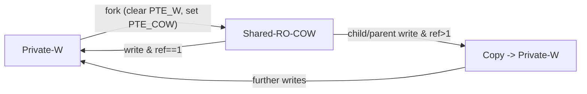

# LAB5——用户程序
## 练习0：填写已有实验
>本实验依赖实验2/3/4。请把你做的实验2/3/4的代码填入本实验中代码中有“LAB2”/“LAB3”/“LAB4”的注释相应部分。注意：为了能够正确执行lab5的测试应用程序，可能需对已完成的实验2/3/4的代码进行进一步改进。
## 练习一：加载应用程序并执行（需要编码）
>**`do_execve`**函数调用`load_icode`（位于kern/process/proc.c中）来加载并解析一个处于内存中的ELF执行文件格式的应用程序。你需要补充`load_icode`的第6步，设置好`proc_struct`结构中的成员变量`trapframe`的内容，确保在执行此进程后，能够从应用程序设定的起始执行地址开始执行。需设置正确的trapframe内容。
>
>请在实验报告中简要说明你的设计实现过程。
>
> - 请简要描述这个用户态进程被ucore选择占用CPU执行（RUNNING态）到具体执行应用程序第一条指令的整个经过。

在第6步中设置了trapframe的关键字段如下：
```c
    struct trapframe *tf = current->tf;
    memset(tf, 0, sizeof(struct trapframe));
    tf->gpr.sp = USTACKTOP;           // 用户栈指针
    tf->epc = elf->e_entry;           // 程序入口地址

    // 设置sstatus寄存器
    uintptr_t sstatus = read_csr(sstatus);
    // 清除SPP位（设置为用户态），开启中断
    sstatus &= ~SSTATUS_SPP;    // 清除SPP，表示从用户态进入
    sstatus |= SSTATUS_SPIE;   // 设置SPIE，允许中断
    sstatus &= ~SSTATUS_SIE;    // 清除SIE，在内核中禁用中断
    tf->status = sstatus;
```
首先获取当前进程的trapframe指针tf，清空trapframe。将用户栈指针设置为用户栈顶地址（USTACKTOP），并设置程序计数器（epc）为ELF文件的入口地址（elf->e_entry）。最后从CSR读取当前的sstatus寄存器值，配置处理器状态寄存器：清除SPP位（表示返回到用户态）、设置SPIE位（在用户态允许中断）、清除SIE位（当前在内核态禁用中断），确保执行sret指令后能够正确切换到用户态并开始执行应用程序。

- 用户态进程执行过程（通过exec加载新程序后的执行流程）

`load_icode()`在`do_execve()`中被调用，用于加载新程序。当进程调用exec系统调用加载新程序后，从系统调用返回用户态并执行新程序的流程如下：
1. 进程调用exec系统调用，在内核态执行`do_execve()`和`load_icode()`
2. `load_icode()`设置新的trapframe（包括`tf->epc = elf->e_entry`和`tf->gpr.sp = USTACKTOP`）
3. `sys_exec()`返回0，系统调用处理完成
4. 返回到`exception_handler()`，然后返回到`trap()`，最后返回到`__trapret`
5. `__trapret`调用`RESTORE_ALL`宏，从trapframe恢复所有寄存器（包括sstatus和sepc）
6. 执行`sret`指令：
   - CPU从sstatus恢复特权级别（用户态，因为SPP=0）
   - 从sepc恢复PC（sepc = elf->e_entry）
   - 切换到用户态
7. 程序计数器指向`elf->e_entry`指定的入口地址，应用程序的第一条指令开始执行

注意：exec后的进程不经过forkret，而是直接通过系统调用的正常返回路径（__trapret）返回到用户态。


## 练习二：父进程复制自己的内存空间给子进程（需要编码）
>创建子进程的函数`do_fork`在执行中将拷贝当前进程（即父进程）的用户内存地址空间中的合法内容到新进程中（子进程），完成内存资源的复制。具体是通过`copy_range`函数（位于kern/mm/pmm.c中）实现的，请补充`copy_range`的实现，确保能够正确执行。
>
>请在实验报告中简要说明你的设计实现过程。
>
> - 如何设计实现`Copy on Write`机制？给出概要设计，鼓励给出详细设计。
## 练习三：阅读分析源代码，理解进程执行 fork/exec/wait/exit 的实现，以及系统调用的实现（不需要编码）
> 请在实验报告中简要说明你对 fork/exec/wait/exit函数的分析。并回答如下问题：
>
> - 请分析fork/exec/wait/exit的执行流程。重点关注哪些操作是在用户态完成，哪些是在内核态完成？内核态与用户态程序是如何交错执行的？内核态执行结果是如何返回给用户程序的？
> - 请给出ucore中一个用户态进程的执行状态生命周期图（包执行状态，执行状态之间的变换关系，以及产生变换的事件或函数调用）。（字符方式画即可）
>
>执行：make grade。如果所显示的应用程序检测都输出ok，则基本正确。（使用的是qemu-1.0.1）
## fork/exec/wait/exit 执行流程分析

### 系统调用机制

**用户态 -> 内核态切换：**
1. 用户程序调用系统调用包装函数（如 `sys_fork()`），该函数位于 `user/libs/syscall.c`
2. 包装函数执行内联汇编，将系统调用号和参数放入寄存器 a0-a5，然后执行 `ecall` 指令
3. `ecall` 指令触发硬件异常（CAUSE_USER_ECALL），CPU自动切换到内核态并跳转到异常处理入口
4. 异常处理程序 `__alltraps` 保存所有寄存器到 trapframe，然后调用 `trap()` 函数
5. `trap_dispatch()` -> `exception_handler()` -> `syscall()` 函数根据系统调用号分发到具体处理函数

**内核态 -> 用户态返回：**
1. 内核函数将返回值放入 `tf->gpr.a0` 寄存器
2. `__trapret` 恢复所有寄存器（包括包含返回值的 a0）
3. 执行 `sret` 指令，CPU恢复用户态并跳转到 `ecall` 的下一条指令
4. 用户程序从 a0 寄存器读取返回值

### fork() 执行流程

**用户态操作：**
- 调用 `fork()` -> `sys_fork()` -> 执行 `ecall` 指令陷入内核态

**内核态操作：**
- `syscall()` -> `sys_fork()` -> `do_fork()`
- `do_fork()` 执行：
  - 分配子进程PCB（状态为 PROC_UNINIT）
  - 分配内核栈
  - 复制父进程内存空间（`copy_mm()`）
  - 设置子进程 trapframe（子进程的 a0 设为 0）
  - 设置子进程 context（首次运行入口为 `forkret`）
  - 将子进程加入进程链表并设为 PROC_RUNNABLE（`wakeup_proc()`）
- 父进程返回子进程 PID（通过 `tf->gpr.a0`）

**子进程首次运行：**
- 调度器选择子进程后，通过 `proc_run()` 切换到子进程
- 子进程从 `forkret` 开始执行，通过 `sret` 返回用户态
- 子进程从 `fork()` 调用处继续执行，返回值为 0

### exec() 执行流程

**用户态操作：**
- 调用 `exec()` -> `sys_exec()` -> 执行 `ecall` 指令陷入内核态

**内核态操作：**
- `syscall()` -> `sys_exec()` -> `do_execve()`
- `do_execve()` 执行：
  - 验证用户空间地址有效性
  - 释放旧的内存空间（`exit_mmap()`, `put_pgdir()`, `mm_destroy()`）
  - 调用 `load_icode()` 加载新程序：
    - 创建新的内存管理结构
    - 解析 ELF 文件，加载代码段和数据段
    - 设置用户栈
    - 设置新的 trapframe（`tf->epc = elf->e_entry`，`tf->gpr.sp = USTACKTOP`）
- 通过 `sret` 返回用户态时，跳转到新程序的入口地址（不再返回 `exec()` 调用处）

### wait() 执行流程

**用户态操作：**
- 调用 `wait()` -> `sys_wait()` -> 执行 `ecall` 指令陷入内核态

**内核态操作：**
- `syscall()` -> `sys_wait()` -> `do_wait()`
- `do_wait()` 执行：
  - 查找是否有 ZOMBIE 状态的子进程
  - 如果有：回收子进程资源，返回子进程 PID 和退出码
  - 如果没有但存在子进程：
    - 设置当前进程状态为 PROC_SLEEPING
    - 调用 `schedule()` 让出 CPU（**进程在内核态睡眠**）
    - 被子进程退出唤醒后，在内核态继续执行，重新查找 ZOMBIE 子进程

### exit() 执行流程

**用户态操作：**
- 调用 `exit()` -> `sys_exit()` -> 执行 `ecall` 指令陷入内核态

**内核态操作：**
- `syscall()` -> `sys_exit()` -> `do_exit()`
- `do_exit()` 执行：
  - 释放内存资源（切换到内核页表后释放用户空间）
  - 设置进程状态为 PROC_ZOMBIE
  - 处理子进程关系（将子进程的父进程设为 initproc）
  - 唤醒等待中的父进程（如果父进程在 `do_wait()` 中睡眠）
  - 调用 `schedule()` 切换到其他进程（当前进程永远不会再被调度）

### 内核态与用户态的交错执行

1. **同步系统调用**（fork、exec、getpid等）：
   - 用户态 -> 内核态执行 -> 立即返回用户态
   - 整个调用过程在同一个进程上下文中完成

2. **可能阻塞的系统调用**（wait）：
   - 用户态 -> 内核态执行
   - 如果没有就绪的资源，进程在内核态进入 PROC_SLEEPING 状态，调用 `schedule()` 让出 CPU
   - **切换到其他进程执行**（可能是其他进程的用户态或内核态代码）
   - 事件发生时（如子进程退出），父进程被唤醒，在内核态继续执行 `do_wait()` 的剩余代码
   - 完成后返回用户态

3. **进程创建的特殊性**（fork）：
   - 父进程在内核态完成 fork 后返回用户态，继续执行 fork() 之后的代码
   - 子进程首次被调度时，从内核态的 `forkret` 开始，然后通过 `sret` 返回用户态，从 fork() 调用处继续执行
   - **两个进程几乎同时从 fork() 返回**，但返回值不同（父进程返回子进程PID，子进程返回0）

4. **进程替换的特殊性**（exec）：
   - exec 执行后，**永远不会返回到 exec() 调用处**
   - 新程序从入口地址开始执行，之前的用户态栈和代码都被替换

### 内核态执行结果返回给用户程序

1. **返回值传递**：
   - 内核函数将返回值赋给 `tf->gpr.a0`（RISC-V中 a0 是返回值寄存器）
   - 例如：`sys_fork()` 返回 `do_fork()` 的结果（子进程PID）

2. **寄存器恢复**：
   - `__trapret` 调用 `RESTORE_ALL` 宏，从 trapframe 恢复所有寄存器
   - 恢复的 a0 寄存器包含系统调用的返回值

3. **返回到用户态**：
   - 执行 `sret` 指令，CPU 从 `sstatus` 恢复特权级别（用户态），从 `sepc` 恢复 PC

4. **用户程序获取返回值**：
   - 用户态的内联汇编：`"sd a0, %0"` 将 a0 的值保存到 `ret` 变量
   - `syscall()` 函数返回这个值，用户程序从包装函数获取返回值
### ucore用户态进程生命周期图
```
                      +----------------------------+
                      |        alloc_proc()        |
                      |   创建 PCB，状态=UNINIT     |
                      +--------------+-------------+
                                     |
                                     | proc_init() / wakeup_proc()
                                     v
                            +------------------+
                            |  PROC_UNINIT     |
                            +--------+---------+
                                     |
                                     | wakeup_proc() / 在 do_fork() 中
                                     v
                         +-------------------------+
                         |     PROC_RUNNABLE      |
                         |   （就绪队列中的进程）  |
                         +-----------+-------------+
                                     |
                                     | schedule() 选择该进程
                                     | proc_run()
                                     v
                              +---------------+
                              |   RUNNING     |
                              +-------+-------+
          +---------------------------+---------------------------+
          |                           |                           |
          | 时间片用完/中断/yield      | do_sleep(), do_wait()     | do_exit()
          | schedule()                 | 主动睡眠/等待资源         | 退出执行
          |                           |                           |
          v                           v                           v
+----------------------+     +---------------------+     +---------------------+
|   PROC_RUNNABLE      |     |   PROC_SLEEPING     |     |    PROC_ZOMBIE      |
| (重新加入就绪队列)    |     | （不可调度，等待事件）|     |（等待父进程 wait）   |
+----------+-----------+     +----------+----------+     +----------+----------+
           ^                        |                           ^
           |                        |                           |
           | wakeup_proc()          |                           |do_kill() -> PF_EXITING(被kill唤醒后检查标志)-> do_exit()
           | 事件触发/条件满足        |                           |
           |                        |                           |
           |                        |                           |
           +------------------------+---------------------------+
                                                               |
                                                               | do_wait() 回收资源
                                                               v
                                                        +---------------------+
                                                        |   （被内核回收）    |
                                                        | do_wait() -> free   |
                                                        +---------------------+

状态说明：
- PROC_UNINIT:   未初始化状态，进程控制块已分配但未完全初始化
- PROC_RUNNABLE: 可运行状态，进程在就绪队列中等待调度
- RUNNING:       运行状态，进程正在CPU上执行（状态值仍为PROC_RUNNABLE）
- PROC_SLEEPING: 睡眠状态，进程因等待资源或事件而阻塞，不可调度
- PROC_ZOMBIE:   僵尸状态，进程已退出但资源未回收，等待父进程处理

关键转换函数和事件：
1. alloc_proc():           创建进程结构，状态设为PROC_UNINIT
2. proc_init()/wakeup_proc(): PROC_UNINIT -> PROC_RUNNABLE
3. schedule() -> proc_run(): PROC_RUNNABLE -> RUNNING
4. 时间片用完/中断/yield:    RUNNING -> PROC_RUNNABLE (通过schedule())
5. do_sleep()/do_wait():    RUNNING -> PROC_SLEEPING
6. wakeup_proc():           PROC_SLEEPING -> PROC_RUNNABLE
7. do_exit():               RUNNING -> PROC_ZOMBIE
8. do_kill() + do_exit():   PROC_SLEEPING -> PROC_ZOMBIE (进程在睡眠时被kill)
9. do_wait():               父进程回收子进程资源，PROC_ZOMBIE -> 进程被销毁
```

## 扩展练习一：实现 Copy on Write （COW）机制
>给出实现源码,测试用例和设计报告（包括在cow情况下的各种状态转换（类似有限状态自动机）的说明）。
>
>这个扩展练习涉及到本实验和上一个实验“虚拟内存管理”。在ucore操作系统中，当一个用户父进程创建自己的子进程时，父进程会把其申请的用户空间设置为只读，子进程可共享父进程占用的用户内存空间中的页面（这就是一个共享的资源）。当其中任何一个进程修改此用户内存空间中的某页面时，ucore会通过page fault异常获知该操作，并完成拷贝内存页面，使得两个进程都有各自的内存页面。这样一个进程所做的修改不会被另外一个进程可见了。请在ucore中实现这样的COW机制。
>
>由于COW实现比较复杂，容易引入bug，请参考 https://dirtycow.ninja/ 看看能否在ucore的COW实现中模拟这个错误和解决方案。需要有解释。

### 实现要点
- 在fork拷贝阶段不再逐页复制，而是把可写用户页改成只读+PTE_COW：父子页表权限都去掉PTE_W并加上PTE_COW，子进程直接共享同一物理页。
- 页故障路径识别“写入COW页”场景：若ref>1则分配新页并复制数据；若ref==1只需去掉PTE_COW恢复PTE_W，无需复制。
- trap层把load/store page fault交给do_pgfault处理，失败则杀死进程并打印故障信息。
- 统计pgfault_num以便后续调试，路径在do_pgfault中递增。


状态说明：
- Private-W：独占可写页，常规读写不触发fault。
- Shared-RO-COW：父子共享页，PTE_W清除、PTE_COW置位，写入触发fault。
- Copy -> Private-W：COW fault且ref>1时分配新页并复制，映射为可写后回到独占态；ref==1时直接去掉PTE_COW并恢复PTE_W。
转换事件：fork触发共享；写访问触发COW fault；ref计数决定是复制还是原地升级。
### 实验源码
#### `copy_range`的修改
```c
int copy_range(pde_t *to, pde_t *from, uintptr_t start, uintptr_t end,bool share)
{
    assert(start % PGSIZE == 0 && end % PGSIZE == 0);
    assert(USER_ACCESS(start, end));

    do {
        // call get_pte to find process A's pte according to the addr start
        pte_t *ptep = get_pte(from, start, 0), *nptep;
        if (ptep == NULL) {
            start = ROUNDDOWN(start + PTSIZE, PTSIZE);
            continue;
        }

        // call get_pte to find process B's pte according to the addr start.
        // If pte is NULL, just alloc a PT
        if (*ptep & PTE_V) {

            if ((nptep = get_pte(to, start, 1)) == NULL) {
                return -E_NO_MEM;
            }

            uint32_t perm = (*ptep & PTE_USER);
            struct Page *page = pte2page(*ptep);
            assert(page != NULL);

            // ================================
            //  Case 1: COW mode (share == 1)
            // ================================
            if (share) {

                /*
                 * Enable copy-on-write for writable user mappings by
                 * removing the write bit from both parent and child
                 * PTEs and marking them with PTE_COW. Future writes
                 * will trap and be resolved in the page-fault handler.
                 */

                if (perm & PTE_W) {
                    perm = (perm | PTE_COW) & ~PTE_W; // child perm
                    *ptep = (*ptep & ~PTE_W) | PTE_COW; // parent perm
                    tlb_invalidate(from, start);
                }

                // map the same physical page into child
                int ret = page_insert(to, page, start, perm);
                if (ret != 0) return ret;
            }

            // ================================
            //  Case 2: normal DUP (share == 0)
            // ================================
            else {

                // alloc a page for process B
                struct Page *npage = alloc_page();
                assert(npage != NULL);

                int ret = 0;

                void *src = page2kva(page);
                void *dst = page2kva(npage);
                memcpy(dst, src, PGSIZE);

                ret = page_insert(to, npage, start, perm);
                assert(ret == 0);
            }
        }

        start += PGSIZE;

    } while (start != 0 && start < end);

    return 0;
}
```
- 判断与目标：只有原本可写的页面才需要 COW`（if (perm & PTE_W)）`；不可写页无需处理。
- 子进程处理：`perm = (perm | PTE_COW) & ~PTE_W` —— 给子进程加上 `PTE_COW `标记并去掉写权限，使其成为“只读 + COW”。
- 父进程处理：`*ptep = (*ptep & ~PTE_W) | PTE_COW` —— 同样撤销父的写权限并标记为 COW，确保父写入时也会触发`page fault`。
- TLB 刷新：`tlb_invalidate(...)` 用于使刚改的父页权限立即生效，避免旧权限被缓存导致绕过 COW。
- 共享映射：`page_insert(to, page, start, perm)` 把相同的物理页映射到子进程（不分配新页、不 memcpy），实现“按需复制”的核心优化。
#### `do_pgfault`的实现
```c
int do_pgfault(struct mm_struct *mm, uint32_t error_code, uintptr_t addr)
{
    pgfault_num++;

    if (mm == NULL)
    {
        return -E_INVAL;
    }
    struct vma_struct *vma = find_vma(mm, addr);
    if (vma == NULL || addr < vma->vm_start)
    {
        return -E_INVAL;
    }
    uintptr_t la = ROUNDDOWN(addr, PGSIZE);
    pte_t *ptep = get_pte(mm->pgdir, la, 0);
    if (ptep == NULL)
    {
        return -E_NO_MEM;
    }
    // Only handle write faults on COW-marked present pages
    if ((*ptep & (PTE_V | PTE_COW)) == (PTE_V | PTE_COW) && error_code == CAUSE_STORE_PAGE_FAULT)
    {
        struct Page *page = pte2page(*ptep);
        if (page_ref(page) > 1)
        {
            struct Page *npage = alloc_page();
            if (npage == NULL)
            {
                return -E_NO_MEM;
            }
            memcpy(page2kva(npage), page2kva(page), PGSIZE);
            uint32_t perm = (*ptep & PTE_USER) | PTE_W;
            perm &= ~PTE_COW;
            int ret = page_insert(mm->pgdir, npage, la, perm);
            if (ret != 0)
            {
                free_page(npage);
                return ret;
            }
        }
        else
        {
            *ptep = (*ptep | PTE_W) & ~PTE_COW;
            tlb_invalidate(mm->pgdir, la);
        }
        return 0;
    }
    return -E_INVAL;
}
```
- 当缺页异常发生时，内核首先根据异常地址查找对应的 VMA，并通过 `get_pte()` 获取页表项。如果页表项不存在或不包含有效位（PTE_V），说明这不是写时复制相关的 fault，应直接返回错误。

- 一旦确认页表项既有效又带有 `PTE_COW`（即 `(PTE_V | PTE_COW)` 同时满足），并且异常类型为写操作（`CAUSE_STORE_PAGE_FAULT`），说明当前进程试图写入一个被 COW 机制管理的共享页面，这正是 COW 的触发条件：

   ```c
   if ((*ptep & (PTE_V | PTE_COW)) == (PTE_V | PTE_COW) &&
      error_code == CAUSE_STORE_PAGE_FAULT)
   ```

- 进入 COW 分支后，内核通过 `pte2page(*ptep)` 找到实际的物理页，并根据引用计数决定处理方式：

1. **如果 `page_ref(page) > 1`，该页由多个进程共享。**
   代码中调用 `alloc_page()` 为当前进程分配一个新物理页，然后通过：

   ```c
   memcpy(page2kva(npage), page2kva(page), PGSIZE);
   ```

   将旧页内容完整复制到新页。接着重新利用 `page_insert()` 将该新页映射到触发异常的地址，并为它添加写权限（`| PTE_W`）并移除 COW 标记（`& ~PTE_COW`）。这样，只有当前进程获得新的可写页，不会影响其他仍共享旧物理页的进程。

2. **如果 `page_ref(page) == 1`，说明该页已为当前进程独占。**
   既然没有其他进程依赖这页数据，就无需复制。代码直接修改页表项，恢复写权限并移除 COW 标记：

   ```c
   *ptep = (*ptep | PTE_W) & ~PTE_COW;
   tlb_invalidate(mm->pgdir, la);
   ```

   此时刷新 TLB 是必要的，因为 CPU 可能仍缓存旧的只读+COW 权限。如果不刷新，CPU 会继续误认为该页不可写，从而重复触发错误。
#### 异常处理
```c
case CAUSE_STORE_PAGE_FAULT:
      if (current != NULL && current->mm != NULL)
      {
         int ret = do_pgfault(current->mm, tf->cause, tf->tval);
         if (ret != 0)
         {
               cprintf("Unhandled page fault: va=0x%lx cause=%ld err=%d\n", tf->tval, tf->cause, ret);
               print_trapframe(tf);
               do_exit(-E_KILLED);
         }
      }
      else
      {
         cprintf("Kernel page fault at va=0x%lx\n", tf->tval);
         print_trapframe(tf);
         panic("unhandled kernel page fault");
      }
      break;
```
1. 判断当前是否有用户进程在运行

   ```c
   if (current != NULL && current->mm != NULL)
   ```

* `current`：当前正在运行的进程
* `current->mm`：进程的内存管理结构（包含页表、VMA 列表等）

   如果两者都存在 → 说明 page fault 发生在用户态进程中，应该交给用户页错误处理逻辑。
2. 调用 do_pgfault() 处理缺页

   ```c
   int ret = do_pgfault(current->mm, tf->cause, tf->tval);
   ```

* `current->mm`：进程的内存空间
* `tf->cause`：异常原因（这里是 STORE_PAGE_FAULT）
* `tf->tval`：触发异常的虚拟地址（faulting address）

  这里进行`COW+缺页异常`的处理；
3. 如果 do_pgfault 返回非 0（表示失败）

```c
if (ret != 0)
{
    cprintf("Unhandled page fault: va=0x%lx cause=%ld err=%d\n",
            tf->tval, tf->cause, ret);
    print_trapframe(tf);
    do_exit(-E_KILLED);
}
```

表示这个 page fault 当前内核无法处理。
1. **打印错误信息**
2. **打印 trapframe（寄存器状态）排查问题**
3. **终止当前进程（do_exit(-E_KILLED)）**

也就是说：

> **只要 do_pgfault 无法处理，该进程就被认为访问非法内存 → 直接 kill。**

---
4. 如果没有 current 或 current->mm,表示 page fault 发生在：

* 内核态 kernel page fault
* 或者进入 trap 的时候没有有效进程

```c
else
{
    cprintf("Kernel page fault at va=0x%lx\n", tf->tval);
    print_trapframe(tf);
    panic("unhandled kernel page fault");
}
```
**这是致命错误**，内核绝不能随便缺页，于是直接 panic。
### 测试样例
为了测试COW机制的正确性，我们设计了`cow.c`文件，验证在实现 Copy-on-Write（COW） 机制后，用户进程在 `fork()` 之后共享的只读页是否能够正确触发写时复制过程，从而保证父子进程对同一逻辑地址空间的写入不会互相影响。
1. 测试功能概述

   程序中定义了一个全局缓冲区：

   ```c
   static char shared_page[4096] = "ucore-cow";
   ```

   该数组放在用户进程的 **BSS/数据段** 中，对应着一页可写的用户空间物理页。在调用 `fork()` 后，父子进程应当按照 COW 机制：

   1. **共享同一个物理页**
   2. **页面权限设置为只读**
   3. **当其中一个进程写入该页时触发 page fault**
   4. 操作系统为写入进程分配一个新的物理页，并将原内容复制过去，从而实现写时复制。

   本测试代码正是通过修改该缓冲区内容来检测上述机制是否正确工作。
2. 测试流程说明

   (1)父进程的初始化输出

   ```c
   cprintf("[cow] parent before fork: %s\n", shared_page);
   ```

   父进程首先输出缓冲区初始内容 `"ucore-cow"`，用于后续与子进程修改后的数据作对比。

   ---

   (2)创建子进程：fork()

   ```c
   int pid = fork();
   ```

   此时：

   * 父进程与子进程共享同一物理页的数据段页
   * 内核在 fork() 中应该将该页标记为 **只读 + COW 属性**
   * 页框引用计数增加（`ref > 1`）

   这是 COW 正常启动的必要前提。

   ---

   (3)子进程的 COW 写入测试

   子进程中执行：

   ```c
   shared_page[0] = 'C';
   shared_page[1] = 'H';
   shared_page[2] = 'I';
   ```

   该写入操作应当触发：

   1. **写时 page fault**
   2. do_pgfault 检测到这是 COW 页（ref > 1）
   3. 内核为子进程分配新物理页
   4. 将原页内容复制到新页
   5. 将子进程页表修改为可写
   6. 页框引用计数恢复正确数值（通常 ref--）

   子进程随后输出修改后的字符串：

   ```c
   cprintf("[cow] child modified buffer: %s\n", shared_page);
   ```

   若输出成功，说明子进程确实获得了一个私有的新页。

   ---

   (4)父进程对子进程写入的隔离性验证

   父进程等待子进程退出：

   ```c
   wait();
   ```

   此后父进程再次打印其缓冲区内容：

   ```c
   cprintf("[cow] parent after child exit: %s\n", shared_page);
   ```

   其预期内容仍应为 `"ucore-cow"`。

   然后父进程进一步判断：

   ```c
   if (shared_page[0] == 'C') {
      cprintf("[cow] FAILED: parent saw child's write\n");
   }
   ```

   如果父进程看到 `"CHI..."` 开头的字符串，则说明 COW **失效**：父进程与子进程没有被分离。

   若父进程数据未改变，则输出：
   ```
   [cow] PASSED: parent buffer intact
   ```
   这表明：

   * COW 机制正确触发
   * 子进程写入不会影响父进程
   * 内核成功处理写时复制的 page fault
### 测试结果
我们执行`make build-cow`和`make qemu`后，在终端中输出调试信息，出现`PASS`信息，说明我们的COW实现正确。

## dirtycow的模拟与解决
COW状态机（按虚拟页视角）
1. Private-W: 单独占有、可写（普通映射）。
2. Fork → Shared-RO-COW: 父/子共享同一物理页，PTE_W被清除、PTE_COW置位，写入会触发fault。
3. Fault on Shared-RO-COW:
   - ref>1: 分配新页，复制内容，映射为Private-W；其他进程仍留在Shared-RO-COW。
   - ref==1: 直接清除PTE_COW、恢复PTE_W，状态变为Private-W（无复制）。
4. 后续写入在Private-W上不再触发COW。

测试用例
- 新增用户态程序[user/cow.c](user/cow.c)：父进程在fork前写入缓冲区，子进程写入首字节并退出，父进程检测自身缓冲区是否被污染；成功则输出“PASSED”。该用例覆盖了共享只读、写时复制、父子视图隔离三条路径。

- Dirty COW漏洞核心是利用写入与权限标记之间的竞态反复将页变回可写并绕过复制。在本实现里，写fault只有在PTE_COW存在时才会触发，且do_pgfault在持有页表锁（隐含于当前进程上下文）后要么复制、要么就地升级权限；ref计数>1时必须复制，避免绕过共享保护。这样避免了在标记回写之前的可写窗口。
- 若要进一步逼近Dirty COW场景，可以让父子进程在同一页上高频并发write，观察是否出现父视图被污染；当前逻辑在ref>1时强制复制，应不会出现污染。若发现污染，可在PTE更新后强制sfence.vma并检查ref计数一致性来缓解。


说明
- 用户程序在链接阶段被拼入内核镜像，由kernel.ld把多个__user_*段按binary形式附加到内核镜像，启动时直接可用，省去了运行时磁盘加载，适合教学环境的小型镜像。
## 扩展练习二
>说明该用户程序是何时被预先加载到内存中的？与我们常用操作系统的加载有何区别，原因是什么？
## 实验设计的知识点
## 分支任务