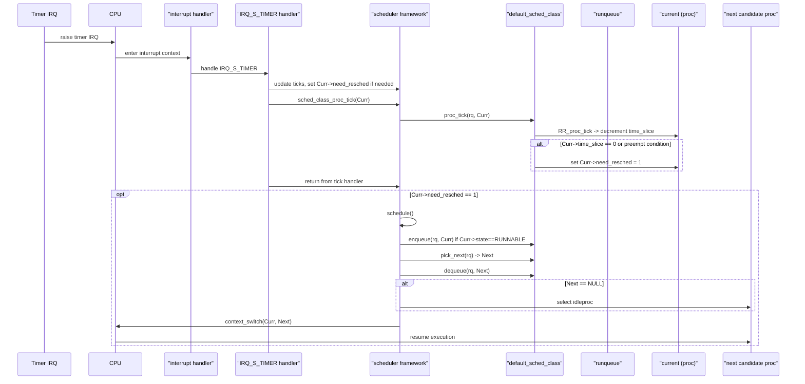
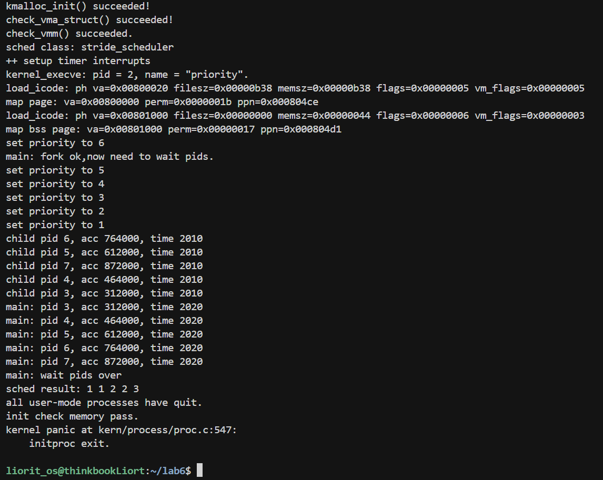

# lab6——进程调度

## 练习0：填写已有实验
>本实验依赖实验2/3/4/5。请把你做的实验2/3/4/5的代码填入本实验中代码中有“LAB2”/“LAB3”/“LAB4”“LAB5”的注释相应部分。并确保编译通过。 注意：为了能够正确执行lab6的测试应用程序，可能需对已完成的实验2/3/4/5的代码进行进一步改进。 由于我们在进程控制块中记录了一些和调度有关的信息，例如Stride、优先级、时间片等等，因此我们需要对进程控制块的初始化进行更新，将调度有关的信息初始化。同时，由于时间片轮转的调度算法依赖于时钟中断，你可能也要对时钟中断的处理进行一定的更新。
## 练习1: 理解调度器框架的实现（不需要编码）
>请仔细阅读和分析调度器框架的相关代码，特别是以下两个关键部分的实现：
>
>在完成练习0后，请仔细阅读并分析以下调度器框架的实现：
>
>- 调度类结构体 sched_class 的分析：请详细解释 sched_class 结构体中每个函数指针的作用和调用时机，分析为什么需要将这些函数定义为函数指针，而不是直接实现函数。
>
>- 运行队列结构体 run_queue 的分析：比较lab5和lab6中 run_queue 结构体的差异，解释为什么lab6的 run_queue 需要支持两种数据结构（链表和斜堆）。
>
>- 调度器框架函数分析：分析 sched_init()、wakeup_proc() 和 schedule() 函数在lab6中的实现变化，理解这些函数如何与具体的调度算法解耦。
>
>对于调度器框架的使用流程，请在实验报告中完成以下分析：
>
>- 调度类的初始化流程：描述从内核启动到调度器初始化完成的完整流程，分析 default_sched_class 如何与调度器框架关联。
>- 进程调度流程：绘制一个完整的进程调度流程图，包括：时钟中断触发、proc_tick 被调用、schedule() 函数执行、调度类各个函数的调用顺序。并解释 need_resched 标志位在调度过程中的作用
>- 调度算法的切换机制：分析如果要添加一个新的调度算法（如stride），需要修改哪些代码？并解释为什么当前的设计使得切换调度算法变得容易。
### 一.调度器框架的实现
#### 1.`sched_class`分析
```cpp
struct sched_class
{
    const char *name;
    void (*init)(struct run_queue *rq);
    void (*enqueue)(struct run_queue *rq, struct proc_struct *proc);
    void (*dequeue)(struct run_queue *rq, struct proc_struct *proc);
    struct proc_struct *(*pick_next)(struct run_queue *rq);
    void (*proc_tick)(struct run_queue *rq, struct proc_struct *proc);
};
```
| 函数指针名 | 作用 | 调用时机 |
|-----------|------|----------|
| init | 初始化该调度类在 run_queue 中所需的私有数据结构和参数，为后续调度操作建立基础环境。例如初始化就绪队列、优先级结构或时间片相关变量。 | 系统启动阶段或 CPU 初始化对应 run_queue 时调用，通常每个 run_queue 只调用一次。 |
| enqueue | 将一个处于就绪状态的进程加入 run_queue，并按照具体调度策略组织其在就绪队列中的位置，从而影响其未来被调度的顺序。 | 进程被创建、从阻塞态被唤醒，或时间片用完但仍可运行而重新进入就绪态时调用，需在持有 run_queue 锁的情况下执行。 |
| dequeue | 将指定进程从 run_queue 中移除，确保该进程不再参与后续调度，维护就绪队列的一致性与正确性。 | 进程被选中运行、进入阻塞态（如等待 I/O）、或被终止时调用，通常与 enqueue 成对出现。 |
| pick_next | 根据调度策略从 run_queue 中选择下一个要运行的进程，是调度器做出调度决策的核心接口，直接决定 CPU 下一步执行的进程。 | 在发生调度事件时调用，如当前进程主动让出 CPU、时间片耗尽或进程阻塞，需要进行进程切换时。 |
| proc_tick | 在时钟中断到来时更新当前运行进程的调度相关状态，例如消耗时间片、更新运行时间，并判断是否需要触发重新调度。 | 每一次时钟中断发生时调用，仅针对当前正在 CPU 上运行的进程，用于支持抢占式调度。 |

---

在调度器设计中，将 `init`、`enqueue`、`dequeue`、`pick_next`、`proc_tick` 等操作定义为函数指针，而不是直接实现为固定函数，主要是出于**解耦性、可扩展性和灵活性**方面的考虑。

1. **解耦调度框架与调度策略**

操作系统调度器通常由两部分组成：
一是**调度框架**，负责在合适的时机触发调度；
二是**调度策略**，决定进程如何进入就绪队列以及下一个运行进程的选择规则。

若将调度逻辑直接写成固定函数，调度框架将不可避免地依赖某一种具体调度算法，导致两者高度耦合。而通过函数指针的方式，调度框架只需调用统一的接口，而不关心具体实现，从而实现调度机制与调度策略的解耦。


2. **支持多种调度算法的灵活切换**

不同调度算法（如时间片轮转、优先级调度、公平调度）在进程入队、出队和选择下一个进程时的行为存在显著差异。将这些操作抽象为函数指针，可以为每一种调度算法提供各自的实现，并在运行时通过指针绑定具体策略。

这种设计避免了在调度器核心代码中引入大量条件判断（如 `if-else` 或 `switch`），使得新增或替换调度算法时无需修改调度主流程。


3. **提高系统的可扩展性与可维护性**

采用函数指针后，新增一种调度策略只需实现一组符合接口约定的函数，并将其封装为新的 `sched_class` 实例即可。这种方式：

* 不破坏原有调度代码结构
* 降低修改带来的风险
* 便于调试和维护

同时，调度类中预留的接口（如未来的负载均衡函数）也可以在不影响现有实现的前提下逐步扩展。

#### 2.`run_queue`分析
```c
struct run_queue
{
    list_entry_t run_list;
    unsigned int proc_num;
    int max_time_slice;
    // For LAB6 ONLY
    skew_heap_entry_t *lab6_run_pool;
};
```
---
- `run_list` 是运行队列的基础数据结构，采用链表形式组织所有可运行进程。链表结构实现简单，插入和删除开销较小，能够满足时间片轮转等顺序型调度算法的需求，同时也作为调度框架中最通用的就绪队列表示方式。

- `proc_num` 用于记录当前运行队列中就绪进程的数量。

- `max_time_slice` 表示调度器允许单个进程连续占用 CPU 的最大时间片长度，该字段通常与时钟中断处理函数配合使用，用于实现抢占式调度。

- `lab6_run_pool` 指向一个斜堆结构，用于按照某种调度关键字（权重）对进程进行有序管理。相较于链表，斜堆更适合频繁选取最小关键字进程的场景，有效支持基于优先级的调度策略。
---
在 LAB6 中我们需要实现 **RR（Round-Robin）调度算法** 和 **Stride 调度算法**，这两种调度策略在调度目标和核心操作上存在本质差异，因此对运行队列的数据组织方式提出了不同的要求。为了在不破坏调度框架统一性的前提下同时支持这两种算法，`run_queue` 被设计为同时包含链表和斜堆两种数据结构。

RR 调度算法强调进程的**到达顺序和时间片轮转**。在该算法中，调度器只需要按照“先进先出”的顺序依次选取就绪进程，每次调度选择队首进程即可。因此，采用链表作为运行队列的组织方式可以以较低的实现复杂度完成进程的入队和出队操作，同时能够清晰地表达 RR 调度的轮转语义，且无需额外的排序或比较开销。

与之相比，Stride 调度算法的核心在于**公平性和权重控制**。调度器在每次调度时需要从所有就绪进程中选取 stride 值（或 pass 值）最小的进程运行，并在进程运行后动态更新其关键字。由于该关键字会频繁变化，运行队列必须支持高效的“最小值选取”和节点的删除与重新插入。链表结构在这种场景下需要遍历整个队列，时间开销较大，而斜堆能够在较低复杂度下完成最小节点的提取与合并操作，更适合实现 Stride 调度。

将链表和斜堆同时引入 `run_queue`，使得 LAB6 可以在**同一调度框架下复用不同的数据结构**：RR 调度算法仅使用链表字段，而 Stride 调度算法仅使用斜堆字段，二者互不干扰。这种设计避免了为不同调度算法分别维护独立的运行队列结构，从而保持了调度器接口的一致性和代码结构的清晰性。

#### 3.调度器框架函数分析
LAB6 的实验目标是理解和实现操作系统的调度管理机制，支持多种调度算法（RR 和 Stride）。为了实现这一目标，`sched_init()`、`wakeup_proc()` 和 `schedule()` 三个函数相较 LAB5 做了系统性重构。下面从功能变化和解耦设计两个角度分析这些函数。

---

### 1. `sched_init()`：调度器初始化与策略绑定

在Lab6中，在进程调度方面，新加了`sched_init()`函数

```c
void sched_init(void) 
{
    list_init(&timer_list);

    sched_class = &default_sched_class;

    rq = &__rq;
    rq->max_time_slice = MAX_TIME_SLICE;
    sched_class->init(rq);

    cprintf("sched class: %s\n", sched_class->name);
}
```
1. 初始化系统定时器列表 `timer_list`。
2. 指定当前调度类 `sched_class`，明确系统采用的调度策略。
3. 初始化运行队列 `rq` 并调用调度类的 `init` 方法：

   * RR 调度：初始化链表
   * Stride 调度：初始化斜堆
4. 统一输出调度类名称，便于调试和验证。

> 通过 `sched_init()`，调度器从 LAB5 的“硬编码调度逻辑”演进为“可配置、可扩展的调度框架”，为策略解耦打下基础。

---

### 2. `wakeup_proc()`：将阻塞进程加入运行队列

```c
void wakeup_proc(struct proc_struct *proc)
{
    assert(proc->state != PROC_ZOMBIE);
    bool intr_flag;
    local_intr_save(intr_flag);
    {
        if (proc->state != PROC_RUNNABLE)
        {
            proc->state = PROC_RUNNABLE;
            proc->wait_state = 0;
            if (proc != current)
            {
                sched_class_enqueue(proc);
            }
        }
        else
        {
            warn("wakeup runnable process.\n");
        }
    }
    local_intr_restore(intr_flag);
}
```
1. LAB5 版本只修改进程状态为 `PROC_RUNNABLE`，不操作队列。
     ```c
     proc->state = PROC_RUNNABLE;
     proc->wait_state = 0;
     ```
2. LAB6 版本新增 `sched_class_enqueue(proc)`： 将进程加入运行队列，由调度类决定具体数据结构（链表或斜堆）。
   * RR 调度：插入链表尾部
   * Stride 调度：插入斜堆
3. 保证唤醒操作与底层调度数据结构解耦，使 `wakeup_proc()` 与具体调度算法无关。

---

### 3. `schedule()`：统一调度驱动，策略与机制解耦
```c
void schedule(void)
{
    bool intr_flag;
    struct proc_struct *next;
    local_intr_save(intr_flag);
    {
        current->need_resched = 0;
        if (current->state == PROC_RUNNABLE)
        {
            sched_class_enqueue(current);
        }
        if ((next = sched_class_pick_next()) != NULL)
        {
            sched_class_dequeue(next);
        }
        if (next == NULL)
        {
            next = idleproc;
        }
        next->runs++;
        if (next != current)
        {
            proc_run(next);
        }
    }
    local_intr_restore(intr_flag);
}
```
1. 当前进程若仍可运行，则通过 `sched_class_enqueue(current)` 入队。
2. 调度器通过 `sched_class_pick_next()` 选择下一个进程，由调度类决定：

   * RR：队列头进程
   * Stride：最小 stride 值进程
3. 调度器通过 `sched_class_dequeue(next)` 从运行队列取出选中进程。
4. 若无可运行进程，则调度到 `idleproc`。
5. 与 LAB5 相比，不再直接遍历全局进程表，调度逻辑完全委托给调度类接口。
     ```c
     //lab5中schedule()的核心操作
     do {
     le = list_next(le);
     next = le2proc(le, list_link);
     if (next->state == PROC_RUNNABLE) break;
     } while (le != last);
     ```

> `schedule()` 成为统一的调度驱动器，实现策略与机制的解耦，不同调度算法只需实现自己的 `enqueue`、`dequeue` 和 `pick_next` 方法即可。

---
在 LAB6 中，`sched_init()`、`wakeup_proc()` 和 `schedule()` 通过统一调用调度类接口（`init`、`enqueue`、`dequeue`、`pick_next`）与具体的调度算法解耦，实现了调度策略与调度机制的分离;不同算法（RR 或 Stride）只需实现对应接口即可，而调度器框架本身无需关心底层队列的数据结构或具体选择规则，从而支持多策略共存与可扩展性。

### 二.调度器的使用流程
#### 1.调度类的初始化流程

内核启动由 `kern_init()` 函数开始，它完成系统各子系统的初始化，为调度器运行和多进程管理提供基础环境。流程如下：

##### 1. `sched_init()` 之前的初始化

在调用 `sched_init()` 之前，`kern_init()` 主要完成以下工作：

1. **数据段清零与控制台初始化**

   ```c
   extern char edata[], end[];
   memset(edata, 0, end - edata);
   cons_init();
   ```

   * 清零 `.bss` 段，保证未初始化全局变量为 0。
   * 初始化控制台，为内核输出提供接口。

2. **内核信息打印与调试工具**

   ```c
   cprintf("%s\n\n", message);
   print_kerninfo();
   // grade_backtrace();
   ```

   * 打印内核启动信息和系统基本信息。
   * 可选的回溯函数用于开发和调试。

3. **硬件与底层子系统初始化**

   ```c
   dtb_init();  // 初始化设备树
   pmm_init();  // 初始化物理内存管理
   pic_init();  // 初始化中断控制器
   idt_init();  // 初始化中断描述表
   vmm_init();  // 初始化虚拟内存
   ```

   * 设置硬件信息、内存管理和中断机制，为调度器和进程管理提供必要的支持。

---

##### 2. 调度器初始化：`sched_init()`

`sched_init()` 是 LAB6 中新增的调度器初始化函数，负责**绑定调度策略并初始化运行队列**。

```c
void sched_init(void)
{
    list_init(&timer_list);

    sched_class = &default_sched_class;

    rq = &__rq;
    rq->max_time_slice = MAX_TIME_SLICE;
    sched_class->init(rq);

    cprintf("sched class: %s\n", sched_class->name);
}
```

1. **定时器列表初始化**

   ```c
   list_init(&timer_list);
   ```

   * 为系统时钟事件管理初始化链表，支持定时任务和时间片轮转调度。

2. **绑定默认调度类**

   ```c
   sched_class = &default_sched_class;
   ```

   * 将调度器框架与具体调度策略（这里是 RR 调度）关联。
   * `default_sched_class` 包含函数指针集合：`init`、`enqueue`、`dequeue`、`pick_next`、`proc_tick`。

3. **运行队列初始化**

   ```c
   rq = &__rq;
   rq->max_time_slice = MAX_TIME_SLICE;
   sched_class->init(rq);
   ```

   * `__rq` 是全局运行队列实例。
   * 通过 `sched_class->init(rq)` 调用具体调度策略的初始化函数：

     ```c
     static void RR_init(struct run_queue *rq)
     {
         list_init(&(rq->run_list));
         rq->proc_num = 0;
     }
     ```
   * 对于 RR 调度，初始化运行队列链表 `run_list` 并将进程数置为 0。
   * 框架通过接口调用策略初始化，实现了**调度器机制与具体算法解耦**。

4. **输出调试信息**

   ```c
   cprintf("sched class: %s\n", sched_class->name);
   ```

   * 打印当前调度策略名称，便于验证初始化是否成功。

---

##### 3. `default_sched_class` 与调度器框架的关联

```c
struct sched_class default_sched_class = {
    .name = "RR_scheduler",
    .init = RR_init,
    .enqueue = RR_enqueue,
    .dequeue = RR_dequeue,
    .pick_next = RR_pick_next,
    .proc_tick = RR_proc_tick,
};
```

* 调度器框架（通过 `sched_class` 指针）**不直接操作具体队列**，而是调用调度类的函数指针完成任务：

  * `init`：初始化队列
  * `enqueue` / `dequeue`：进程入队/出队
  * `pick_next`：选择下一个进程
  * `proc_tick`：处理时间片更新
* 框架负责调度流程和调用时机，策略负责具体实现。
* 通过这种设计，RR 或 Stride 等不同调度算法可以复用同一调度框架，无需修改核心调度逻辑，实现了策略与机制解耦。

---
#### 2.进程调度流程

在 LAB6 中，进程调度由**时钟中断驱动**，通过调度器框架调用调度类接口实现具体策略。流程如下：

1. **时钟中断触发**：系统时钟产生 IRQ，进入中断处理器。
2. **tick 更新与时间片管理**：`ticks` 自增，调用 `sched_class_proc_tick()` 由调度类（RR）递减时间片，并在时间片耗尽时将 `current->need_resched` 置为 1。
3. **调度器执行调度**：若 `need_resched` 为 1，框架调用 `schedule()`，流程为：

   * 当前进程入队 (`enqueue`)
   * 选择下一个可运行进程 (`pick_next`)
   * 将选中进程出队 (`dequeue`)
   * 执行上下文切换 (`proc_run`)

---

**`need_resched` 标志位的作用**

`need_resched` 是每个进程结构体中的一个标志，用于指示**当前进程是否需要被调度器抢占或切换**。其作用可以总结如下：

1. **触发调度的信号**

   * 当时间片耗尽（RR 调度）或系统 tick 达到预定条件时，将 `current->need_resched = 1`。
   * 调度器在 `schedule()` 中检查该标志，决定是否进行进程切换。

2. **实现抢占式调度**

   * 在多进程系统中，CPU 不会无限运行单个进程。
   * `need_resched` 保证时间片用完或者有更高优先级任务时，当前进程可以被中断并切换到其他进程。

3. **与调度框架解耦**

   * 调度器框架只关注 `need_resched` 是否被置位，不关心具体算法如何设置它。
   * 不同调度策略（RR、Stride 等）通过自己的 `proc_tick()` 或其他机制设置 `need_resched`，框架统一处理调度流程。

#### 3.调度算法的切换机制
在 LAB6 中，调度器框架与具体调度策略是**解耦的**，通过 `sched_class` 结构体的函数指针实现接口调用。因此，要增加新的调度算法，只需关注策略实现，而不修改调度框架核心逻辑。

---

**1. 需要修改/新增的代码**

假设要实现 Stride 调度算法，主要修改点如下：

| 功能模块         | 修改内容                                          | 说明                                                                                                                    |
| ------------ | --------------------------------------------- | --------------------------------------------------------------------------------------------------------------------- |
| **调度类定义**    | 新建 `stride_sched_class` 结构体                   | 类似于 `default_sched_class`（RR），实现 `init`、`enqueue`、`dequeue`、`pick_next`、`proc_tick` 函数指针，内部用斜堆管理运行队列，按照 stride 值选择进程。 |
| **运行队列初始化**  | 在 `stride_init()` 中初始化斜堆或优先队列                 | 运行队列支持链表和斜堆，因此可以选择合适的数据结构。                                                                                       |
| **进程入队/出队**  | 在 `stride_enqueue()` 和 `stride_dequeue()` 中实现 | 根据 stride 值维护斜堆顺序，保证 pick_next 总是返回 stride 最小的进程。                                                                     |
| **选择下一个进程**  | `stride_pick_next()`                          | 返回 stride 最小的进程，调度算法核心逻辑。                                                                                             |
| **时间片/步长更新** | `stride_proc_tick()`                          | 每次 tick 或进程运行时更新 stride 值，并判断是否需要抢占（设置 `need_resched`）。                                                               |
| **调度器绑定**    | 修改 `sched_class = &stride_sched_class;`       | 在 `sched_init()` 中替换调度类即可切换算法。                                                                                |

> 不需要修改 `schedule()`、`sched_class_enqueue()`、`sched_class_pick_next()` 等框架函数，因为它们都是通过 `sched_class` 函数指针调用策略接口。

---

**2. 为什么切换调度算法变得容易**

1. **函数指针接口解耦**

   * 调度器框架只调用接口函数：`init`、`enqueue`、`dequeue`、`pick_next`、`proc_tick`。
   * 新算法只需实现这些接口即可，无需修改框架逻辑。

2. **统一运行队列管理**

   * `run_queue` 支持多种数据结构（链表、斜堆），不同算法可以选择合适的实现。
   * 框架使用 `rq` 指针统一管理，不关心具体数据结构细节。

3. **抢占标志统一**

   * 框架通过 `need_resched` 判断是否调度，新算法通过自己的 `proc_tick` 或策略逻辑设置该标志即可。

4. **调度器初始化灵活**

   * 在 `sched_init()` 中只需更改绑定的调度类指针：

     ```c
     sched_class = &stride_sched_class;
     sched_class->init(rq);
     ```
   * 无需修改 `schedule()` 或 ISR 逻辑，整个框架仍可正常工作。

## 练习2: 实现 Round Robin 调度算法（需要编码）
>完成练习0后，建议大家比较一下（可用kdiff3等文件比较软件）个人完成的lab5和练习0完成后的刚修改的lab6之间的区别，分析了解lab6采用RR调度算法后的执行过程。理解调度器框架的工作原理后，请在此框架下实现时间片轮转（Round Robin）调度算法。

注意有“LAB6”的注释，你需要完成 kern/schedule/default_sched.c 文件中的 RR_init、RR_enqueue、RR_dequeue、RR_pick_next 和 RR_proc_tick 函数的实现，使系统能够正确地进行进程调度。代码中所有需要完成的地方都有“LAB6”和“YOUR CODE”的注释，请在提交时特别注意保持注释，将“YOUR CODE”替换为自己的学号，并且将所有标有对应注释的部分填上正确的代码。

提示，请在实现时注意以下细节：

链表操作：list_add_before、list_add_after等。
宏的使用：le2proc(le, member) 宏等。
边界条件处理：空队列的处理、进程时间片耗尽后的处理、空闲进程的处理等。
请在实验报告中完成：

比较一个在lab5和lab6都有, 但是实现不同的函数, 说说为什么要做这个改动, 不做这个改动会出什么问题
提示: 如kern/schedule/sched.c里的函数。你也可以找个其他地方做了改动的函数。
描述你实现每个函数的具体思路和方法，解释为什么选择特定的链表操作方法。对每个实现函数的关键代码进行解释说明，并解释如何处理边界情况。
展示 make grade 的输出结果，并描述在 QEMU 中观察到的调度现象。
分析 Round Robin 调度算法的优缺点，讨论如何调整时间片大小来优化系统性能，并解释为什么需要在 RR_proc_tick 中设置 need_resched 标志。
拓展思考：如果要实现优先级 RR 调度，你的代码需要如何修改？当前的实现是否支持多核调度？如果不支持，需要如何改进？

---

### 调度框架的深度对比分析 (Lab 5 vs Lab 6)

在编码之前，必须深刻理解为什么 Lab 6 要重构 `schedule` 函数。这是操作系统设计中“解耦”思想的典型体现。

#### 1. 核心差异点：`kern/schedule/sched.c` 中的 `schedule` 函数

我们对比 Lab 5 和 Lab 6 的 `schedule` 函数实现，可以发现本质的区别：

| 特性 | Lab 5 `schedule()` | Lab 6 `schedule()` |
| --- | --- | --- |
| **查找方式** | **遍历式**：直接操作全局 `proc_list` 链表，遍历寻找 `PROC_RUNNABLE` 的进程。 | **接口式**：调用 `sched_class->pick_next()`，完全不关心底层是链表还是堆。 |
| **队列管理** | **无显式队列**：所有进程混杂在 `proc_list` 中，调度器每次都要线性扫描 O(N)。 | **显式就绪队列**：引入 `run_queue`，只有就绪进程才在里面，调度复杂度取决于具体算法（RR为O(1)）。 |
| **状态变迁** | 仅仅修改 `state` 状态，不涉及队列迁移。 | 必须显式调用 `enqueue` 和 `dequeue` 来维护就绪队列的成员。 |

#### 2. 代码级分析

**Lab 5 的实现逻辑（伪代码回顾）：**

```c
// Lab 5: 逻辑与实现紧耦合
void schedule(void) {
    // ...
    // 直接依赖全局 proc_list，这限制了我们只能用链表
    list_entry_t *le = last_proc->list_link;
    do {
        if (le->state == PROC_RUNNABLE) break; // 必须遍历
        le = list_next(le);
    } while (le != last);
    // ...
}

```

**Lab 6 的实现逻辑：**

```c
// Lab 6: 逻辑与实现解耦
void schedule(void) {
    // ...
    current->need_resched = 0;
    // 1. 如果当前进程还能运行，将其放回就绪队列（具体放哪里，由算法决定）
    if (current->state == PROC_RUNNABLE) {
        sched_class_enqueue(current);
    }
    // 2. 无论底层是链表还是斜堆，我都只管“拿下一个”
    if ((next = sched_class_pick_next()) != NULL) {
        sched_class_dequeue(next); // 从就绪队列移除，表示正在运行
    }
    // ...
}

```

#### 3. 为什么要做这个改动？（不做会怎样？）

* **如果不改动（后果）：**
* **扩展性为零**：如果我们要实现 Stride 调度（基于优先队列/斜堆），Lab 5 的 `schedule` 函数根本无法复用，因为它强制假设所有进程都在一个链表里。我们必须为每个新算法重写一遍 `schedule`。
* **效率低下**：Lab 5 的调度复杂度是 （N为系统总进程数）。而在 Lab 6 中，RR 算法的 `pick_next` 复杂度仅为 ，因为它只需要取队头。


* **改动的意义（解耦）：**
* Lab 6 将“**何时调度**”（由 `schedule` 函数控制）和“**选谁调度**”（由 `sched_class` 控制）完全分开了。这意味着我们可以通过替换 `default_sched_class` 指针，瞬间完成调度算法的切换，而不需要修改内核核心代码。


---

### Round Robin 调度算法的具体实现

在 `kern/schedule/default_sched.c` 中，我们需要填充 5 个核心函数。RR 算法的核心逻辑是：**维护一个 FIFO 的运行队列，时间片用完后放到队尾**。

#### 1. 数据结构回顾

在 `kern/schedule/sched.h` 中定义了 `run_queue`：

```c
struct run_queue {
    list_entry_t run_list;  // 就绪队列的哨兵节点
    unsigned int proc_num;  // 进程数量
    int max_time_slice;     // 默认时间片大小
};

```

#### 2. 函数实现与详解

##### (1) `RR_init`：初始化

**代码：**

```c
static void
RR_init(struct run_queue *rq) {
    // 初始化链表头节点，使其 prev 和 next 都指向自身
    list_init(&(rq->run_list));
    // 初始进程数为 0
    rq->proc_num = 0;
}

```

**分析：**

* 必须使用 `list_init`，否则 `run_list` 的指针是未定义的乱码，导致后续插入操作直接崩溃。

##### (2) `RR_enqueue`：入队（核心）

这是最关键的函数，决定了调度的顺序。

**代码：**

```c
static void
RR_enqueue(struct run_queue *rq, struct proc_struct *proc) {
    // 1. 边界检查：确保进程结构体的 run_link 没有被挂在其他链表上
    assert(list_empty(&(proc->run_link)));

    // 2. 链表操作：插入到队列尾部
    // list_add_before(head, elem) 意味着插在头节点的前面，即循环链表的尾部
    list_add_before(&(rq->run_list), &(proc->run_link));

    // 3. 时间片重置机制
    // 如果进程时间片用完了（被抢占），或者初次创建（值为0），则恢复为默认最大值
    if (proc->time_slice == 0 || proc->time_slice > rq->max_time_slice) {
        proc->time_slice = rq->max_time_slice;
    }

    // 4. 更新元数据
    proc->rq = rq;
    rq->proc_num++;
}

```

**深度解析：**

* **为什么用 `list_add_before`？**
* RR 算法要求 **FIFO（先进先出）**。新来的进程必须排队。
* 在双向循环链表中，`rq->run_list` 是哨兵。它的 `next` 是队头，它的 `prev` 是队尾。
* `list_add_before(head, node)` 会把 `node` 插入到 `head` 和 `head->prev` 之间，也就是成为了新的队尾。
* 如果用 `list_add_after`，进程就会插到队头，这就变成了 **LIFO（后进先出）**，即栈式调度，这会导致先来的进程被饿死，违反了 RR 的公平性。


* **时间片为何在这里重置？**
* 进程可能因为两个原因进入就绪队列：一是刚被创建，二是时间片用完被抢占。无论哪种情况，它在下一次获得 CPU 时都应该拥有一个新的完整时间片。


##### (3) `RR_dequeue`：出队

**代码：**

```c
static void
RR_dequeue(struct run_queue *rq, struct proc_struct *proc) {
    // 验证进程确实属于这个队列
    assert(!list_empty(&(proc->run_link)) && proc->rq == rq);
    
    // 从链表中移除，并重新初始化节点（防止野指针）
    list_del_init(&(proc->run_link));
    
    // 维护计数
    rq->proc_num--;
}

```

##### (4) `RR_pick_next`：选择下一个

**代码：**

```c
static struct proc_struct *
RR_pick_next(struct run_queue *rq) {
    // 1. 获取链表头部的第一个节点
    list_entry_t *le = list_next(&(rq->run_list));
    
    // 2. 检查队列是否为空
    // 如果 le 指向了头节点本身，说明链表里没有其他元素
    if (le != &(rq->run_list)) {
        // 3. 使用宏将链表节点转换为进程结构体指针
        return le2proc(le, run_link);
    }
    
    // 队列为空
    return NULL;
}

```

**宏 `le2proc` 解析：**

* `le` 只是 `proc_struct` 内部的一个成员变量 `run_link` 的地址。我们不能直接把它强转为 `proc_struct*`。
* `le2proc` 利用了 `offsetof` 原理：`进程地址 = 成员地址 - 成员在结构体中的偏移量`。这是 C 语言实现泛型链表的标准技巧。

##### (5) `RR_proc_tick`：时钟中断响应

**代码：**

```c
static void
RR_proc_tick(struct run_queue *rq, struct proc_struct *proc) {
    // 1. 递减时间片
    if (proc->time_slice > 0) {
        proc->time_slice--;
    }
    
    // 2. 判断是否耗尽
    if (proc->time_slice == 0) {
        // 3. 设置调度请求标志
        proc->need_resched = 1;
    }
}

```

**为什么不直接调用 `schedule()`？**

* 这个函数是在 **中断上下文（Interrupt Context）** 中执行的（由时钟中断触发）。
* 在中断处理过程中直接进行进程切换是非常危险的，甚至可能导致内核栈崩溃。
* **正确做法**：设置 `need_resched` 标志位。当中断处理完成，准备返回用户态时（在 `trap.c` 的 `trap` 函数末尾），操作系统会检查这个标志。如果为 1，才会在安全的环境下调用 `schedule()`。

---

### 实验结果与现象


这表明 RR 调度器能够正确处理进程的入队、出队和时间片轮转。

---

### 深入思考与分析

#### 1. Round Robin 算法的优缺点

* **优点**：
* **极致的公平**：每个进程获得的时间片完全相同，没有任何进程会因为优先级低而被饿死（Starvation Free）。
* **实现简单**：基于链表的  操作，调度开销极低。


* **缺点**：
* **对 I/O 密集型任务不友好**：如果一个进程只用 1ms 就阻塞等待 I/O，它剩余的时间片就浪费了，且下次回来还得重新排队，响应速度变慢。
* **平均周转时间较差**：相比于 SJF（短作业优先），RR 可能导致所有作业都稍晚一点完成。


#### 2. 时间片（Time Slice）的选择艺术

在 `RR_init` 中，我们通常设置 `rq->max_time_slice`。

* **如果时间片太小（如 1ms）**：
* **问题**：上下文切换（保存寄存器、切换页表、刷新 TLB）的开销可能高达 0.1ms。此时 CPU 有 10% 的时间在做无用功，**吞吐量（Throughput）**大幅下降。


* **如果时间片太大（如 1000ms）**：
* **问题**：RR 算法退化为 FCFS（先来先服务）。用户交互会感到明显的卡顿，**响应时间（Response Time）**变差。


* **结论**：时间片应设置为略大于一次典型交互所需的时间（如 10ms - 100ms），在 uCore 中默认为 5 ticks 左右。

#### 3. 拓展：如何支持优先级与多核？

**问题 1：如果要实现优先级 RR 调度，你的代码需要如何修改？**
目前的 RR 实现视所有进程平等。要支持优先级：

1. **数据结构升级**：将 `run_queue` 中的 `run_list` 改为一个**链表数组**，例如 `list_entry_t queues[MAX_PRIO]`。
2. **入队策略 (`RR_enqueue`)**：根据 `proc->priority`，将进程插入到对应的优先级队列 `queues[proc->priority]` 中。
3. **调度策略 (`RR_pick_next`)**：使用多级队列算法。从最高优先级的队列开始检查，如果非空则取队头；如果为空，则检查下一级队列。

**问题 2：当前的实现是否支持多核调度？如果不支持，需要如何改进？**
**当前状态：不支持。**

* 当前的 `run_queue` 是一个全局变量（实际上是绑定在默认调度类上的）。
* 在多核 CPU 下，如果两个核心同时执行 `schedule()`，会同时操作同一个链表（例如同时执行 `list_del`）。这会导致**竞争条件（Race Condition）**，使链表指针错乱，引发内核崩溃。

**改进方案：**

1. **加锁（Locking）**：最简单的办法是在操作 `run_queue` 前加一把**自旋锁（Spinlock）**。任何 CPU 想调度，必须先拿锁。
* *缺点*：随着核数增加，锁竞争会成为瓶颈。


2. **Per-CPU Runqueue**：现代操作系统（如 Linux）的做法。
* 为每个 CPU 分配一个独立的 `run_queue`。
* CPU 0 只从 Queue 0 拿进程，CPU 1 只从 Queue 1 拿进程。
* **负载均衡**：当某个 CPU 忙而另一个闲时，实现“任务窃取（Work Stealing）”机制，将进程从一个队列迁移到另一个队列。
## 扩展练习 Challenge 1: 实现 Stride Scheduling 调度算法（需要编码）
>首先需要换掉RR调度器的实现，在sched_init中切换调度方法。然后根据此文件和后续文档对Stride度器的相关描述，完成Stride调度算法的实现。 注意有“LAB6”的注释，主要是修改default_sched_stride_c中的内容。代码中所有需要完成的地方都有“LAB6”和“YOUR CODE”的注释，请在提交时特别注意保持注释，将“YOUR CODE”替换为自己的学号，并且将所有标有对应注释的部分填上正确的代码。

后面的实验文档部分给出了Stride调度算法的大体描述。这里给出Stride调度算法的一些相关的资料（目前网上中文的资料比较欠缺）。

strid-shed paper location
也可GOOGLE “Stride Scheduling” 来查找相关资料
请在实验报告中完成：

简要说明如何设计实现”多级反馈队列调度算法“，给出概要设计，鼓励给出详细设计
简要证明/说明（不必特别严谨，但应当能够”说服你自己“），为什么Stride算法中，经过足够多的时间片之后，每个进程分配到的时间片数目和优先级成正比。
请在实验报告中简要说明你的设计实现过程。
### 1.数据结构定义

**BIG_STRIDE 常量：**
``` c
#define BIG_STRIDE 0x7FFFFFFF  /* 32位有符号整数的最大值 */
```

选择 `0x7FFFFFFF`是为了确保 stride 差值不会溢出。

### 2.`stride_init()` 函数实现

**实现代码：**
```c
stride_init(struct run_queue *rq)
{
     /* LAB6 CHALLENGE 1: 2311089
      * (1) init the ready process list: rq->run_list
      * (2) init the run pool: rq->lab6_run_pool
      * (3) set number of process: rq->proc_num to 0
      */
     list_init(&(rq->run_list));
     rq->lab6_run_pool = NULL;
     rq->proc_num = 0;
}
```

**实现思路：**
- 初始化 `run_list`：使用 `list_init()` 创建空的双向链表
- 初始化 `lab6_run_pool`：设置为 `NULL`，表示优先队列为空
- 初始化 `proc_num`：进程数量设为 0

### 3.`stride_enqueue()` 函数实现

**实现代码：**
```c
static void
stride_enqueue(struct run_queue *rq, struct proc_struct *proc)
{
     /* LAB6 CHALLENGE 1: 2311089
      * (1) insert the proc into rq correctly
      * NOTICE: you can use skew_heap or list. Important functions
      *         skew_heap_insert: insert a entry into skew_heap
      *         list_add_before: insert  a entry into the last of list
      * (2) recalculate proc->time_slice
      * (3) set proc->rq pointer to rq
      * (4) increase rq->proc_num
      */
#if USE_SKEW_HEAP
     // 如果进程已经在队列中，先移除（避免重复插入）
     if (proc->rq == rq) {
          rq->lab6_run_pool = skew_heap_remove(rq->lab6_run_pool, &(proc->lab6_run_pool), proc_stride_comp_f);
          rq->proc_num--;
     }
     // skew_heap_insert 内部会调用 skew_heap_init，所以不需要手动初始化
     rq->lab6_run_pool = skew_heap_insert(rq->lab6_run_pool, &(proc->lab6_run_pool), proc_stride_comp_f);
#else
     assert(list_empty(&(proc->run_link)));
     list_add_before(&(rq->run_list), &(proc->run_link));
#endif
     if (proc->time_slice == 0 || proc->time_slice > rq->max_time_slice) {
          proc->time_slice = rq->max_time_slice;
     }
     proc->rq = rq;
     rq->proc_num++;
}
```

**实现思路：**
1. **检查重复插入**：
   - 如果进程已经在队列中（`proc->rq == rq`），先移除它，避免重复插入导致的数据结构损坏

2. **插入进程到优先队列**：
   - 使用 `skew_heap_insert()` 将进程插入到斜堆。由于使用者可以快速的插入和删除队列中的元素，并且在预先指定的顺序下快速取得当前在队列中的最小（或者最大）值及其对应元素。因此相比普通链表扫描，优先队列在进程数量多时效率更高
   `skew_heap_insert()` 内部会调用 `skew_heap_init()` 初始化节点，所以不需要手动初始化
   - 使用 `proc_stride_comp_f` 比较函数，保证堆按 stride 值排序（最小值在堆顶）

3. **设置时间片**：
   - 如果 `time_slice` 为 0 或大于 `max_time_slice`，则设置为 `max_time_slice`，确保了每个进程都有合理的时间片

4. **更新元数据**：
   - 设置 `proc->rq` 指针，建立进程与运行队列的关联
   - 增加 `rq->proc_num`，更新队列中的进程数量

### 4.`stride_dequeue()` 函数实现

**实现代码：**
```c
static void
stride_dequeue(struct run_queue *rq, struct proc_struct *proc)
{
     /* LAB6 CHALLENGE 1: 2311089
      * (1) remove the proc from rq correctly
      * NOTICE: you can use skew_heap or list. Important functions
      *         skew_heap_remove: remove a entry from skew_heap
      *         list_del_init: remove a entry from the  list
      */
#if USE_SKEW_HEAP
     if (proc->rq == rq) {
          rq->lab6_run_pool = skew_heap_remove(rq->lab6_run_pool, &(proc->lab6_run_pool), proc_stride_comp_f);
          rq->proc_num--;
          proc->rq = NULL;
     }
#else
     list_del_init(&(proc->run_link));
     rq->proc_num--;
#endif
}
```

**实现思路：**
- 只有当 `proc->rq == rq` 时才执行移除操作，避免移除不在队列中的进程。使用 `skew_heap_remove()` 从优先队列中移除指定进程
- 减少 `proc_num`，更新队列中的进程数量。清除 `proc->rq` 指针，表示进程不在任何队列中

### 5.`stride_pick_next()` 函数实现

**实现代码：**
```c
static struct proc_struct *
stride_pick_next(struct run_queue *rq)
{
     /* LAB6 CHALLENGE 1: 2311089
      * (1) get a  proc_struct pointer p  with the minimum value of stride
             (1.1) If using skew_heap, we can use le2proc get the p from rq->lab6_run_pol
             (1.2) If using list, we have to search list to find the p with minimum stride value
      * (2) update p;s stride value: p->lab6_stride
      * (3) return p
      */
#if USE_SKEW_HEAP
     skew_heap_entry_t *le = rq->lab6_run_pool;
     if (le == NULL) {
          return NULL;
     }
     struct proc_struct *p = le2proc(le, lab6_run_pool);
#else
     list_entry_t *le = list_next(&(rq->run_list));
     if (le == &(rq->run_list)) {
          return NULL;
     }
     struct proc_struct *p = le2proc(le, run_link);
     le = list_next(le);
     while (le != &(rq->run_list)) {
          struct proc_struct *q = le2proc(le, run_link);
          if ((int32_t)(p->lab6_stride - q->lab6_stride) > 0) {
               p = q;
          }
          le = list_next(le);
     }
#endif
     if (p->lab6_priority == 0) {
          p->lab6_stride += BIG_STRIDE;
     } else {
          p->lab6_stride += BIG_STRIDE / p->lab6_priority;
     }
     return p;
}
```

**实现思路：**
1. **获取 stride 最小的进程**：
   - 使用斜堆时，堆顶（`rq->lab6_run_pool`）就是 stride 最小的进程
   - 使用 `le2proc` 宏将 `skew_heap_entry_t` 转换为 `proc_struct` 指针
   - 如果队列为空（`le == NULL`），返回 `NULL`

2. **更新 stride 值**：
   - 如果 `priority == 0`，则 `stride += BIG_STRIDE`避免除零错误。否则`stride += BIG_STRIDE / priority`。优先级越高每次增加的 stride 越小，这确保了优先级高的进程 stride 增长慢，更容易被选中


**边界条件处理：**
- 空队列：返回 `NULL`，调用者会切换到 `idleproc`
- 更新 stride 后，堆的性质可能被破坏，但是 `pick_next` 之后会立即 `dequeue`，然后进程会以新的 stride 值重新 `enqueue`

### 6.`stride_proc_tick()` 函数实现

**实现代码：**
```c
static void
stride_proc_tick(struct run_queue *rq, struct proc_struct *proc)
{
     /* LAB6 CHALLENGE 1: 2311089 */
     if (proc->time_slice > 0) {
          proc->time_slice--;
     }
     if (proc->time_slice == 0) {
          proc->need_resched = 1;
     }
}
```

**实现思路：**
- 每次时钟中断，减少当前进程的时间片，当时间片耗尽时，设置 `need_resched = 1`，触发进程切换
- 在 `schedule()` 函数中会检查这个标志，决定是否进行进程切换
- 由于时钟中断发生在中断上下文中，不能直接调用 `schedule()`，需要通过标志位延迟到合适时机

### 7.总结
Stride 调度算法的核心思想是：每个进程有一个 stride 值，初始为 0；每次被选中运行后，stride 增加 `BIG_STRIDE / priority`；总是选择 stride 值最小的进程运行

**为什么经过足够多的时间片后，每个进程分配到的时间片数目和优先级成正比？**

假设有两个进程 A 和 B，优先级分别为 `p_a` 和 `p_b`。

1. **stride 增长速率**：
   进程 A 、B 每次运行后 stride 分别增加`BIG_STRIDE / p_a`、`BIG_STRIDE / p_b`

2. **长期运行后的平衡**：
   - 经过足够长的时间，因为总是选择 stride 最小的，两个进程的 stride 值会趋于接近
   - 设进程 A 运行了 `n_a` 次，进程 B 运行了 `n_b` 次。平衡时：`n_a * (BIG_STRIDE / p_a) ≈ n_b * (BIG_STRIDE / p_b)`。因此：`n_a / n_b ≈ p_a / p_b`

3. **结论**：
   进程运行次数与优先级成正比。由于每次运行的时间片相同，总 CPU 时间也与优先级成正比

**举例说明：**
- 进程 A：priority = 6，每次 stride 增加 `BIG_STRIDE / 6`
- 进程 B：priority = 3，每次 stride 增加 `BIG_STRIDE / 3`
- 经过足够长时间后，进程 A 的运行次数应该是进程 B 的 2 倍（6/3 = 2）。因此，进程 A 获得的总 CPU 时间是进程 B 的 2 倍


## 多级反馈队列调度算法设计

### 1.概要

多级反馈队列（MLFQ）是一种结合了优先级调度和时间片轮转的调度算法。

**核心思想：**
- 维护多个优先级队列，每个队列有不同的时间片大小。高优先级队列的时间片较小，低优先级队列的时间片较大
- 新进程进入最高优先级队列
- 如果进程在时间片内完成，保持当前优先级。如果进程时间片用完但未完成，降级到下一优先级队列


### 2.详细设计

**数据结构：**
```c
#define MAX_PRIORITY_LEVEL 5

struct mlfq_run_queue {
    struct run_queue queues[MAX_PRIORITY_LEVEL];  // 多个优先级队列
    int time_slices[MAX_PRIORITY_LEVEL];          // 每个队列的时间片大小
    unsigned int total_proc_num;                   // 总进程数
};
```

**关键函数设计：**

1. **`mlfq_init()`**：
   初始化所有优先级队列，设置每个队列的时间片大小（高优先级队列时间片小，低优先级队列时间片大）

2. **`mlfq_enqueue()`**：
   新进程进入最高优先级队列，设置进程的当前优先级级别

3. **`mlfq_pick_next()`**：
   从最高优先级队列开始查找，找到第一个非空队列，选择该队列的队首进程

4. **`mlfq_proc_tick()`**：
   减少当前进程的时间片。如果时间片用完未完成，降级到下一优先级队列

5. **`mlfq_dequeue()`**：
   从对应优先级队列中移除进程

## 测试结果



从实验输出可以看到，不同优先级的进程获得了不同数量的 CPU 时间。优先级较高的进程获得了更多的执行机会，完成了更多的工作量。优先级最高的进程（priority = 6，pid = 7）累计完成的工作量为 acc = 872000；优先级最低的进程（priority = 1，pid = 3）累计完成的工作量为 acc = 312000；可以观察到，随着进程优先级的降低，其获得的 CPU 时间和完成的工作量也逐渐减少。

从整体趋势来看，进程的累计运行量 acc 与其优先级呈正相关关系。虽然各进程的运行时间time基本相同，但高优先级进程在相同时间内获得了更多的 CPU 资源，这与 Stride 调度算法“按权重比例分配 CPU 时间”的设计目标一致。尽管由于时间片离散和调度切换等因素，实际数值与理论比例并不完全一致，但总体分配结果符合预期。


## 实验知识点

1. 在 stride 调度实验中，通过给进程设置不同的 priority，并据此计算 stride，使高优先级进程在调度中被更频繁地选中，从而获得更多的 CPU 时间。这对应了 OS 原理中的调度策略与加权公平调度思想。
2. 通过维护进程的 stride 和累计值，在每次调度时选择 stride 最小的进程运行。这对应了 OS 原理中调度器维护就绪队列并根据策略进行调度决策。
3. 进程调度的前提是操作系统对进程生命周期的管理。在操作系统中，每个进程通常有若干状态：运行态表示正在占用 CPU 执行；可运行态表示已就绪但尚未获得 CPU；阻塞态（表示因等待 I/O 或同步事件而暂停；终止态（表示进程已结束但仍保留进程表项。调度器在 CPU 空闲或抢占条件触发时，从可运行队列（run queue）中选择下一个进程，依据状态与策略进行调度，实现进程的上下文切换。
4. 常见进程调度算法
* **先来先服务（FCFS）**：按照进程到达就绪队列的顺序分配 CPU。实现简单，但可能导致**长作业延迟短作业**的“队头阻塞”问题，平均周转时间不优。
* **最短作业优先（SJF）**：选择估计执行时间最短的进程运行，可最小化平均等待时间，但难以准确预测执行时间，并可能造成**饥饿**。
* **时间片轮转（RR）**：每个进程分配固定长度的时间片，到期强制抢占，循环执行就绪队列中的进程。公平性好，适合交互式系统，但时间片长度过短会增加上下文切换开销。
* **优先级调度**：按进程优先级选择 CPU，优先级可以静态或动态调整。容易产生低优先级进程饥饿问题，可结合老化（aging）机制缓解。
* **Stride / 多级反馈队列（MLFQ）**：更复杂的策略，结合优先级、CPU 使用率和轮转时间片，实现既保证公平又优化响应时间的调度，适合多类型负载系统。
5. 评价调度算法性能通常考虑以下指标：
- **CPU 利用率**:CPU 的实际使用时间占总时间的比例。高利用率意味着系统资源未闲置。
- **吞吐量**:单位时间内完成的进程数量。吞吐量高说明系统处理能力强，但可能牺牲单个交互进程响应时间。
- **平均等待时间**:进程在就绪队列中等待 CPU 的平均时间。低等待时间意味着调度算法更高效。
- **周转时间**:从进程提交到完成的总时间。调度算法应尽量缩短平均周转时间，提升用户体验。
- **响应时间**:对交互式或实时进程，响应时间比平均周转时间更关键，影响系统的交互性能。
- **公平性**: 调度算法是否能够保证所有进程在合理时间内获得 CPU，防止长时间饥饿。

