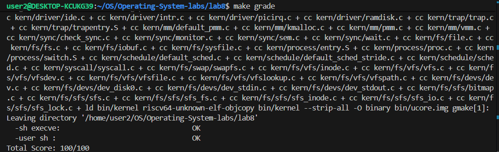

# Lab8 文件系统
## 练习0：填写已有实验
本实验依赖实验2/3/4/5/6/7。请把你做的实验2/3/4/5/6/7的代码填入本实验中代码中有“LAB2”/“LAB3”/“LAB4”/“LAB5”/“LAB6” /“LAB7”的注释相应部分。并确保编译通过。注意：为了能够正确执行lab8的测试应用程序，可能需对已完成的实验2/3/4/5/6/7的代码进行进一步改进。

## 练习1: 完成读文件操作的实现（需要编码）
> 首先了解打开文件的处理流程，然后参考本实验后续的文件读写操作的过程分析，填写在 kern/fs/sfs/sfs_inode.c中 的sfs_io_nolock()函数，实现读文件中数据的代码。
---
1. **首块且读写区间位于同一块内**
```c
// Step 1: first block (may be partial)
blkoff = offset % SFS_BLKSIZE;

if (blkno == end_blkno) {
    size_t size = endpos - offset;
    ret = sfs_bmap_load_nolock(sfs, sin, blkno, &ino);
    if (ret) goto out;
    ret = sfs_buf_op(sfs, buf, size, ino, blkoff);
    if (ret) goto out;
    alen += size;
    goto out;
}
```
- 首先，根据文件偏移量计算其在当前逻辑块内的偏移`blkoff`;
- 若读写区间的起始位置和结束位置位于同一个逻辑块中（即 `blkno `== `end_blkno`），说明本次 I/O 请求完全落在单个磁盘块内。此时无需进行块切分操作，仅需通过`sfs_bmap_load_nolock` 获取对应的磁盘块号，并调用块内缓冲读写接口`sfs_buf_op` 完成指定偏移和长度的数据访问。该路径在完成操作后直接返回，避免了后续不必要的判断，提高了小范围读写场景下的执行效率。
---

2. **首块非对齐且读写区间跨越多个块**
```c
// first block partial
if (blkoff) {
    size_t size = SFS_BLKSIZE - blkoff;
    ret = sfs_bmap_load_nolock(sfs, sin, blkno, &ino);
    if (ret) goto out;
    ret = sfs_buf_op(sfs, buf, size, ino, blkoff);
    if (ret) goto out;
    alen += size;
    blkno++;
    buf = (char *)buf + size;
}
```

当文件偏移未与块边界对齐且读写区间跨越多个逻辑块时，需要首先处理首块中从起始偏移到块末尾的部分。我们首先计算首块中需要访问的剩余字节数，并通过`sfs_buf_op `完成块内部分读写操作。完成首块访问后，代码将逻辑块号加一，并同步推进用户缓冲区指针，为后续整块读写阶段做好准备。这一步保证了后续操作从块边界开始，使逻辑块访问过程保持连续和正确。

---
3. **中间完整逻辑块的处理**
```c
// Step 2: full blocks
for (; blkno < end_blkno; blkno++) {
    ret = sfs_bmap_load_nolock(sfs, sin, blkno, &ino);
    if (ret) goto out;
    ret = sfs_block_op(sfs, buf, ino, 1);
    if (ret) goto out;
    alen += SFS_BLKSIZE;
    buf = (char *)buf + SFS_BLKSIZE;
}
```
该循环用于处理读写区间中完全覆盖的中间逻辑块。由于这些块均为块对齐访问，代码采用`sfs_block_op`接口进行整块读写操作，避免了块内偏移计算和数据拼接，具有较高的执行效率。循环条件限定为`blkno < end_blkno`，确保仅对完全位于读写区间内部的块进行整块访问，而不包含可能存在部分访问的尾块。

---
4. 尾块非对齐部分的处理
```c
// Step 3: last block partial
size_t last_size = endpos % SFS_BLKSIZE;
if (last_size) {
    ret = sfs_bmap_load_nolock(sfs, sin, blkno, &ino);
    if (ret) goto out;
    ret = sfs_buf_op(sfs, buf, last_size, ino, 0);
    if (ret) goto out;
    alen += last_size;
}
```
当读写区间的结束位置未与块边界对齐时，需要对尾块中的部分数据进行单独处理。此时代码计算尾块中需要访问的字节数，并从块起始位置开始调用`sfs_buf_op`完成数据读写。该处理方式避免了对尾块中无关区域的访问，保证了文件读写范围的精确性。通过这一逻辑，文件系统能够在任意结束偏移条件下正确完成文件 I/O 操作。

---
## 练习2: 完成基于文件系统的执行程序机制的实现（需要编码）
> 改写proc.c中的load_icode函数和其他相关函数，实现基于文件系统的执行程序机制。执行：make qemu。如果能看看到sh用户程序的执行界面，则基本成功了。如果在sh用户界面上可以执行exit, hello（更多用户程序放在user目录下）等其他放置在sfs文件系统中的其他执行程序，则可以认为本实验基本成功。

---
### **`alloc_proc`函数中filesp的初始化**
```c
proc->filesp = NULL;
```
在 `alloc_proc()` 中，`filesp` 仅表示进程的文件表指针，它属于**进程控制块(proc_struct)的成员资源**。此时：

* 进程只是“占位”，还不是完整的可运行进程
* 文件表是一个**可共享、带引用计数的资源**
* 初始化为 `NULL` 表示该进程当前还没有文件表

> **为什么不能在 `alloc_proc()` 调用 `filesp_create()`？**

如果在 `alloc_proc()` 里直接创建 `files_struct`，会引发**资源管理问题**：

1. **idleproc 初始化**

   * 系统启动时会在 `proc_init()` 再次调用 `filesp_create()`
   * 如果 alloc 阶段已经创建了一次，第一次创建的文件表将没有引用被释放
   * → **内存泄漏**

2. **fork 场景**

   * fork 会通过 `copy_files()` 将父进程的文件表复制给子进程
   * 如果 alloc 阶段已经创建文件表：

     * 子进程会获得两个文件表
     * → **双重分配 / 内核资源冲突**

3. **引用计数与共享语义冲突**

   * 文件表是可共享的、带引用计数的资源
   * 过早创建会破坏引用计数机制，使 fork 或 exit 时的资源释放出现问题

### **`proc_run`中tlb的刷新**
```c
/* flush TLB after updating satp */
flush_tlb();
/* switch context */
switch_to(&(prev->context), &(next->context));
```
在`proc_run()`中，调用`switch_to()`前必须刷新 TLB。这是因为`switch_to()`仅切换 CPU 上下文，不会更新 CPU 的虚拟地址映射缓存。当新进程的页表基址写入`satp`后，如果不刷新 TLB，CPU 仍可能使用旧进程的虚拟-物理映射，从而访问错误内存。使用`flush_tlb()`可以清空这些缓存条目，保证新进程访问虚拟地址时映射正确，从而避免数据错误或内核崩溃。
### **`do_fork`函数**
```c
    if (copy_files(clone_flags, proc) != 0)
    { // for LAB8
        goto bad_fork_cleanup_kstack;
    }
    
fork_out:
    return ret;

bad_fork_cleanup_fs: // for LAB8
    put_files(proc);
```
在 LAB8 中，`do_fork()` 增加了对子进程文件系统资源的管理。
具体实现如下：
 1. 使用 `copy_files(clone_flags, proc)` 将父进程的文件表复制或共享给子进程：

    * 若指定共享，则增加引用计数，使父子进程共享同一 `files_struct`
    * 否则创建新的文件表并复制父进程打开的文件
 2. 如果 `copy_files()` 返回错误，则 fork 失败，需要跳转到清理流程：

    * 调用 `put_files(proc)` 释放子进程已分配的文件表
    * 再释放 kernel stack 和 `proc_struct`

 通过这种设计，可以保证 fork 时：

 * 子进程继承父进程的文件资源
 * 失败路径不会造成文件表泄漏
 * 引用计数机制保证共享资源的安全释放


### **更新`load_icode`函数**
在`load_icode()`中，文件系统的主要处理流程是通过文件描述符 fd 将 ELF 可执行文件加载到当前进程内存：
1. **读取 ELF 文件头**

    ```c
    struct elfhdr elf;
    if ((ret = load_icode_read(fd, &elf, sizeof(elf), 0)) != 0)
    {
        ret = -E_INVAL_ELF;
        goto bad_elf_cleanup_pgdir;
    }
    if (elf.e_magic != ELF_MAGIC)
    {
        ret = -E_INVAL_ELF;
        goto bad_elf_cleanup_pgdir;
    }
    ```

* **功能**：

  * 调用 `load_icode_read()` 读取文件头（ELF Header）
  * 判断文件是否为合法 ELF 文件（检查 `e_magic`）


2. **读取程序段表**

    ```c
    size_t phsize = elf.e_phnum * sizeof(struct proghdr);
    struct proghdr *phbuf = NULL;
    if (phsize > 0)
    {
        if ((phbuf = kmalloc(phsize)) == NULL)
        {
            ret = -E_NO_MEM;
            goto bad_pgdir_cleanup_mm;
        }
        if ((ret = load_icode_read(fd, phbuf, phsize, elf.e_phoff)) != 0)
        {
            kfree(phbuf);
            goto bad_elf_cleanup_pgdir;
        }
    }
    ```

* **功能**：

  * 读取 ELF 文件中的程序段表（Program Headers），用于定位 TEXT、DATA、BSS 段
  * 使用 `load_icode_read()` 直接从文件系统读取文件的特定偏移和长度
  * `phbuf` 在内存中存储程序段描述信息

3. **读取程序段内容到内存**

    ```c
    /* load file-backed part */
    while (start < end_file)
    {
        if ((page = pgdir_alloc_page(mm->pgdir, la, perm)) == NULL)
            goto bad_cleanup_mmap;
        size_t off = start - la;
        size_t toread = PGSIZE - off;
        if (end_file < la + PGSIZE)
            toread = end_file - la - off;
        off = start - la;
        if ((ret = load_icode_read(fd, page2kva(page) + off, toread, ph->p_offset + (start - ph->p_va))) != 0)
            goto bad_cleanup_mmap;
        start += toread;
        la += PGSIZE;
    }
    ```

* **功能**：

  * 对每一个可加载段（TEXT / DATA）：

    * 分配页框
    * 从 ELF 文件中读取实际内容到分配的内存页
  * `load_icode_read()` 从文件描述符 `fd` 指向的文件中读取字节
  
4. **BSS 处理**：
    ```c
    if (start < end_mem)
    {
        /* if previous loop ended in the middle of a page, fill remaining */
        uintptr_t page_la = ROUNDDOWN(start, PGSIZE);
        size_t off = start - page_la;
        if (off != 0)
        {
            if ((page = pgdir_alloc_page(mm->pgdir, page_la, perm)) == NULL)
                goto bad_cleanup_mmap;
            size_t zerolen = PGSIZE - off;
            if (end_mem < page_la + PGSIZE)
                zerolen = end_mem - start;
            memset(page2kva(page) + off, 0, zerolen);
            start += zerolen;
            page_la += PGSIZE;
        }
        while (start < end_mem)
        {
            if ((page = pgdir_alloc_page(mm->pgdir, page_la, perm)) == NULL)
                goto bad_cleanup_mmap;
            size_t zerolen = PGSIZE;
            if (end_mem < page_la + PGSIZE)
                zerolen = end_mem - page_la;
            memset(page2kva(page), 0, zerolen);
            start += zerolen;
            page_la += PGSIZE;
        }
    }
    ```
* 首先判断当前段还有剩余内存需要处理（BSS，`start`表示已经加载的内存位置；`end_mem`代表该段在进程虚拟地址空间的结束位置
* **处理上一页未填满的部分**
    * **ROUNDDOWN(start, PGSIZE)**：找到当前内存页的起始地址
    * **off = start - page_la**：计算上一页已经写入的偏移
    * 如果 `off != 0`，说明上一次加载文件内容时 **中间页未写满**
    * **操作**：

    * 分配该页（`pgdir_alloc_page`）
    * 填充剩余部分为 0（`memset`）
    * 更新 `start` 到本页末尾

* **处理剩余完整页的 BSS**
    * 循环分配完整的页，直到覆盖整个 BSS
    * **页内全零**（`memset`）
    * 处理最后可能不满一页的情况：`zerolen = end_mem - page_la`
    * 更新 `start` 和 `page_la`，继续下一页

5. **`bad_cleanup_mmap`处理更新**
    ```c
    bad_cleanup_mmap:
        if (phbuf)
            kfree(phbuf);
        exit_mmap(mm);
    ```
    在加载过程中，如果发生错误（如文件读取失败、页分配失败），会跳转到`bad_cleanup_mmap`标签进行资源回收。我们在此处增加`if (phbuf) kfree(phbuf);`
    - 确保已经分配的缓冲区在出错时被释放，避免内存泄漏
    - 对 phbuf 为 NULL 的情况安全处理，避免对空指针调用 kfree

通过以上代码，用户程序的可执行文件内容被正确加载到新进程的地址空间，为后续执行提供数据基础。整个过程充分利用了文件系统接口（`load_icode_read` / `sfs_io_nolock`）和内存管理接口（`pgdir_alloc_page` / `mm_map`），实现了文件到进程内存的完整映射。


### **`put_kargv`函数的改进**
```c
static void
put_kargv(int argc, char **kargv)
{
    int i;
    for (i = 0; i < argc; i++)
    {
        if (kargv[i] != NULL)
        {
            kfree(kargv[i]);
            kargv[i] = NULL;
        }
    }
}
```
在 LAB8 中，我们对`put_kargv`函数进行了改进，以增强内核参数数组释放的安全性和可读性。原实现直接从数组末尾依次释放内存，未检查指针是否为 NULL，也未将释放后的指针置空，可能导致悬空指针或对未分配内存调用 kfree。

改进后的实现：
- 增加了 NULL 检查，确保只释放已分配的内存
- 释放后将指针置为 NULL，避免悬空指针
- 循环顺序由前向后，更直观易读

通过这些改进，即使在 ELF 文件加载失败或参数部分初始化的情况下，也能安全释放内核参数内存，防止内存泄漏和潜在的野指针访问。

---
最终我们`make grade`得到下面的结果，说明我们本实验基本成功。

## 扩展练习 Challenge1：完成基于“UNIX的PIPE机制”的设计方案
>如果要在ucore里加入UNIX的管道（Pipe）机制，至少需要定义哪些数据结构和接口？（接口给出语义即可，不必具体实现。数据结构的设计应当给出一个（或多个）具体的C语言struct定义。在网络上查找相关的Linux资料和实现，请在实验报告中给出设计实现”UNIX的PIPE机制“的概要设方案，你的设计应当体现出对可能出现的同步互斥问题的处理。）


### 1.Linux Pipe机制参考

通过查阅Linux内核源码和相关资料，Linux中pipe的实现具有以下特点：

1. **数据结构**: 使用`pipe_inode_info`结构体表示管道
2. **缓冲区**: 使用`pipe_buffer`数组存储数据页，支持动态分配
3. **同步机制**: 使用`mutex`和`wait_queue`实现进程同步
4. **非阻塞I/O**: 支持O_NONBLOCK标志实现非阻塞读写
5. **信号处理**: 支持SIGPIPE信号（当向已关闭读端的管道写入时）


本设计借鉴Linux的实现思路，但针对ucore的特点进行了简化：
- 使用固定大小的环形缓冲区（4KB），简化内存管理
- 复用ucore现有的信号量和等待队列机制
- 保持与UNIX标准pipe语义的兼容性

### 2.核心数据结构设计

#### （1）pipe结构体

这是管道机制的核心数据结构，表示一个管道实例：

```c
#define PIPE_BUF_SIZE 4096  // 管道缓冲区大小（4KB，一个页面）

struct pipe {
    // 数据缓冲区（环形缓冲区）
    char buffer[PIPE_BUF_SIZE];
    size_t read_pos;              // 读位置指针
    size_t write_pos;             // 写位置指针
    size_t data_size;             // 当前缓冲区中的数据量
    
    // 同步互斥机制
    semaphore_t mutex;            // 保护pipe结构的互斥信号量
    semaphore_t read_sem;         // 读等待信号量（当缓冲区为空时阻塞）
    semaphore_t write_sem;        // 写等待信号量（当缓冲区满时阻塞）
    
    // 引用计数和状态
    int read_refs;                // 读端引用计数
    int write_refs;               // 写端引用计数
    bool read_closed;             // 读端是否已关闭
    bool write_closed;            // 写端是否已关闭
    
    // 等待队列（用于进程阻塞）
    wait_queue_t read_wait_queue;   // 读等待队列
    wait_queue_t write_wait_queue;  // 写等待队列
    
    // 链表管理
    list_entry_t pipe_link;       // 用于pipe管理链表的链接
};
```

**设计说明：**
- 使用固定大小的缓冲区，通过read_pos和write_pos实现循环使用，提高空间利用率
- mutex保护整个结构，read_sem和write_sem分别控制读写阻塞
- 支持多个进程共享同一个pipe端
- 使用ucore的wait_queue机制实现进程阻塞和唤醒

#### （2）pipe_manager结构体

用于管理系统中的所有pipe实例：

```c
#define MAX_PIPES 1024  // 系统最大管道数

struct pipe_manager {
    struct pipe pipes[MAX_PIPES];  // 管道数组
    int pipe_count;                 // 当前管道数量
    semaphore_t manager_sem;        // 保护pipe_manager的互斥信号量
    list_entry_t free_list;         // 空闲管道链表
    list_entry_t used_list;         // 使用中管道链表
};
```

**设计说明：**
- 集中管理系统中所有pipe实例，便于资源分配和回收
- 使用链表管理空闲和使用的pipe，提高分配效率
- 通过manager_sem保护管理操作，避免竞态条件

#### （3）file结构体扩展

在ucore现有的`file`结构体中添加pipe相关字段：

```c
struct file {
    enum {
        FD_NONE, FD_INIT, FD_OPENED, FD_CLOSED,
    } status;
    bool readable;
    bool writable;
    int fd;
    off_t pos;
    struct inode *node;      // 对于pipe，此字段为NULL
    int open_count;
    
    // Pipe相关扩展字段
    struct pipe *pipe_ptr;   // 指向关联的pipe结构
    bool is_pipe_read;       // 标识是否为pipe的读端
    bool is_pipe_write;      // 标识是否为pipe的写端
};
```

**设计说明：**
- pipe文件描述符复用现有的file结构，保持系统一致性。但是通过pipe_ptr字段区分普通文件和pipe
- is_pipe_read/is_pipe_write标识pipe的端类型，便于在read/write时路由

### 3.系统调用接口设计

#### （1）pipe()系统调用

**用户空间接口：**
```c
int pipe(int fd[2]);
```
- 创建一个匿名管道，返回两个文件描述符。`fd[0]`读端文件描述符，用于从管道读取数据；`fd[1]`写端文件描述符，用于向管道写入数据。

- 成功返回0，失败返回-1并设置errno为以下值之一：
  - `EFAULT`: fd指针无效（用户空间指针无效）
  - `EMFILE`: 进程打开文件数达到上限
  - `ENFILE`: 系统管道数达到上限
  - `ENOMEM`: 内存不足


**内核处理函数：**
```c
int sys_pipe(uint64_t arg[]);
```

**实现流程：**
1. 验证用户空间指针有效性（使用copy_from_user等安全函数）
2. 调用pipe_alloc()从pipe管理器分配pipe结构
3. 调用pipe_create()初始化pipe（初始化缓冲区、信号量、等待队列等）
4. 分配两个file描述符（fd[0]和fd[1]）
5. 设置file结构的pipe相关字段（pipe_ptr、is_pipe_read、is_pipe_write）
6. 将fd数组写入用户空间
7. 返回0表示成功

#### （2）read()系统调用扩展


当fd是pipe读端时，从管道读取数据到用户缓冲区。如果管道为空且写端未关闭，阻塞等待直到有数据写入；如果管道为空且写端已关闭，返回0（EOF，文件结束）。最后返回实际读取的字节数。


```c
// 在sys_read()中添加pipe检测
if (file->is_pipe_read && file->pipe_ptr != NULL) {
    return pipe_read(file->pipe_ptr, buf, len);
} else {
    // 原有的文件读取逻辑
    return file_read(fd, buf, len, ...);
}
```

#### （3）write()系统调用扩展

当fd是pipe写端时，将用户缓冲区数据写入管道。如果管道满且读端未关闭，阻塞等待直到有空间；如果读端已关闭，返回EPIPE错误（Broken pipe）。最后返回实际写入的字节数。


```c
// 在sys_write()中添加pipe检测
if (file->is_pipe_write && file->pipe_ptr != NULL) {
    return pipe_write(file->pipe_ptr, buf, len);
} else {
    // 原有的文件写入逻辑
    return file_write(fd, buf, len, ...);
}
```

#### （4）close()系统调用扩展

关闭pipe的文件描述符，减少对应端的引用计数。当引用计数为0时，设置关闭标志并唤醒等待的进程；当两端都关闭时，调用pipe_free()释放pipe资源。

```c
// 在sys_close()中添加pipe处理
if (file->pipe_ptr != NULL) {
    if (file->is_pipe_read) {
        pipe_close_read(file->pipe_ptr);
    }
    if (file->is_pipe_write) {
        pipe_close_write(file->pipe_ptr);
    }
    // 检查是否两端都关闭，如果是则释放pipe
    if (file->pipe_ptr->read_closed && 
        file->pipe_ptr->write_closed) {
        pipe_free(file->pipe_ptr);
    }
}
// 原有的文件关闭逻辑
```


### 核心操作函数接口

#### pipe_create()
```c
int pipe_create(struct pipe **pipe_store);
```
创建并初始化 pipe 结构
#### pipe_destroy()
```c
void pipe_destroy(struct pipe *pipe);
```
销毁pipe结构并释放资源


#### pipe_read()
```c
int pipe_read(struct pipe *pipe, void *buf, size_t len);
```
当管道为空且写端仍未关闭时，读操作会阻塞等待；如果管道为空且写端已经关闭，则返回 0 表示到达文件末尾（EOF）。函数通过环形缓冲区读取数据，在成功读取后会唤醒可能因管道已满而阻塞的写进程，最终返回实际读取的字节数。

#### pipe_write()
```c
int pipe_write(struct pipe *pipe, const void *buf, size_t len);
```
如果读端已经关闭，写操作会失败并返回 EPIPE 错误；当管道已满且读端仍然存在时，写操作会阻塞等待。函数同样使用环形缓冲区进行写入，并在写入完成后唤醒可能因管道为空而阻塞的读进程，返回实际写入的字节数。


#### pipe_close_read()
```c
void pipe_close_read(struct pipe *pipe);
```
用于关闭管道的读端，函数会减少读端引用计数，当 read_refs 下降为 0 时设置 read_closed 标志，并唤醒所有正在等待写入的进程。

#### pipe_close_write()
```c
void pipe_close_write(struct pipe *pipe);
```
用于关闭写端，同样会减少写端引用计数；当最后一个写端关闭后，管道被标记为写端关闭，并唤醒所有阻塞在读操作上的进程。

#### pipe_manager_init()
```c
void pipe_manager_init(void);
```
初始化全局的 pipe 管理结构，包括空闲链表、使用链表以及相关的互斥保护，一般在系统启动阶段完成。

#### pipe_alloc()
```c
struct pipe *pipe_alloc(void);
```
负责从管理器中取出一个可用的 pipe 结构并投入使用，分配失败时返回 NULL。

#### pipe_free()
```c
void pipe_free(struct pipe *pipe);
```
在确认 pipe 已完全关闭后回收该结构，将其重新放回管理器中供后续使用。

### 同步互斥机制设计

#### 互斥保护机制

- 在 pipe 的实现中，使用一个 mutex 信号量来保护 pipe 结构体，保证对 pipe 状态的修改不会发生并发冲突。只要访问或修改 pipe 的内部状态，就必须先获取 mutex；同时避免在持有 mutex 的情况下进行长时间阻塞，进程需要等待时通过等待队列机制释放锁后再阻塞，而不是直接在锁内 sleep。

- 对于 pipe 管理器，则使用单独的 manager_sem 信号量进行保护，主要用于 pipe 的分配和回收操作。为了避免死锁，约定统一的加锁顺序：如果同时需要访问管理器和具体的 pipe，必须先获取 manager_sem，再获取 pipe 自身的 mutex。

#### 条件同步机制

当管道中没有数据可读时，读进程需要阻塞等待，因此使用 read_sem 作为同步手段，其初始状态表示当前没有可读数据；一旦有写进程向管道写入数据，就会唤醒相应的读进程。同样地，当管道缓冲区已满时，写进程不能继续写入，需要等待可用空间，因此使用 write_sem 进行控制，在有数据被读出后唤醒等待写入的进程。

#### 等待队列机制

除了信号量外，pipe 还要维护读等待队列和写等待队列，用于管理被阻塞的进程。当管道为空时，尝试读取的进程会被加入读等待队列；当管道写满时，写进程会被加入写等待队列。对应地，在数据写入或读出后，通过唤醒等待队列中的进程，使其重新参与调度并继续执行。


### 总结

1. 使用mutex、信号量和等待队列的多层次同步机制，充分处理了并发访问问题
2. 环形缓冲区设计，空间利用率高，实现简单


3. 与Linux实现的对比

| 特性 | Linux实现 | ucore设计 |
|------|-----------|-----------|
| 缓冲区 | 动态页分配 | 固定4KB缓冲区 |
| 同步机制 | mutex + wait_queue | mutex + semaphore + wait_queue |
| 非阻塞I/O | 支持 | 可扩展支持 |
| 信号处理 | 支持SIGPIPE | 可扩展支持 |
| 原子性 | PIPE_BUF保证 | PIPE_BUF_SIZE保证 |


## 扩展练习 Challenge2：完成基于“UNIX的软连接和硬连接机制”的设计方案
>如果要在ucore里加入UNIX的软连接和硬连接机制，至少需要定义哪些数据结构和接口？（接口给出语义即可，不必具体实现。数据结构的设计应当给出一个（或多个）具体的C语言struct定义。在网络上查找相关的Linux资料和实现，请在实验报告中给出设计实现”UNIX的软连接和硬连接机制“的概要设方案，你的设计应当体现出对可能出现的同步互斥问题的处理。）

## 实验知识点
**1. 文件与目录管理**

文件系统通过 inode 或类似的数据结构管理文件的元信息，如大小、类型、权限和数据块位置；目录则组织文件名与文件索引的映射，可以采用链表型或树型结构，实现文件的查找与层级管理，从而支持高效的文件存储和访问。

**2. 文件数据一致性与访问控制**

文件系统通过缓冲区缓存、写回策略及事务或日志机制保证文件数据与元数据的一致性，同时利用权限位、用户和组信息控制对文件的读、写和执行操作，确保在多用户环境下数据安全和隔离，同时支持操作系统的统一访问接口（如虚拟文件系统 VFS）。

**3. 管道**

pipe 通过内核中的缓冲区实现进程间的单向通信，读写两端通过系统调用访问。当管道为空或已满时，进程通过等待队列阻塞，并在条件满足时被唤醒。
